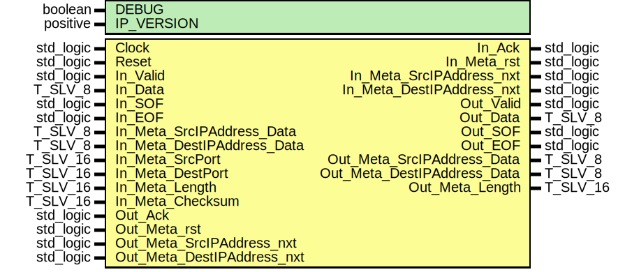

# Entity: udp_TX

## Diagram

## Description

EMACS settings: -*-  tab-width: 2; indent-tabs-mode: t -*-
vim: tabstop=2:shiftwidth=2:noexpandtab
kate: tab-width 2; replace-tabs off; indent-width 2;
=============================================================================
Authors:				 	Patrick Lehmann
Entity:				 	TODO
Description:
-------------------------------------
.. TODO:: No documentation available.
License:
=============================================================================
Copyright 2007-2015 Technische Universitaet Dresden - Germany
Licensed under the Apache License, Version 2.0 (the "License");
you may not use this file except in compliance with the License.
You may obtain a copy of the License at
Unless required by applicable law or agreed to in writing, software
distributed under the License is distributed on an "AS IS" BASIS,
WITHOUT WARRANTIES OR CONDITIONS OF ANY KIND, either express or implied.
See the License for the specific language governing permissions and
limitations under the License.
=============================================================================
## Generics

| Generic name | Type     | Value | Description |
| ------------ | -------- | ----- | ----------- |
| DEBUG        | boolean  | FALSE |             |
| IP_VERSION   | positive | 6     |             |
## Ports

| Port name                   | Direction | Type      | Description |
| --------------------------- | --------- | --------- | ----------- |
| Clock                       | in        | std_logic |             |
| Reset                       | in        | std_logic |             |
| In_Valid                    | in        | std_logic | IN port     |
| In_Data                     | in        | T_SLV_8   |             |
| In_SOF                      | in        | std_logic |             |
| In_EOF                      | in        | std_logic |             |
| In_Ack                      | out       | std_logic |             |
| In_Meta_rst                 | out       | std_logic |             |
| In_Meta_SrcIPAddress_nxt    | out       | std_logic |             |
| In_Meta_SrcIPAddress_Data   | in        | T_SLV_8   |             |
| In_Meta_DestIPAddress_nxt   | out       | std_logic |             |
| In_Meta_DestIPAddress_Data  | in        | T_SLV_8   |             |
| In_Meta_SrcPort             | in        | T_SLV_16  |             |
| In_Meta_DestPort            | in        | T_SLV_16  |             |
| In_Meta_Length              | in        | T_SLV_16  |             |
| In_Meta_Checksum            | in        | T_SLV_16  |             |
| Out_Valid                   | out       | std_logic | OUT port    |
| Out_Data                    | out       | T_SLV_8   |             |
| Out_SOF                     | out       | std_logic |             |
| Out_EOF                     | out       | std_logic |             |
| Out_Ack                     | in        | std_logic |             |
| Out_Meta_rst                | in        | std_logic |             |
| Out_Meta_SrcIPAddress_nxt   | in        | std_logic |             |
| Out_Meta_SrcIPAddress_Data  | out       | T_SLV_8   |             |
| Out_Meta_DestIPAddress_nxt  | in        | std_logic |             |
| Out_Meta_DestIPAddress_Data | out       | T_SLV_8   |             |
| Out_Meta_Length             | out       | T_SLV_16  |             |
## Signals

| Name                   | Type                                | Description |
| ---------------------- | ----------------------------------- | ----------- |
| State                  | T_STATE                             |             |
| NextState              | T_STATE                             |             |
| In_Ack_i               | std_logic                           |             |
| UpperLayerPacketLength | std_logic_vector(15 downto 0)       |             |
| IPSeqCounter_rst       | std_logic                           |             |
| IPSeqCounter_en        | std_logic                           |             |
| IPSeqCounter_us        | unsigned(3 downto 0)                |             |
| Checksum_rst           | std_logic                           |             |
| Checksum_en            | std_logic                           |             |
| Checksum_Addend0_us    | unsigned(T_SLV_8'range)             |             |
| Checksum_Addend1_us    | unsigned(T_SLV_8'range)             |             |
| Checksum0_nxt0_us      | unsigned(T_SLV_8'high + 1 downto 0) |             |
| Checksum0_nxt1_us      | unsigned(T_SLV_8'high + 1 downto 0) |             |
| Checksum0_d_us         | unsigned(T_SLV_8'high downto 0)     |             |
| Checksum0_cy           | unsigned(T_SLV_2'range)             |             |
| Checksum1_nxt_us       | unsigned(T_SLV_8'range)             |             |
| Checksum1_d_us         | unsigned(T_SLV_8'range)             |             |
| Checksum0_cy0          | std_logic                           |             |
| Checksum0_cy0_d        | std_logic                           |             |
| Checksum0_cy1          | std_logic                           |             |
| Checksum0_cy1_d        | std_logic                           |             |
| Checksum_i             | T_SLV_16                            |             |
| Checksum               | T_SLV_16                            |             |
| Checksum_mux_rst       | std_logic                           |             |
| Checksum_mux_set       | std_logic                           |             |
| Checksum_mux_r         | std_logic                           |             |
## Types

| Name    | Type                                                                                                                                                                                                                                                                                                                                                                                                                                                                                                                                                                                                                                                                                             | Description |
| ------- | ------------------------------------------------------------------------------------------------------------------------------------------------------------------------------------------------------------------------------------------------------------------------------------------------------------------------------------------------------------------------------------------------------------------------------------------------------------------------------------------------------------------------------------------------------------------------------------------------------------------------------------------------------------------------------------------------ | ----------- |
| T_STATE | ( ST_IDLE, ST_CHECKSUMV4_IPV4_ADDRESSES, ST_CHECKSUMV4_LENGTH_UDP_TYPE_0,	ST_CHECKSUMV4_LENGTH_UDP_TYPE_1, ST_CHECKSUMV4_PORT_NUMBER_0,			ST_CHECKSUMV4_PORT_NUMBER_1, ST_CHECKSUMV4_CHECKSUM_LENGTH_0,	ST_CHECKSUMV4_CHECKSUM_LENGTH_1, ST_CHECKSUMV6_IPV6_ADDRESSES, ST_CHECKSUMV6_LENGTH_UDP_TYPE_0,	ST_CHECKSUMV6_LENGTH_UDP_TYPE_1, ST_CHECKSUMV6_PORT_NUMBER_0,			ST_CHECKSUMV6_PORT_NUMBER_1, ST_CHECKSUMV6_CHECKSUM_LENGTH_0,	ST_CHECKSUMV6_CHECKSUM_LENGTH_1, ST_CARRY_0,  ST_CARRY_1, ST_SEND_SOURCE_PORT_0, ST_SEND_SOURCE_PORT_1, ST_SEND_DEST_PORT_0,	ST_SEND_DEST_PORT_1, ST_SEND_LENGTH_0,			ST_SEND_LENGTH_1, ST_SEND_CHECKSUM_0,		ST_SEND_CHECKSUM_1, ST_SEND_DATA, ST_ERROR )  |             |
## Processes
- unnamed: ( Clock )
- unnamed: ( State,
					In_Valid, In_SOF, In_EOF, In_Data,
					Out_Ack, Out_Meta_rst,
					Out_Meta_SrcIPAddress_nxt,	In_Meta_SrcIPAddress_Data,
					Out_Meta_DestIPAddress_nxt, In_Meta_DestIPAddress_Data,
					In_Meta_SrcPort, In_Meta_DestPort, In_Meta_Checksum,
					IPSeqCounter_us, Checksum0_cy, Checksum,
					UpperLayerPacketLength )
- unnamed: ( Clock )
**Description**
IPSeqCounter

- unnamed: ( Clock )
- unnamed: ( Clock )
