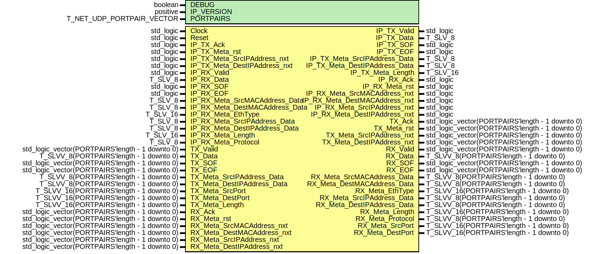

# Entity: udp_Wrapper

- **File**: udp_Wrapper.vhdl
## Diagram

## Description

EMACS settings: -*-  tab-width: 2; indent-tabs-mode: t -*-
vim: tabstop=2:shiftwidth=2:noexpandtab
kate: tab-width 2; replace-tabs off; indent-width 2;
=============================================================================
Authors:				 	Patrick Lehmann
Entity:				 	TODO
Description:
-------------------------------------
.. TODO:: No documentation available.
License:
=============================================================================
Copyright 2007-2015 Technische Universitaet Dresden - Germany
Licensed under the Apache License, Version 2.0 (the "License");
you may not use this file except in compliance with the License.
You may obtain a copy of the License at
Unless required by applicable law or agreed to in writing, software
distributed under the License is distributed on an "AS IS" BASIS,
WITHOUT WARRANTIES OR CONDITIONS OF ANY KIND, either express or implied.
See the License for the specific language governing permissions and
limitations under the License.
=============================================================================
## Generics

| Generic name | Type                      | Value                     | Description |
| ------------ | ------------------------- | ------------------------- | ----------- |
| DEBUG        | boolean                   | FALSE                     |             |
| IP_VERSION   | positive                  | 6                         |             |
| PORTPAIRS    | T_NET_UDP_PORTPAIR_VECTOR | (0 => (x"0000", x"0000")) |             |
## Ports

| Port name                      | Direction | Type                                            | Description      |
| ------------------------------ | --------- | ----------------------------------------------- | ---------------- |
| Clock                          | in        | std_logic                                       |                  |
| Reset                          | in        | std_logic                                       |                  |
| IP_TX_Valid                    | out       | std_logic                                       | from IP layer    |
| IP_TX_Data                     | out       | T_SLV_8                                         |                  |
| IP_TX_SOF                      | out       | std_logic                                       |                  |
| IP_TX_EOF                      | out       | std_logic                                       |                  |
| IP_TX_Ack                      | in        | std_logic                                       |                  |
| IP_TX_Meta_rst                 | in        | std_logic                                       |                  |
| IP_TX_Meta_SrcIPAddress_nxt    | in        | std_logic                                       |                  |
| IP_TX_Meta_SrcIPAddress_Data   | out       | T_SLV_8                                         |                  |
| IP_TX_Meta_DestIPAddress_nxt   | in        | std_logic                                       |                  |
| IP_TX_Meta_DestIPAddress_Data  | out       | T_SLV_8                                         |                  |
| IP_TX_Meta_Length              | out       | T_SLV_16                                        |                  |
| IP_RX_Valid                    | in        | std_logic                                       | to IP layer      |
| IP_RX_Data                     | in        | T_SLV_8                                         |                  |
| IP_RX_SOF                      | in        | std_logic                                       |                  |
| IP_RX_EOF                      | in        | std_logic                                       |                  |
| IP_RX_Ack                      | out       | std_logic                                       |                  |
| IP_RX_Meta_rst                 | out       | std_logic                                       |                  |
| IP_RX_Meta_SrcMACAddress_nxt   | out       | std_logic                                       |                  |
| IP_RX_Meta_SrcMACAddress_Data  | in        | T_SLV_8                                         |                  |
| IP_RX_Meta_DestMACAddress_nxt  | out       | std_logic                                       |                  |
| IP_RX_Meta_DestMACAddress_Data | in        | T_SLV_8                                         |                  |
| IP_RX_Meta_EthType             | in        | T_SLV_16                                        |                  |
| IP_RX_Meta_SrcIPAddress_nxt    | out       | std_logic                                       |                  |
| IP_RX_Meta_SrcIPAddress_Data   | in        | T_SLV_8                                         |                  |
| IP_RX_Meta_DestIPAddress_nxt   | out       | std_logic                                       |                  |
| IP_RX_Meta_DestIPAddress_Data  | in        | T_SLV_8                                         |                  |
| IP_RX_Meta_Length              | in        | T_SLV_16                                        |                  |
| IP_RX_Meta_Protocol            | in        | T_SLV_8                                         |                  |
| TX_Valid                       | in        | std_logic_vector(PORTPAIRS'length - 1 downto 0) | from upper layer |
| TX_Data                        | in        | T_SLVV_8(PORTPAIRS'length - 1 downto 0)         |                  |
| TX_SOF                         | in        | std_logic_vector(PORTPAIRS'length - 1 downto 0) |                  |
| TX_EOF                         | in        | std_logic_vector(PORTPAIRS'length - 1 downto 0) |                  |
| TX_Ack                         | out       | std_logic_vector(PORTPAIRS'length - 1 downto 0) |                  |
| TX_Meta_rst                    | out       | std_logic_vector(PORTPAIRS'length - 1 downto 0) |                  |
| TX_Meta_SrcIPAddress_nxt       | out       | std_logic_vector(PORTPAIRS'length - 1 downto 0) |                  |
| TX_Meta_SrcIPAddress_Data      | in        | T_SLVV_8(PORTPAIRS'length - 1 downto 0)         |                  |
| TX_Meta_DestIPAddress_nxt      | out       | std_logic_vector(PORTPAIRS'length - 1 downto 0) |                  |
| TX_Meta_DestIPAddress_Data     | in        | T_SLVV_8(PORTPAIRS'length - 1 downto 0)         |                  |
| TX_Meta_SrcPort                | in        | T_SLVV_16(PORTPAIRS'length - 1 downto 0)        |                  |
| TX_Meta_DestPort               | in        | T_SLVV_16(PORTPAIRS'length - 1 downto 0)        |                  |
| TX_Meta_Length                 | in        | T_SLVV_16(PORTPAIRS'length - 1 downto 0)        |                  |
| RX_Valid                       | out       | std_logic_vector(PORTPAIRS'length - 1 downto 0) | to upper layer   |
| RX_Data                        | out       | T_SLVV_8(PORTPAIRS'length - 1 downto 0)         |                  |
| RX_SOF                         | out       | std_logic_vector(PORTPAIRS'length - 1 downto 0) |                  |
| RX_EOF                         | out       | std_logic_vector(PORTPAIRS'length - 1 downto 0) |                  |
| RX_Ack                         | in        | std_logic_vector(PORTPAIRS'length - 1 downto 0) |                  |
| RX_Meta_rst                    | in        | std_logic_vector(PORTPAIRS'length - 1 downto 0) |                  |
| RX_Meta_SrcMACAddress_nxt      | in        | std_logic_vector(PORTPAIRS'length - 1 downto 0) |                  |
| RX_Meta_SrcMACAddress_Data     | out       | T_SLVV_8(PORTPAIRS'length - 1 downto 0)         |                  |
| RX_Meta_DestMACAddress_nxt     | in        | std_logic_vector(PORTPAIRS'length - 1 downto 0) |                  |
| RX_Meta_DestMACAddress_Data    | out       | T_SLVV_8(PORTPAIRS'length - 1 downto 0)         |                  |
| RX_Meta_EthType                | out       | T_SLVV_16(PORTPAIRS'length - 1 downto 0)        |                  |
| RX_Meta_SrcIPAddress_nxt       | in        | std_logic_vector(PORTPAIRS'length - 1 downto 0) |                  |
| RX_Meta_SrcIPAddress_Data      | out       | T_SLVV_8(PORTPAIRS'length - 1 downto 0)         |                  |
| RX_Meta_DestIPAddress_nxt      | in        | std_logic_vector(PORTPAIRS'length - 1 downto 0) |                  |
| RX_Meta_DestIPAddress_Data     | out       | T_SLVV_8(PORTPAIRS'length - 1 downto 0)         |                  |
| RX_Meta_Length                 | out       | T_SLVV_16(PORTPAIRS'length - 1 downto 0)        |                  |
| RX_Meta_Protocol               | out       | T_SLVV_8(PORTPAIRS'length - 1 downto 0)         |                  |
| RX_Meta_SrcPort                | out       | T_SLVV_16(PORTPAIRS'length - 1 downto 0)        |                  |
| RX_Meta_DestPort               | out       | T_SLVV_16(PORTPAIRS'length - 1 downto 0)        |                  |
## Signals

| Name                                 | Type                                                                                                            | Description                                                                                   |
| ------------------------------------ | --------------------------------------------------------------------------------------------------------------- | --------------------------------------------------------------------------------------------- |
| StmMux_In_Valid                      | std_logic_vector(UDP_SWITCH_PORTS - 1 downto 0)                                                                 |                                                                                               |
| StmMux_In_Data                       | T_SLM(UDP_SWITCH_PORTS - 1 downto 0,  T_SLV_8'range)                         | necessary default assignment 'Z' to get correct simulation results (iSIM, vSIM, ghdl/gtkwave) |
| StmMux_In_Meta                       | T_SLM(UDP_SWITCH_PORTS - 1 downto 0,  isum(STMMUX_META_BITS) - 1 downto 0)   | necessary default assignment 'Z' to get correct simulation results (iSIM, vSIM, ghdl/gtkwave) |
| StmMux_In_Meta_rev                   | T_SLM(UDP_SWITCH_PORTS - 1 downto 0,  STMMUX_META_REV_BITS - 1 downto 0)     | necessary default assignment 'Z' to get correct simulation results (iSIM, vSIM, ghdl/gtkwave) |
| StmMux_In_SOF                        | std_logic_vector(UDP_SWITCH_PORTS - 1 downto 0)                                                                 |                                                                                               |
| StmMux_In_EOF                        | std_logic_vector(UDP_SWITCH_PORTS - 1 downto 0)                                                                 |                                                                                               |
| StmMux_In_Ack                        | std_logic_vector(UDP_SWITCH_PORTS - 1 downto 0)                                                                 |                                                                                               |
| StmMux_Out_Valid                     | std_logic                                                                                                       |                                                                                               |
| StmMux_Out_Data                      | T_SLV_8                                                                                                         |                                                                                               |
| StmMux_Out_Meta                      | std_logic_vector(isum(STMMUX_META_BITS) - 1 downto 0)                                                           |                                                                                               |
| StmMux_Out_Meta_rev                  | std_logic_vector(STMMUX_META_REV_BITS - 1 downto 0)                                                             |                                                                                               |
| StmMux_Out_SOF                       | std_logic                                                                                                       |                                                                                               |
| StmMux_Out_EOF                       | std_logic                                                                                                       |                                                                                               |
| StmMux_Out_SrcIPAddress_Data         | T_SLV_8                                                                                                         |                                                                                               |
| StmMux_Out_DestIPAddress_Data        | T_SLV_8                                                                                                         |                                                                                               |
| StmMux_Out_Length                    | T_SLV_16                                                                                                        |                                                                                               |
| StmMux_Out_Protocol                  | T_SLV_8                                                                                                         |                                                                                               |
| TX_FCS_Valid                         | std_logic                                                                                                       |                                                                                               |
| TX_FCS_Data                          | T_SLV_8                                                                                                         |                                                                                               |
| TX_FCS_SOF                           | std_logic                                                                                                       |                                                                                               |
| TX_FCS_EOF                           | std_logic                                                                                                       |                                                                                               |
| TX_FCS_MetaOut_rst                   | std_logic                                                                                                       |                                                                                               |
| TX_FCS_MetaOut_nxt                   | std_logic_vector(TX_FCS_META_BITS'length - 1 downto 0)                                                          |                                                                                               |
| TX_FCS_MetaOut_Data                  | std_logic_vector(isum(TX_FCS_META_BITS) - 1 downto 0)                                                           |                                                                                               |
| TX_FCS_Meta_SrcIPAddress_Data        | T_SLV_8                                                                                                         |                                                                                               |
| TX_FCS_Meta_DestIPAddress_Data       | T_SLV_8                                                                                                         |                                                                                               |
| TX_FCS_Meta_SrcPort                  | T_SLV_16                                                                                                        |                                                                                               |
| TX_FCS_Meta_DestPort                 | T_SLV_16                                                                                                        |                                                                                               |
| TX_FCS_Meta_Checksum                 | T_SLV_16                                                                                                        |                                                                                               |
| TX_FCS_Meta_Length                   | T_SLV_16                                                                                                        |                                                                                               |
| TX_FCS_Ack                           | std_logic                                                                                                       |                                                                                               |
| TX_FCS_MetaIn_rst                    | std_logic                                                                                                       |                                                                                               |
| TX_FCS_MetaIn_nxt                    | std_logic_vector(TX_FCS_META_BITS'length - 1 downto 0)                                                          |                                                                                               |
| TX_FCS_MetaIn_Data                   | std_logic_vector(isum(TX_FCS_META_BITS) - 1 downto 0)                                                           |                                                                                               |
| UDP_TX_Ack                           | std_logic                                                                                                       |                                                                                               |
| UDP_TX_Meta_rst                      | std_logic                                                                                                       |                                                                                               |
| UDP_TX_Meta_SrcIPAddress_nxt         | std_logic                                                                                                       |                                                                                               |
| UDP_TX_Meta_DestIPAddress_nxt        | std_logic                                                                                                       |                                                                                               |
| UDP_RX_Valid                         | std_logic                                                                                                       |                                                                                               |
| UDP_RX_Data                          | T_SLV_8                                                                                                         |                                                                                               |
| UDP_RX_SOF                           | std_logic                                                                                                       |                                                                                               |
| UDP_RX_EOF                           | std_logic                                                                                                       |                                                                                               |
| UDP_RX_Meta_SrcMACAddress_Data       | T_SLV_8                                                                                                         |                                                                                               |
| UDP_RX_Meta_DestMACAddress_Data      | T_SLV_8                                                                                                         |                                                                                               |
| UDP_RX_Meta_EthType                  | T_SLV_16                                                                                                        |                                                                                               |
| UDP_RX_Meta_SrcIPAddress_Data        | T_SLV_8                                                                                                         |                                                                                               |
| UDP_RX_Meta_DestIPAddress_Data       | T_SLV_8                                                                                                         |                                                                                               |
| UDP_RX_Meta_Length                   | T_SLV_16                                                                                                        |                                                                                               |
| UDP_RX_Meta_Protocol                 | T_SLV_8                                                                                                         |                                                                                               |
| UDP_RX_Meta_SrcPort                  | T_SLV_16                                                                                                        |                                                                                               |
| UDP_RX_Meta_DestPort                 | T_SLV_16                                                                                                        |                                                                                               |
| StmDeMux_Out_Ack                     | std_logic                                                                                                       |                                                                                               |
| StmDeMux_Out_Meta_rst                | std_logic                                                                                                       |                                                                                               |
| StmDeMux_Out_Meta_SrcMACAddress_nxt  | std_logic                                                                                                       |                                                                                               |
| StmDeMux_Out_Meta_DestMACAddress_nxt | std_logic                                                                                                       |                                                                                               |
| StmDeMux_Out_Meta_SrcIPAddress_nxt   | std_logic                                                                                                       |                                                                                               |
| StmDeMux_Out_Meta_DestIPAddress_nxt  | std_logic                                                                                                       |                                                                                               |
| StmDeMux_Out_MetaIn                  | std_logic_vector(isum(STMDEMUX_META_BITS) - 1 downto 0)                                                         |                                                                                               |
| StmDeMux_Out_MetaIn_rev              | std_logic_vector(STMDEMUX_META_REV_BITS - 1 downto 0)                                                           |                                                                                               |
| StmDeMux_Out_Data                    | T_SLM(UDP_SWITCH_PORTS - 1 downto 0,  STMDEMUX_DATA_BITS - 1 downto 0)       | necessary default assignment 'Z' to get correct simulation results (iSIM, vSIM, ghdl/gtkwave) |
| StmDeMux_Out_MetaOut                 | T_SLM(UDP_SWITCH_PORTS - 1 downto 0,  isum(STMDEMUX_META_BITS) - 1 downto 0) | necessary default assignment 'Z' to get correct simulation results (iSIM, vSIM, ghdl/gtkwave) |
| StmDeMux_Out_MetaOut_rev             | T_SLM(UDP_SWITCH_PORTS - 1 downto 0,  STMDEMUX_META_REV_BITS - 1 downto 0)   | necessary default assignment 'Z' to get correct simulation results (iSIM, vSIM, ghdl/gtkwave) |
| StmDeMux_Control                     | std_logic_vector(UDP_SWITCH_PORTS - 1 downto 0)                                                                 |                                                                                               |
## Constants

| Name                            | Type     | Value                                                                                                                                                                                                                                                                                                                                                                                                                                                                                                                                                                                                                                                                             | Description                                         |
| ------------------------------- | -------- | --------------------------------------------------------------------------------------------------------------------------------------------------------------------------------------------------------------------------------------------------------------------------------------------------------------------------------------------------------------------------------------------------------------------------------------------------------------------------------------------------------------------------------------------------------------------------------------------------------------------------------------------------------------------------------- | --------------------------------------------------- |
| UDP_SWITCH_PORTS                | positive |  PORTPAIRS'length                                                                                                                                                                                                                                                                                                                                                                                                                                                                                                                                                                                                                                                                 |                                                     |
| STMMUX_META_RST_BIT             | natural  |  0                                                                                                                                                                                                                                                                                                                                                                                                                                                                                                                                                                                                                                                                                |                                                     |
| STMMUX_META_SRCIP_NXT_BIT       | natural  |  1                                                                                                                                                                                                                                                                                                                                                                                                                                                                                                                                                                                                                                                                                |                                                     |
| STMMUX_META_DESTIP_NXT_BIT      | natural  |  2                                                                                                                                                                                                                                                                                                                                                                                                                                                                                                                                                                                                                                                                                |                                                     |
| STMMUX_META_REV_BITS            | natural  |  3                                                                                                                                                                                                                                                                                                                                                                                                                                                                                                                                                                                                                                                                                |                                                     |
| STMMUX_META_STREAMID_SRCIP      | natural  |  0                                                                                                                                                                                                                                                                                                                                                                                                                                                                                                                                                                                                                                                                                |                                                     |
| STMMUX_META_STREAMID_DESTIP     | natural  |  1                                                                                                                                                                                                                                                                                                                                                                                                                                                                                                                                                                                                                                                                                |                                                     |
| STMMUX_META_STREAMID_SRCPORT    | natural  |  2                                                                                                                                                                                                                                                                                                                                                                                                                                                                                                                                                                                                                                                                                |                                                     |
| STMMUX_META_STREAMID_DESTPORT   | natural  |  3                                                                                                                                                                                                                                                                                                                                                                                                                                                                                                                                                                                                                                                                                |                                                     |
| STMMUX_META_STREAMID_LENGTH     | natural  |  4                                                                                                                                                                                                                                                                                                                                                                                                                                                                                                                                                                                                                                                                                |                                                     |
| STMMUX_META_BITS                | T_POSVEC |  ( 		STMMUX_META_STREAMID_SRCIP			=> 8,  		STMMUX_META_STREAMID_DESTIP			=> 8,  		STMMUX_META_STREAMID_SRCPORT		=> 16,  		STMMUX_META_STREAMID_DESTPORT		=> 16,  		STMMUX_META_STREAMID_LENGTH			=> 16 	)                                                                                                                                                                                                                                                                                                                             |                                                     |
| TX_FCS_META_STREAMID_SRCIP      | natural  |  0                                                                                                                                                                                                                                                                                                                                                                                                                                                                                                                                                                                                                                                                                |                                                     |
| TX_FCS_META_STREAMID_DESTIP     | natural  |  1                                                                                                                                                                                                                                                                                                                                                                                                                                                                                                                                                                                                                                                                                |                                                     |
| TX_FCS_META_STREAMID_SRCPORT    | natural  |  2                                                                                                                                                                                                                                                                                                                                                                                                                                                                                                                                                                                                                                                                                |                                                     |
| TX_FCS_META_STREAMID_DESTPORT   | natural  |  3                                                                                                                                                                                                                                                                                                                                                                                                                                                                                                                                                                                                                                                                                |                                                     |
| TX_FCS_META_STREAMID_LEN        | natural  |  4                                                                                                                                                                                                                                                                                                                                                                                                                                                                                                                                                                                                                                                                                |                                                     |
| TX_FCS_META_BITS                | T_POSVEC |  ( 		TX_FCS_META_STREAMID_SRCIP			=> 8,  		TX_FCS_META_STREAMID_DESTIP			=> 8,  		TX_FCS_META_STREAMID_SRCPORT		=> 16,  		TX_FCS_META_STREAMID_DESTPORT		=> 16,  		TX_FCS_META_STREAMID_LEN				=> 16 	)                                                                                                                                                                                                                                                                                                                               |                                                     |
| TX_FCS_META_FIFO_DEPTHS         | T_POSVEC |  ( 		TX_FCS_META_STREAMID_SRCIP			=> ite((IP_VERSION = 6),  16,  4),  		TX_FCS_META_STREAMID_DESTIP			=> ite((IP_VERSION = 6),  16,  4),  		TX_FCS_META_STREAMID_SRCPORT		=> 1,  		TX_FCS_META_STREAMID_DESTPORT		=> 1,  		TX_FCS_META_STREAMID_LEN				=> 1 	)                                                                                                                            |                                                     |
| STMDEMUX_META_RST_BIT           | natural  |  0                                                                                                                                                                                                                                                                                                                                                                                                                                                                                                                                                                                                                                                                                |                                                     |
| STMDEMUX_META_MACSRC_NXT_BIT    | natural  |  1                                                                                                                                                                                                                                                                                                                                                                                                                                                                                                                                                                                                                                                                                |                                                     |
| STMDEMUX_META_MACDEST_NXT_BIT   | natural  |  2                                                                                                                                                                                                                                                                                                                                                                                                                                                                                                                                                                                                                                                                                |                                                     |
| STMDEMUX_META_IPSRC_NXT_BIT     | natural  |  3                                                                                                                                                                                                                                                                                                                                                                                                                                                                                                                                                                                                                                                                                |                                                     |
| STMDEMUX_META_IPDEST_NXT_BIT    | natural  |  4                                                                                                                                                                                                                                                                                                                                                                                                                                                                                                                                                                                                                                                                                |                                                     |
| STMDEMUX_META_STREAMID_SRCMAC   | natural  |  0                                                                                                                                                                                                                                                                                                                                                                                                                                                                                                                                                                                                                                                                                |                                                     |
| STMDEMUX_META_STREAMID_DESTMAC  | natural  |  1                                                                                                                                                                                                                                                                                                                                                                                                                                                                                                                                                                                                                                                                                |                                                     |
| STMDEMUX_META_STREAMID_ETHTYPE  | natural  |  2                                                                                                                                                                                                                                                                                                                                                                                                                                                                                                                                                                                                                                                                                |                                                     |
| STMDEMUX_META_STREAMID_SRCIP    | natural  |  3                                                                                                                                                                                                                                                                                                                                                                                                                                                                                                                                                                                                                                                                                |                                                     |
| STMDEMUX_META_STREAMID_DESTIP   | natural  |  4                                                                                                                                                                                                                                                                                                                                                                                                                                                                                                                                                                                                                                                                                |                                                     |
| STMDEMUX_META_STREAMID_LENGTH   | natural  |  5                                                                                                                                                                                                                                                                                                                                                                                                                                                                                                                                                                                                                                                                                |                                                     |
| STMDEMUX_META_STREAMID_PROTO    | natural  |  6                                                                                                                                                                                                                                                                                                                                                                                                                                                                                                                                                                                                                                                                                |                                                     |
| STMDEMUX_META_STREAMID_SRCPORT  | natural  |  7                                                                                                                                                                                                                                                                                                                                                                                                                                                                                                                                                                                                                                                                                |                                                     |
| STMDEMUX_META_STREAMID_DESTPORT | natural  |  8                                                                                                                                                                                                                                                                                                                                                                                                                                                                                                                                                                                                                                                                                |                                                     |
| STMDEMUX_DATA_BITS              | natural  |  8                                                                                                                                                                                                                                                                                                                                                                                                                                                                                                                                                                                                                                                                                |                                                     |
| STMDEMUX_META_BITS              | T_POSVEC |  ( 		STMDEMUX_META_STREAMID_SRCMAC			=> 8,  		STMDEMUX_META_STREAMID_DESTMAC 		=> 8,  		STMDEMUX_META_STREAMID_ETHTYPE 		=> 16,  		STMDEMUX_META_STREAMID_SRCIP			=> 8,  		STMDEMUX_META_STREAMID_DESTIP			=> 8,  		STMDEMUX_META_STREAMID_LENGTH			=> 16,  		STMDEMUX_META_STREAMID_PROTO			=> 8,  		STMDEMUX_META_STREAMID_SRCPORT		=> 16,  		STMDEMUX_META_STREAMID_DESTPORT		=> 16 	) |                                                     |
| STMDEMUX_META_REV_BITS          | natural  |  5                                                                                                                                                                                                                                                                                                                                                                                                                                                                                                                                                                                                                                                                                | sum over all control bits (rst, nxt, nxt, nxt, nxt) |
## Instantiations

- TX_StmMux: PoC.stream_Mux
- TX_FCS: PoC.net_FrameChecksum
- TX_UDP: PoC.udp_TX
- RX_UDP: PoC.udp_RX
**Description**
=============================================================================
RX Path
=============================================================================

- RX_StmDeMux: PoC.stream_DeMux
