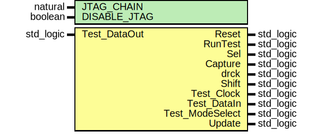

# Entity: xil_BSCAN

## Diagram

## Description

EMACS settings: -*-  tab-width: 2; indent-tabs-mode: t -*-
vim: tabstop=2:shiftwidth=2:noexpandtab
kate: tab-width 2; replace-tabs off; indent-width 2;
=============================================================================
Authors:					Patrick Lehmann
Entity:					JTAG / Boundary Scan wrapper
Description:
-------------------------------------
This module wraps Xilinx "Boundary Scan" (JTAG) primitives in a generic
module. |br|
Supported devices are:
 * Spartan-3, Spartan-6
 * Virtex-5, Virtex-6
 * Series-7 (Artix-7, Kintex-7, Virtex-7, Zynq-7000)
License:
=============================================================================
Copyright 2007-2016 Technische Universitaet Dresden - Germany,
Licensed under the Apache License, Version 2.0 (the "License");
you may not use this file except in compliance with the License.
You may obtain a copy of the License at
Unless required by applicable law or agreed to in writing, software
distributed under the License is distributed on an "AS IS" BASIS,
WITHOUT WARRANTIES OR CONDITIONS OF ANY KIND, either express or implied.
See the License for the specific language governing permissions and
limitations under the License.
=============================================================================
## Generics

| Generic name | Type    | Value | Description |
| ------------ | ------- | ----- | ----------- |
| JTAG_CHAIN   | natural |       |             |
| DISABLE_JTAG | boolean | FALSE |             |
## Ports

| Port name       | Direction | Type      | Description |
| --------------- | --------- | --------- | ----------- |
| Reset           | out       | std_logic |             |
| RunTest         | out       | std_logic |             |
| Sel             | out       | std_logic |             |
| Capture         | out       | std_logic |             |
| drck            | out       | std_logic |             |
| Shift           | out       | std_logic |             |
| Test_Clock      | out       | std_logic |             |
| Test_DataIn     | out       | std_logic |             |
| Test_DataOut    | in        | std_logic |             |
| Test_ModeSelect | out       | std_logic |             |
| Update          | out       | std_logic |             |
## Constants

| Name     | Type          | Value        | Description |
| -------- | ------------- | ------------ | ----------- |
| DEV_INFO | T_DEVICE_INFO |  DEVICE_INFO |             |
