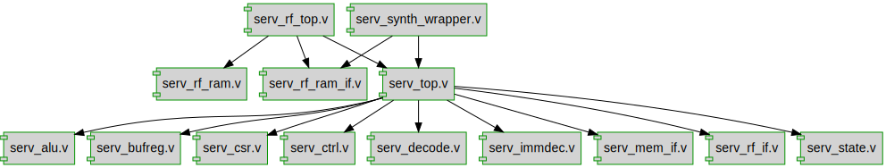

# Documentation for: 

Generated by **TerosHDL** © 2020-2021 License GPLv3 Carlos Alberto Ruiz Naranjo (carlosruiznaranjo@gmail.com) Ismael Perez Rojo (ismaelprojo@gmail.com)  Project revision 2021-07-19 15:07:11  

## Designs

- Module: [serv_alu ](./doc_internal/serv_alu.md)
- Module: [serv_bufreg ](./doc_internal/serv_bufreg.md)
- Module: [serv_csr ](./doc_internal/serv_csr.md)
- Module: [serv_ctrl ](./doc_internal/serv_ctrl.md)
- Module: [serv_decode ](./doc_internal/serv_decode.md)
- Module: [serv_immdec ](./doc_internal/serv_immdec.md)
- Module: [serv_mem_if ](./doc_internal/serv_mem_if.md)
- Module: [serv_rf_if ](./doc_internal/serv_rf_if.md)
- Module: [serv_rf_ram ](./doc_internal/serv_rf_ram.md)
- Module: [serv_rf_top ](./doc_internal/serv_rf_top.md)
- Module: [serv_state ](./doc_internal/serv_state.md)
- Module: [serv_top ](./doc_internal/serv_top.md)

