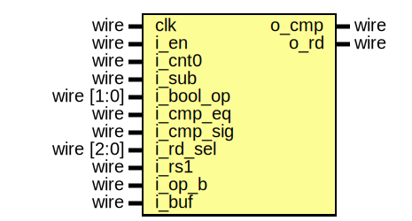

# Entity: serv_alu

## Diagram

## Ports

| Port name | Direction | Type       | Description |
| --------- | --------- | ---------- | ----------- |
| clk       | input     | wire       |             |
| i_en      | input     | wire       |             |
| i_cnt0    | input     | wire       |             |
| o_cmp     | output    | wire       |             |
| i_sub     | input     | wire       |             |
| i_bool_op | input     | wire [1:0] |             |
| i_cmp_eq  | input     | wire       |             |
| i_cmp_sig | input     | wire       |             |
| i_rd_sel  | input     | wire [2:0] |             |
| i_rs1     | input     | wire       |             |
| i_op_b    | input     | wire       |             |
| i_buf     | input     | wire       |             |
| o_rd      | output    | wire       |             |
## Signals

| Name        | Type | Description |
| ----------- | ---- | ----------- |
| result_add  | wire |             |
| cmp_r       | reg  |             |
| add_cy      | wire |             |
| add_cy_r    | reg  |             |
| rs1_sx      | wire |             |
| op_b_sx     | wire |             |
| add_b       | wire |             |
| result_lt   | wire |             |
| result_eq   | wire |             |
| result_bool | wire |             |
## Processes
- unnamed: ( @(posedge clk) )
