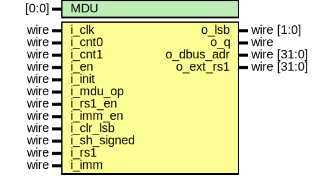

# Entity: serv_bufreg

## Diagram

## Ports

| Port name   | Direction | Type        | Description |
| ----------- | --------- | ----------- | ----------- |
| i_clk       | input     | wire        |             |
| i_cnt0      | input     | wire        |             |
| i_cnt1      | input     | wire        |             |
| i_en        | input     | wire        |             |
| i_init      | input     | wire        |             |
| o_lsb       | output    | [1:0]       |             |
| i_rs1_en    | input     | wire        |             |
| i_imm_en    | input     | wire        |             |
| i_clr_lsb   | input     | wire        |             |
| i_sh_signed | input     | wire        |             |
| i_rs1       | input     | wire        |             |
| i_imm       | input     | wire        |             |
| o_q         | output    | wire        |             |
| o_dbus_adr  | output    | wire [31:0] |             |
## Signals

| Name    | Type       | Description |
| ------- | ---------- | ----------- |
| c       | wire       |             |
| q       | wire       |             |
| c_r     | reg        |             |
| data    | reg [31:2] |             |
| clr_lsb | wire       |             |
## Processes
- unnamed: ( @(posedge i_clk) )
