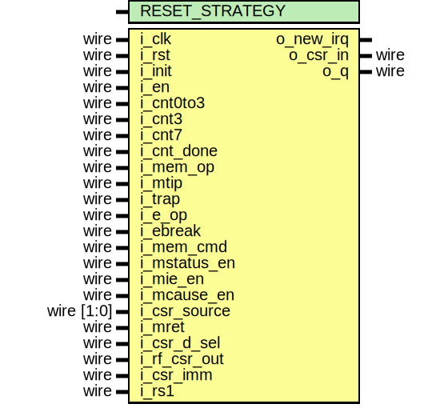

# Entity: serv_csr

- **File**: serv_csr.v
## Diagram

## Generics

| Generic name   | Type | Value  | Description |
| -------------- | ---- | ------ | ----------- |
| RESET_STRATEGY |      | "MINI" |             |
## Ports

| Port name    | Direction | Type       | Description |
| ------------ | --------- | ---------- | ----------- |
| i_clk        | input     | wire       |             |
| i_rst        | input     | wire       |             |
| i_init       | input     | wire       | State       |
| i_en         | input     | wire       |             |
| i_cnt0to3    | input     | wire       |             |
| i_cnt3       | input     | wire       |             |
| i_cnt7       | input     | wire       |             |
| i_cnt_done   | input     | wire       |             |
| i_mem_op     | input     | wire       |             |
| i_mtip       | input     | wire       |             |
| i_trap       | input     | wire       |             |
| o_new_irq    | output    |            |             |
| i_e_op       | input     | wire       | Control     |
| i_ebreak     | input     | wire       |             |
| i_mem_cmd    | input     | wire       |             |
| i_mstatus_en | input     | wire       |             |
| i_mie_en     | input     | wire       |             |
| i_mcause_en  | input     | wire       |             |
| i_csr_source | input     | wire [1:0] |             |
| i_mret       | input     | wire       |             |
| i_csr_d_sel  | input     | wire       |             |
| i_rf_csr_out | input     | wire       | Data        |
| o_csr_in     | output    | wire       |             |
| i_csr_imm    | input     | wire       |             |
| i_rs1        | input     | wire       |             |
| o_q          | output    | wire       |             |
## Signals

| Name         | Type      | Description |
| ------------ | --------- | ----------- |
| mstatus_mie  | reg       |             |
| mstatus_mpie | reg       |             |
| mie_mtie     | reg       |             |
| mcause31     | reg       |             |
| mcause3_0    | reg [3:0] |             |
| mcause       | wire      |             |
| csr_in       | wire      |             |
| csr_out      | wire      |             |
| timer_irq_r  | reg       |             |
| d            | wire      |             |
| timer_irq    | wire      |             |
## Constants

| Name           | Type  | Value | Description |
| -------------- | ----- | ----- | ----------- |
| CSR_SOURCE_CSR | [1:0] | 2'b00 |             |
| CSR_SOURCE_EXT | [1:0] | 2'b01 |             |
| CSR_SOURCE_SET | [1:0] | 2'b10 |             |
| CSR_SOURCE_CLR | [1:0] | 2'b11 |             |
## Processes
- unnamed: ( @(posedge i_clk) )
  - **Type:** always
