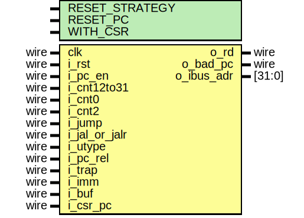

# Entity: serv_ctrl

## Diagram

## Generics

| Generic name   | Type | Value  | Description |
| -------------- | ---- | ------ | ----------- |
| RESET_STRATEGY |      | "MINI" |             |
| RESET_PC       |      | 32'd0  |             |
| WITH_CSR       |      | 1      |             |
## Ports

| Port name     | Direction | Type   | Description |
| ------------- | --------- | ------ | ----------- |
| clk           | input     | wire   |             |
| i_rst         | input     | wire   |             |
| i_pc_en       | input     | wire   |             |
| i_cnt12to31   | input     | wire   |             |
| i_cnt0        | input     | wire   |             |
| i_cnt2        | input     | wire   |             |
| i_jump        | input     | wire   |             |
| i_jal_or_jalr | input     | wire   |             |
| i_utype       | input     | wire   |             |
| i_pc_rel      | input     | wire   |             |
| i_trap        | input     | wire   |             |
| i_imm         | input     | wire   |             |
| i_buf         | input     | wire   |             |
| i_csr_pc      | input     | wire   |             |
| o_rd          | output    | wire   |             |
| o_bad_pc      | output    | wire   |             |
| o_ibus_adr    | output    | [31:0] |             |
## Signals

| Name                   | Type | Description |
| ---------------------- | ---- | ----------- |
| pc_plus_4              | wire |             |
| pc_plus_4_cy           | wire |             |
| pc_plus_4_cy_r         | reg  |             |
| pc_plus_offset         | wire |             |
| pc_plus_offset_cy      | wire |             |
| pc_plus_offset_cy_r    | reg  |             |
| pc_plus_offset_aligned | wire |             |
| plus_4                 | wire |             |
| pc                     | wire |             |
| new_pc                 | wire |             |
| offset_a               | wire |             |
| offset_b               | wire |             |
## Processes
- unnamed: ( @(posedge clk) )
