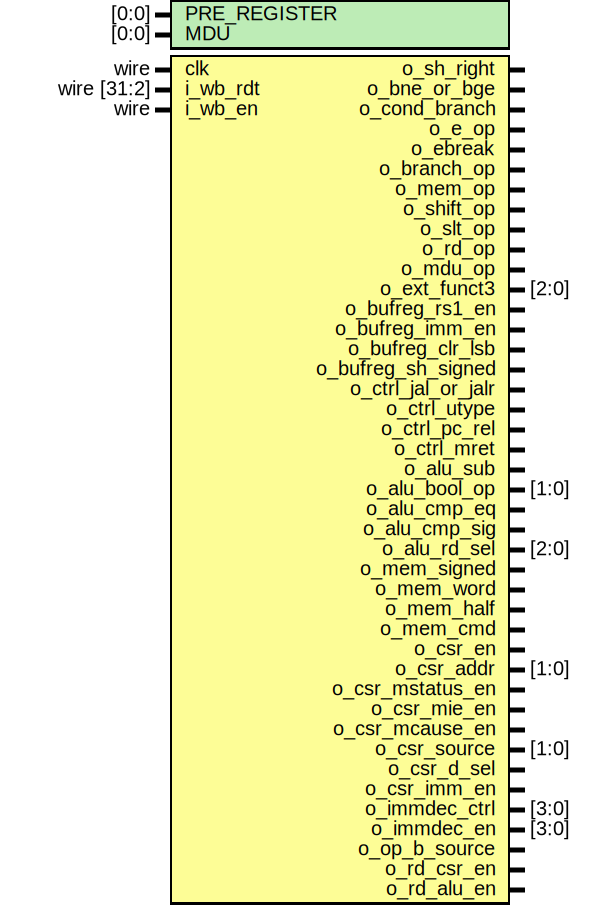

# Entity: serv_decode

- **File**: serv_decode.v
## Diagram

## Generics

| Generic name | Type  | Value | Description |
| ------------ | ----- | ----- | ----------- |
| PRE_REGISTER | [0:0] | 1     |             |
| MDU          | [0:0] | 0     |             |
## Ports

| Port name          | Direction | Type        | Description |
| ------------------ | --------- | ----------- | ----------- |
| clk                | input     | wire        |             |
| i_wb_rdt           | input     | wire [31:2] | Input       |
| i_wb_en            | input     | wire        |             |
| o_sh_right         | output    |             | To state    |
| o_bne_or_bge       | output    |             |             |
| o_cond_branch      | output    |             |             |
| o_e_op             | output    |             |             |
| o_ebreak           | output    |             |             |
| o_branch_op        | output    |             |             |
| o_mem_op           | output    |             |             |
| o_shift_op         | output    |             |             |
| o_slt_op           | output    |             |             |
| o_rd_op            | output    |             |             |
| o_mdu_op           | output    |             | MDU         |
| o_ext_funct3       | output    | [2:0]       | Extension   |
| o_bufreg_rs1_en    | output    |             | To bufreg   |
| o_bufreg_imm_en    | output    |             |             |
| o_bufreg_clr_lsb   | output    |             |             |
| o_bufreg_sh_signed | output    |             |             |
| o_ctrl_jal_or_jalr | output    |             | To ctrl     |
| o_ctrl_utype       | output    |             |             |
| o_ctrl_pc_rel      | output    |             |             |
| o_ctrl_mret        | output    |             |             |
| o_alu_sub          | output    |             | To alu      |
| o_alu_bool_op      | output    | [1:0]       |             |
| o_alu_cmp_eq       | output    |             |             |
| o_alu_cmp_sig      | output    |             |             |
| o_alu_rd_sel       | output    | [2:0]       |             |
| o_mem_signed       | output    |             | To mem IF   |
| o_mem_word         | output    |             |             |
| o_mem_half         | output    |             |             |
| o_mem_cmd          | output    |             |             |
| o_csr_en           | output    |             | To CSR      |
| o_csr_addr         | output    | [1:0]       |             |
| o_csr_mstatus_en   | output    |             |             |
| o_csr_mie_en       | output    |             |             |
| o_csr_mcause_en    | output    |             |             |
| o_csr_source       | output    | [1:0]       |             |
| o_csr_d_sel        | output    |             |             |
| o_csr_imm_en       | output    |             |             |
| o_immdec_ctrl      | output    | [3:0]       | To top      |
| o_immdec_en        | output    | [3:0]       |             |
| o_op_b_source      | output    |             |             |
| o_rd_csr_en        | output    |             |             |
| o_rd_alu_en        | output    |             |             |
## Signals

| Name                | Type       | Description                                                                                                                                                                                                                                                                                                                                                                                                                                                                                                                                                                                                                                                                                                                                           |
| ------------------- | ---------- | ----------------------------------------------------------------------------------------------------------------------------------------------------------------------------------------------------------------------------------------------------------------------------------------------------------------------------------------------------------------------------------------------------------------------------------------------------------------------------------------------------------------------------------------------------------------------------------------------------------------------------------------------------------------------------------------------------------------------------------------------------- |
| opcode              | reg [4:0]  |                                                                                                                                                                                                                                                                                                                                                                                                                                                                                                                                                                                                                                                                                                                                                       |
| funct3              | reg [2:0]  |                                                                                                                                                                                                                                                                                                                                                                                                                                                                                                                                                                                                                                                                                                                                                       |
| op20                | reg        |                                                                                                                                                                                                                                                                                                                                                                                                                                                                                                                                                                                                                                                                                                                                                       |
| op21                | reg        |                                                                                                                                                                                                                                                                                                                                                                                                                                                                                                                                                                                                                                                                                                                                                       |
| op22                | reg        |                                                                                                                                                                                                                                                                                                                                                                                                                                                                                                                                                                                                                                                                                                                                                       |
| op26                | reg        |                                                                                                                                                                                                                                                                                                                                                                                                                                                                                                                                                                                                                                                                                                                                                       |
| imm25               | reg        |                                                                                                                                                                                                                                                                                                                                                                                                                                                                                                                                                                                                                                                                                                                                                       |
| imm30               | reg        |                                                                                                                                                                                                                                                                                                                                                                                                                                                                                                                                                                                                                                                                                                                                                       |
| op_or_opimm         | wire       | opcode                                                                                                                                                                                                                                                                                                                                                                                                                                                                                                                                                                                                                                                                                                                                                |
| co_mem_op           | wire       |                                                                                                                                                                                                                                                                                                                                                                                                                                                                                                                                                                                                                                                                                                                                                       |
| co_branch_op        | wire       |                                                                                                                                                                                                                                                                                                                                                                                                                                                                                                                                                                                                                                                                                                                                                       |
| co_bufreg_rs1_en    | wire       | jal,branch =     imm jalr       = rs1+imm mem        = rs1+imm shift      = rs1                                                                                                                                                                                                                                                                                                                                                                                                                                                                                                                                                                                                                                                                       |
| co_bufreg_imm_en    | wire       |                                                                                                                                                                                                                                                                                                                                                                                                                                                                                                                                                                                                                                                                                                                                                       |
| co_bufreg_clr_lsb   | wire       | Clear LSB of immediate for BRANCH and JAL ops True for BRANCH and JAL False for JALR/LOAD/STORE/OP/OPIMM?                                                                                                                                                                                                                                                                                                                                                                                                                                                                                                                                                                                                                                             |
| co_cond_branch      | wire       | Conditional branch True for BRANCH False for JAL/JALR                                                                                                                                                                                                                                                                                                                                                                                                                                                                                                                                                                                                                                                                                                 |
| co_ctrl_utype       | wire       |                                                                                                                                                                                                                                                                                                                                                                                                                                                                                                                                                                                                                                                                                                                                                       |
| co_ctrl_jal_or_jalr | wire       |                                                                                                                                                                                                                                                                                                                                                                                                                                                                                                                                                                                                                                                                                                                                                       |
| co_ctrl_pc_rel      | wire       | PC-relative operations True for jal, b* auipc False for jalr, lui                                                                                                                                                                                                                                                                                                                                                                                                                                                                                                                                                                                                                                                                                     |
| co_rd_op            | wire       | Write to RD True for OP-IMM, AUIPC, OP, LUI, SYSTEM, JALR, JAL, LOAD False for STORE, BRANCH, MISC-MEM                                                                                                                                                                                                                                                                                                                                                                                                                                                                                                                                                                                                                                                |
| co_sh_right         | wire       |  funct3                                                                                                                                                                                                                                                                                                                                                                                                                                                                                                                                                                                                                                                                                                                                            |
| co_bne_or_bge       | wire       |                                                                                                                                                                                                                                                                                                                                                                                                                                                                                                                                                                                                                                                                                                                                                       |
| csr_op              | wire       | Matches system ops except eceall/ebreak/mret                                                                                                                                                                                                                                                                                                                                                                                                                                                                                                                                                                                                                                                                                                          |
| co_ebreak           | wire       | op20                                                                                                                                                                                                                                                                                                                                                                                                                                                                                                                                                                                                                                                                                                                                                  |
| co_ctrl_mret        | wire       | opcode & funct3 & op21                                                                                                                                                                                                                                                                                                                                                                                                                                                                                                                                                                                                                                                                                                                                |
| co_e_op             | wire       | Matches system opcodes except CSR accesses (funct3 == 0) and mret (!op21)                                                                                                                                                                                                                                                                                                                                                                                                                                                                                                                                                                                                                                                                             |
| co_bufreg_sh_signed | wire       | opcode & funct3 & imm30                                                                                                                                                                                                                                                                                                                                                                                                                                                                                                                                                                                                                                                                                                                               |
| co_alu_sub          | wire       |      True for sub, b*, slt*     False for add*     op    opcode f3  i30     b*    11000  xxx x   t     addi  00100  000 x   f     slt*  0x100  01x x   t     add   01100  000 0   f     sub   01100  000 1   t     */                                                                                                                                                                                                                                                                                                                                                                                                                                                                                                                                 |
| csr_valid           | wire       |      Bits 26, 22, 21 and 20 are enough to uniquely identify the eight supported CSR regs     mtvec, mscratch, mepc and mtval are stored externally (normally in the RF) and are     treated differently from mstatus, mie and mcause which are stored in serv_csr.      The former get a 2-bit address as seen below while the latter get a     one-hot enable signal each.      Hex|2 222|Reg     |csr     adr|6 210|name    |addr     ---|-----|--------|----     300|0_000|mstatus | xx     304|0_100|mie     | xx     305|0_101|mtvec   | 01     340|1_000|mscratch| 00     341|1_001|mepc    | 10     342|1_010|mcause  | xx     343|1_011|mtval   | 11      */ true  for mtvec,mscratch,mepc and mtval false for mstatus, mie, mcause  |
| co_rd_csr_en        | wire       |                                                                                                                                                                                                                                                                                                                                                                                                                                                                                                                                                                                                                                                                                                                                                       |
| co_csr_en           | wire       |                                                                                                                                                                                                                                                                                                                                                                                                                                                                                                                                                                                                                                                                                                                                                       |
| co_csr_mstatus_en   | wire       |                                                                                                                                                                                                                                                                                                                                                                                                                                                                                                                                                                                                                                                                                                                                                       |
| co_csr_mie_en       | wire       |                                                                                                                                                                                                                                                                                                                                                                                                                                                                                                                                                                                                                                                                                                                                                       |
| co_csr_mcause_en    | wire       |                                                                                                                                                                                                                                                                                                                                                                                                                                                                                                                                                                                                                                                                                                                                                       |
| co_csr_source       | wire [1:0] |                                                                                                                                                                                                                                                                                                                                                                                                                                                                                                                                                                                                                                                                                                                                                       |
| co_csr_d_sel        | wire       |                                                                                                                                                                                                                                                                                                                                                                                                                                                                                                                                                                                                                                                                                                                                                       |
| co_csr_imm_en       | wire       |                                                                                                                                                                                                                                                                                                                                                                                                                                                                                                                                                                                                                                                                                                                                                       |
| co_csr_addr         | wire [1:0] |                                                                                                                                                                                                                                                                                                                                                                                                                                                                                                                                                                                                                                                                                                                                                       |
| co_alu_cmp_eq       | wire       |                                                                                                                                                                                                                                                                                                                                                                                                                                                                                                                                                                                                                                                                                                                                                       |
| co_alu_cmp_sig      | wire       |                                                                                                                                                                                                                                                                                                                                                                                                                                                                                                                                                                                                                                                                                                                                                       |
| co_mem_cmd          | wire       |                                                                                                                                                                                                                                                                                                                                                                                                                                                                                                                                                                                                                                                                                                                                                       |
| co_mem_signed       | wire       |                                                                                                                                                                                                                                                                                                                                                                                                                                                                                                                                                                                                                                                                                                                                                       |
| co_mem_half         | wire       |                                                                                                                                                                                                                                                                                                                                                                                                                                                                                                                                                                                                                                                                                                                                                       |
| co_alu_bool_op      | wire [1:0] |                                                                                                                                                                                                                                                                                                                                                                                                                                                                                                                                                                                                                                                                                                                                                       |
| co_immdec_ctrl      | wire [3:0] |                                                                                                                                                                                                                                                                                                                                                                                                                                                                                                                                                                                                                                                                                                                                                       |
| co_immdec_en        | wire [3:0] |                                                                                                                                                                                                                                                                                                                                                                                                                                                                                                                                                                                                                                                                                                                                                       |
| co_alu_rd_sel       | wire [2:0] | B     S                                                                                                                                                                                                                                                                                                                                                                                                                                                                                                                                                                                                                                                                                                                                               |
| co_op_b_source      | wire       | Bool 0 (OP_B_SOURCE_IMM) when OPIMM 1 (OP_B_SOURCE_RS2) when BRANCH or OP                                                                                                                                                                                                                                                                                                                                                                                                                                                                                                                                                                                                                                                                             |
