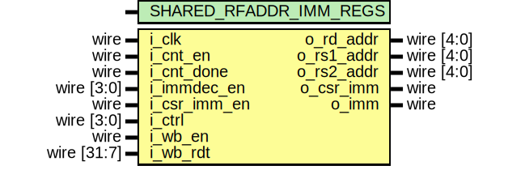

# Entity: serv_immdec

- **File**: serv_immdec.v
## Diagram

## Generics

| Generic name           | Type | Value | Description |
| ---------------------- | ---- | ----- | ----------- |
| SHARED_RFADDR_IMM_REGS |      | 1     |             |
## Ports

| Port name    | Direction | Type        | Description |
| ------------ | --------- | ----------- | ----------- |
| i_clk        | input     | wire        |             |
| i_cnt_en     | input     | wire        |             |
| i_cnt_done   | input     | wire        |             |
| i_immdec_en  | input     | wire [3:0]  |             |
| i_csr_imm_en | input     | wire        |             |
| i_ctrl       | input     | wire [3:0]  |             |
| o_rd_addr    | output    | wire [4:0]  |             |
| o_rs1_addr   | output    | wire [4:0]  |             |
| o_rs2_addr   | output    | wire [4:0]  |             |
| o_csr_imm    | output    | wire        |             |
| o_imm        | output    | wire        |             |
| i_wb_en      | input     | wire        |             |
| i_wb_rdt     | input     | wire [31:7] |             |
## Signals

| Name        | Type      | Description |
| ----------- | --------- | ----------- |
| signbit     | reg       |             |
| imm19_12_20 | reg [8:0] |             |
| imm7        | reg       |             |
| imm30_25    | reg [5:0] |             |
| imm24_20    | reg [4:0] |             |
| imm11_7     | reg [4:0] |             |
