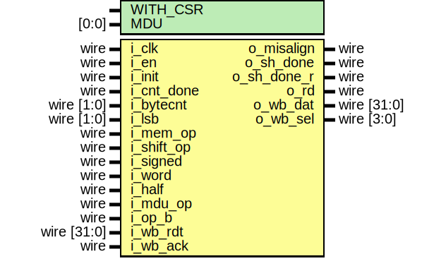

# Entity: serv_mem_if

## Diagram

## Generics

| Generic name | Type | Value | Description |
| ------------ | ---- | ----- | ----------- |
| WITH_CSR     |      | 1     |             |
## Ports

| Port name   | Direction | Type        | Description |
| ----------- | --------- | ----------- | ----------- |
| i_clk       | input     | wire        |             |
| i_en        | input     | wire        |             |
| i_init      | input     | wire        |             |
| i_cnt_done  | input     | wire        |             |
| i_bytecnt   | input     | wire [1:0]  |             |
| i_lsb       | input     | wire [1:0]  |             |
| o_misalign  | output    | wire        |             |
| o_sh_done   | output    | wire        |             |
| o_sh_done_r | output    | wire        |             |
| i_mem_op    | input     | wire        |             |
| i_shift_op  | input     | wire        |             |
| i_signed    | input     | wire        |             |
| i_word      | input     | wire        |             |
| i_half      | input     | wire        |             |
| i_op_b      | input     | wire        |             |
| o_rd        | output    | wire        |             |
| o_wb_dat    | output    | wire [31:0] |             |
| o_wb_sel    | output    | wire [3:0]  |             |
| i_wb_rdt    | input     | wire [31:0] |             |
| i_wb_ack    | input     | wire        |             |
## Signals

| Name       | Type       | Description                                                                                                                                                                                                                                                                                                                                                                                                                                                                                                                                                                                                                                                                                                                                      |
| ---------- | ---------- | ------------------------------------------------------------------------------------------------------------------------------------------------------------------------------------------------------------------------------------------------------------------------------------------------------------------------------------------------------------------------------------------------------------------------------------------------------------------------------------------------------------------------------------------------------------------------------------------------------------------------------------------------------------------------------------------------------------------------------------------------ |
| signbit    | reg        |                                                                                                                                                                                                                                                                                                                                                                                                                                                                                                                                                                                                                                                                                                                                                  |
| dat        | reg [31:0] |                                                                                                                                                                                                                                                                                                                                                                                                                                                                                                                                                                                                                                                                                                                                                  |
| byte_valid | wire       |                                                                                                                                                                                                                                                                                                                                                                                                                                                                                                                                                                                                                                                                                                                                                  |
| dat_en     | wire       |                                                                                                                                                                                                                                                                                                                                                                                                                                                                                                                                                                                                                                                                                                                                                  |
| dat_cur    | wire       |                                                                                                                                                                                                                                                                                                                                                                                                                                                                                                                                                                                                                                                                                                                                                  |
| dat_valid  | wire       |                                                                                                                                                                                                                                                                                                                                                                                                                                                                                                                                                                                                                                                                                                                                                  |
| dat_shamt  | wire [5:0] | The dat register has three different use cases for store, load and     shift operations.     store : Data to be written is shifted to the correct position in dat during             init by dat_en and is presented on the data bus as o_wb_dat     load  : Data from the bus gets latched into dat during i_wb_ack and is then             shifted out at the appropriate time to end up in the correct             position in rd     shift : Data is shifted in during init. After that, the six LSB are used as             a downcounter (with bit 5 initially set to 0) that triggers             o_sh_done and o_sh_done_r when they wrap around to indicate that             the requested number of shifts have been performed     */  |
## Processes
- unnamed: ( @(posedge i_clk) )
