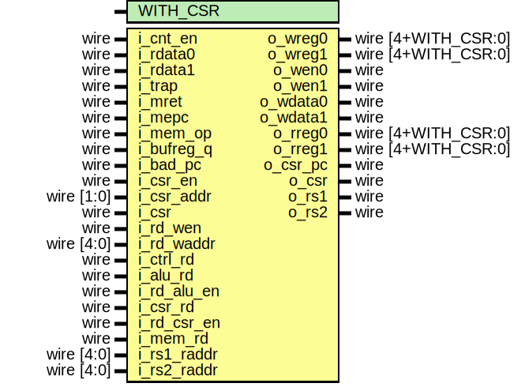

# Entity: serv_rf_if

- **File**: serv_rf_if.v
## Diagram

## Generics

| Generic name | Type | Value | Description |
| ------------ | ---- | ----- | ----------- |
| WITH_CSR     |      | 1     |             |
## Ports

| Port name   | Direction | Type                | Description    |
| ----------- | --------- | ------------------- | -------------- |
| i_cnt_en    | input     | wire                | RF Interface   |
| o_wreg0     | output    | wire [4+WITH_CSR:0] |                |
| o_wreg1     | output    | wire [4+WITH_CSR:0] |                |
| o_wen0      | output    | wire                |                |
| o_wen1      | output    | wire                |                |
| o_wdata0    | output    | wire                |                |
| o_wdata1    | output    | wire                |                |
| o_rreg0     | output    | wire [4+WITH_CSR:0] |                |
| o_rreg1     | output    | wire [4+WITH_CSR:0] |                |
| i_rdata0    | input     | wire                |                |
| i_rdata1    | input     | wire                |                |
| i_trap      | input     | wire                | Trap interface |
| i_mret      | input     | wire                |                |
| i_mepc      | input     | wire                |                |
| i_mem_op    | input     | wire                |                |
| i_bufreg_q  | input     | wire                |                |
| i_bad_pc    | input     | wire                |                |
| o_csr_pc    | output    | wire                |                |
| i_csr_en    | input     | wire                | CSR interface  |
| i_csr_addr  | input     | wire [1:0]          |                |
| i_csr       | input     | wire                |                |
| o_csr       | output    | wire                |                |
| i_rd_wen    | input     | wire                | RD write port  |
| i_rd_waddr  | input     | wire [4:0]          |                |
| i_ctrl_rd   | input     | wire                |                |
| i_alu_rd    | input     | wire                |                |
| i_rd_alu_en | input     | wire                |                |
| i_csr_rd    | input     | wire                |                |
| i_rd_csr_en | input     | wire                |                |
| i_mem_rd    | input     | wire                |                |
| i_rs1_raddr | input     | wire [4:0]          | RS1 read port  |
| o_rs1       | output    | wire                |                |
| i_rs2_raddr | input     | wire [4:0]          | RS2 read port  |
| o_rs2       | output    | wire                |                |
## Signals

| Name   | Type | Description                                    |
| ------ | ---- | ---------------------------------------------- |
| rd_wen | wire |      ********** Write side ***********     */  |
