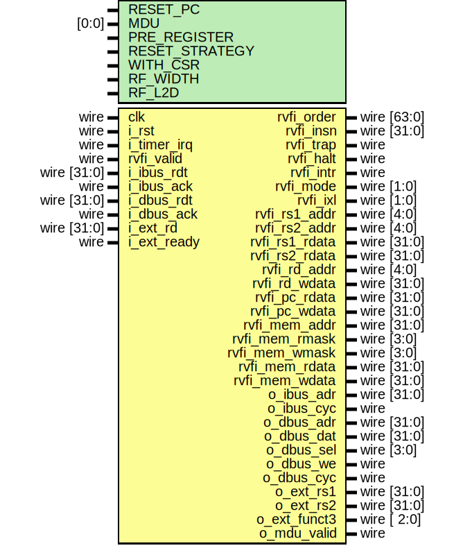

# Entity: serv_rf_top

- **File**: serv_rf_top.v
## Diagram

## Generics

| Generic name   | Type  | Value                                 | Description                                                                                                                                                                                                                                                                                                                                  |
| -------------- | ----- | ------------------------------------- | -------------------------------------------------------------------------------------------------------------------------------------------------------------------------------------------------------------------------------------------------------------------------------------------------------------------------------------------- |
| RESET_PC       |       | 32'd0                                 |                                                                                                                                                                                                                                                                                                                                              |
| MDU            | [0:0] | 0                                     |  Multiplication and Division Unit        This parameter enables the interface for connecting SERV and MDU     */                                                                                                                                                                                                                             |
| PRE_REGISTER   |       | 1                                     |  Register signals before or after the decoder        0 : Register after the decoder. Faster but uses more resources        1 : (default) Register before the decoder. Slower but uses less resources      */                                                                                                                                 |
| RESET_STRATEGY |       | "MINI"                                |  Amount of reset applied to design        "NONE" : No reset at all. Relies on a POR to set correct initialization                  values and that core isn't reset during runtime        "MINI" : Standard setting. Resets the minimal amount of FFs needed to                  restart execution from the instruction at RESET_PC      */  |
| WITH_CSR       |       | 1                                     |                                                                                                                                                                                                                                                                                                                                              |
| RF_WIDTH       |       | 2                                     |                                                                                                                                                                                                                                                                                                                                              |
| RF_L2D         |       | $clog2((32+(WITH_CSR*4))*32/RF_WIDTH) |                                                                                                                                                                                                                                                                                                                                              |
## Ports

| Port name      | Direction | Type        | Description |
| -------------- | --------- | ----------- | ----------- |
| clk            | input     | wire        |             |
| i_rst          | input     | wire        |             |
| i_timer_irq    | input     | wire        |             |
| rvfi_valid     | input     | wire        |             |
| rvfi_order     | output    | wire [63:0] |             |
| rvfi_insn      | output    | wire [31:0] |             |
| rvfi_trap      | output    | wire        |             |
| rvfi_halt      | output    | wire        |             |
| rvfi_intr      | output    | wire        |             |
| rvfi_mode      | output    | wire [1:0]  |             |
| rvfi_ixl       | output    | wire [1:0]  |             |
| rvfi_rs1_addr  | output    | wire [4:0]  |             |
| rvfi_rs2_addr  | output    | wire [4:0]  |             |
| rvfi_rs1_rdata | output    | wire [31:0] |             |
| rvfi_rs2_rdata | output    | wire [31:0] |             |
| rvfi_rd_addr   | output    | wire [4:0]  |             |
| rvfi_rd_wdata  | output    | wire [31:0] |             |
| rvfi_pc_rdata  | output    | wire [31:0] |             |
| rvfi_pc_wdata  | output    | wire [31:0] |             |
| rvfi_mem_addr  | output    | wire [31:0] |             |
| rvfi_mem_rmask | output    | wire [3:0]  |             |
| rvfi_mem_wmask | output    | wire [3:0]  |             |
| rvfi_mem_rdata | output    | wire [31:0] |             |
| rvfi_mem_wdata | output    | wire [31:0] |             |
| o_ibus_adr     | output    | wire [31:0] |             |
| o_ibus_cyc     | output    | wire        |             |
| i_ibus_rdt     | input     | wire [31:0] |             |
| i_ibus_ack     | input     | wire        |             |
| o_dbus_adr     | output    | wire [31:0] |             |
| o_dbus_dat     | output    | wire [31:0] |             |
| o_dbus_sel     | output    | wire [3:0]  |             |
| o_dbus_we      | output    | wire        |             |
| o_dbus_cyc     | output    | wire        |             |
| i_dbus_rdt     | input     | wire [31:0] |             |
| i_dbus_ack     | input     | wire        |             |
| o_ext_rs1      | output    | wire [31:0] |  Extension  |
| o_ext_rs2      | output    | wire [31:0] |             |
| o_ext_funct3   | output    | wire [ 2:0] |             |
| i_ext_rd       | input     | wire [31:0] |             |
| i_ext_ready    | input     | wire        |             |
| o_mdu_valid    | output    | wire        |  MDU        |
## Signals

| Name     | Type                | Description |
| -------- | ------------------- | ----------- |
| rf_wreq  | wire                |             |
| rf_rreq  | wire                |             |
| wreg0    | wire [4+WITH_CSR:0] |             |
| wreg1    | wire [4+WITH_CSR:0] |             |
| wen0     | wire                |             |
| wen1     | wire                |             |
| wdata0   | wire                |             |
| wdata1   | wire                |             |
| rreg0    | wire [4+WITH_CSR:0] |             |
| rreg1    | wire [4+WITH_CSR:0] |             |
| rf_ready | wire                |             |
| rdata0   | wire                |             |
| rdata1   | wire                |             |
| waddr    | wire [RF_L2D-1:0]   |             |
| wdata    | wire [RF_WIDTH-1:0] |             |
| wen      | wire                |             |
| raddr    | wire [RF_L2D-1:0]   |             |
| rdata    | wire [RF_WIDTH-1:0] |             |
## Constants

| Name     | Type | Value      | Description |
| -------- | ---- | ---------- | ----------- |
| CSR_REGS |      | WITH_CSR*4 |             |
## Instantiations

- rf_ram_if: serv_rf_ram_if
- rf_ram: serv_rf_ram
