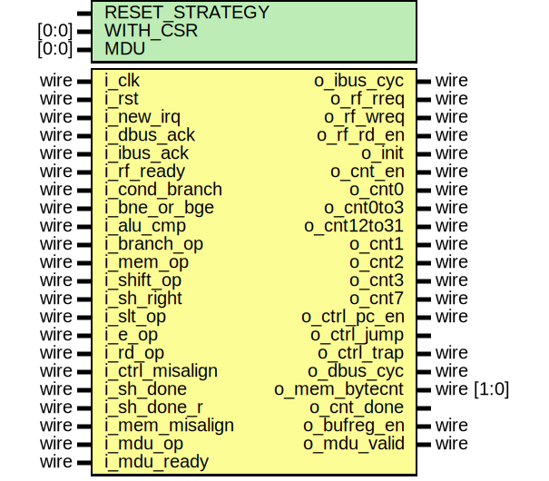

# Entity: serv_state

- **File**: serv_state.v
## Diagram

## Generics

| Generic name   | Type  | Value  | Description |
| -------------- | ----- | ------ | ----------- |
| RESET_STRATEGY |       | "MINI" |             |
| WITH_CSR       | [0:0] | 1      |             |
| MDU            | [0:0] | 0      |             |
## Ports

| Port name       | Direction | Type       | Description |
| --------------- | --------- | ---------- | ----------- |
| i_clk           | input     | wire       |             |
| i_rst           | input     | wire       |             |
| i_new_irq       | input     | wire       |             |
| i_dbus_ack      | input     | wire       |             |
| o_ibus_cyc      | output    | wire       |             |
| i_ibus_ack      | input     | wire       |             |
| o_rf_rreq       | output    | wire       |             |
| o_rf_wreq       | output    | wire       |             |
| i_rf_ready      | input     | wire       |             |
| o_rf_rd_en      | output    | wire       |             |
| i_cond_branch   | input     | wire       |             |
| i_bne_or_bge    | input     | wire       |             |
| i_alu_cmp       | input     | wire       |             |
| i_branch_op     | input     | wire       |             |
| i_mem_op        | input     | wire       |             |
| i_shift_op      | input     | wire       |             |
| i_sh_right      | input     | wire       |             |
| i_slt_op        | input     | wire       |             |
| i_e_op          | input     | wire       |             |
| i_rd_op         | input     | wire       |             |
| o_init          | output    | wire       |             |
| o_cnt_en        | output    | wire       |             |
| o_cnt0          | output    | wire       |             |
| o_cnt0to3       | output    | wire       |             |
| o_cnt12to31     | output    | wire       |             |
| o_cnt1          | output    | wire       |             |
| o_cnt2          | output    | wire       |             |
| o_cnt3          | output    | wire       |             |
| o_cnt7          | output    | wire       |             |
| o_ctrl_pc_en    | output    | wire       |             |
| o_ctrl_jump     | output    |            |             |
| o_ctrl_trap     | output    | wire       |             |
| i_ctrl_misalign | input     | wire       |             |
| i_sh_done       | input     | wire       |             |
| i_sh_done_r     | input     | wire       |             |
| o_dbus_cyc      | output    | wire       |             |
| o_mem_bytecnt   | output    | wire [1:0] |             |
| i_mem_misalign  | input     | wire       |             |
| o_cnt_done      | output    |            |             |
| o_bufreg_en     | output    | wire       |             |
| i_mdu_op        | input     | wire       | MDU         |
| o_mdu_valid     | output    | wire       |             |
| i_mdu_ready     | input     | wire       |             |
## Signals

| Name               | Type      | Description                                                                                                                                                                                                                                                                                                                                                                                                                          |
| ------------------ | --------- | ------------------------------------------------------------------------------------------------------------------------------------------------------------------------------------------------------------------------------------------------------------------------------------------------------------------------------------------------------------------------------------------------------------------------------------ |
| stage_two_req      | reg       |                                                                                                                                                                                                                                                                                                                                                                                                                                      |
| init_done          | reg       |                                                                                                                                                                                                                                                                                                                                                                                                                                      |
| misalign_trap_sync | wire      |                                                                                                                                                                                                                                                                                                                                                                                                                                      |
| two_stage_op       | wire      |                                                                                                                                                                                                                                                                                                                                                                                                                                      |
| o_cnt              | reg [4:2] |                                                                                                                                                                                                                                                                                                                                                                                                                                      |
| o_cnt_r            | reg [3:0] |                                                                                                                                                                                                                                                                                                                                                                                                                                      |
| ibus_cyc           | reg       |                                                                                                                                                                                                                                                                                                                                                                                                                                      |
| take_branch        | wire      | Take branch for jump or branch instructions (opcode == 1x0xx) if a) It's an unconditional branch (opcode[0] == 1) b) It's a conditional branch (opcode[0] == 0) of type beq,blt,bltu (funct3[0] == 0) and ALU compare is true c) It's a conditional branch (opcode[0] == 0) of type bne,bge,bgeu (funct3[0] == 1) and ALU compare is false Only valid during the last cycle of INIT, when the branch condition has been calculated.  |
## Processes
- unnamed: ( @(posedge i_clk) )
  - **Type:** always
