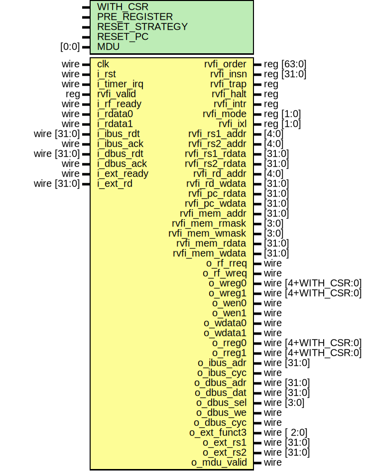

# Entity: serv_top

## Diagram

## Generics

| Generic name   | Type | Value  | Description |
| -------------- | ---- | ------ | ----------- |
| WITH_CSR       |      | 1      |             |
| PRE_REGISTER   |      | 1      |             |
| RESET_STRATEGY |      | "MINI" |             |
| RESET_PC       |      | 32'd0  |             |
## Ports

| Port name      | Direction | Type                | Description |
| -------------- | --------- | ------------------- | ----------- |
| clk            | input     | wire                |             |
| i_rst          | input     | wire                |             |
| i_timer_irq    | input     | wire                |             |
| rvfi_valid     | input     | reg                 |             |
| rvfi_order     | output    | reg [63:0]          |             |
| rvfi_insn      | output    | reg [31:0]          |             |
| rvfi_trap      | output    | reg                 |             |
| rvfi_halt      | output    | reg                 |             |
| rvfi_intr      | output    | reg                 |             |
| rvfi_mode      | output    | reg [1:0]           |             |
| rvfi_ixl       | output    | reg [1:0]           |             |
| rvfi_rs1_addr  | output    | [4:0]               |             |
| rvfi_rs2_addr  | output    | [4:0]               |             |
| rvfi_rs1_rdata | output    | [31:0]              |             |
| rvfi_rs2_rdata | output    | [31:0]              |             |
| rvfi_rd_addr   | output    | [4:0]               |             |
| rvfi_rd_wdata  | output    | [31:0]              |             |
| rvfi_pc_rdata  | output    | [31:0]              |             |
| rvfi_pc_wdata  | output    | [31:0]              |             |
| rvfi_mem_addr  | output    | [31:0]              |             |
| rvfi_mem_rmask | output    | [3:0]               |             |
| rvfi_mem_wmask | output    | [3:0]               |             |
| rvfi_mem_rdata | output    | [31:0]              |             |
| rvfi_mem_wdata | output    | [31:0]              |             |
| o_rf_rreq      | output    | wire                |             |
| o_rf_wreq      | output    | wire                |             |
| i_rf_ready     | input     | wire                |             |
| o_wreg0        | output    | wire [4+WITH_CSR:0] |             |
| o_wreg1        | output    | wire [4+WITH_CSR:0] |             |
| o_wen0         | output    | wire                |             |
| o_wen1         | output    | wire                |             |
| o_wdata0       | output    | wire                |             |
| o_wdata1       | output    | wire                |             |
| o_rreg0        | output    | wire [4+WITH_CSR:0] |             |
| o_rreg1        | output    | wire [4+WITH_CSR:0] |             |
| i_rdata0       | input     | wire                |             |
| i_rdata1       | input     | wire                |             |
| o_ibus_adr     | output    | wire [31:0]         |             |
| o_ibus_cyc     | output    | wire                |             |
| i_ibus_rdt     | input     | wire [31:0]         |             |
| i_ibus_ack     | input     | wire                |             |
| o_dbus_adr     | output    | wire [31:0]         |             |
| o_dbus_dat     | output    | wire [31:0]         |             |
| o_dbus_sel     | output    | wire [3:0]          |             |
| o_dbus_we      | output    | wire                |             |
| o_dbus_cyc     | output    | wire                |             |
| i_dbus_rdt     | input     | wire [31:0]         |             |
| i_dbus_ack     | input     | wire                |             |
## Signals

| Name             | Type       | Description |
| ---------------- | ---------- | ----------- |
| rd_addr          | wire [4:0] |             |
| rs1_addr         | wire [4:0] |             |
| rs2_addr         | wire [4:0] |             |
| immdec_ctrl      | wire [3:0] |             |
| immdec_en        | wire [3:0] |             |
| sh_right         | wire       |             |
| bne_or_bge       | wire       |             |
| cond_branch      | wire       |             |
| e_op             | wire       |             |
| ebreak           | wire       |             |
| branch_op        | wire       |             |
| mem_op           | wire       |             |
| shift_op         | wire       |             |
| slt_op           | wire       |             |
| rd_op            | wire       |             |
| rd_alu_en        | wire       |             |
| rd_csr_en        | wire       |             |
| ctrl_rd          | wire       |             |
| alu_rd           | wire       |             |
| mem_rd           | wire       |             |
| csr_rd           | wire       |             |
| ctrl_pc_en       | wire       |             |
| jump             | wire       |             |
| jal_or_jalr      | wire       |             |
| utype            | wire       |             |
| mret             | wire       |             |
| imm              | wire       |             |
| trap             | wire       |             |
| pc_rel           | wire       |             |
| init             | wire       |             |
| cnt_en           | wire       |             |
| cnt0to3          | wire       |             |
| cnt12to31        | wire       |             |
| cnt0             | wire       |             |
| cnt1             | wire       |             |
| cnt2             | wire       |             |
| cnt3             | wire       |             |
| cnt7             | wire       |             |
| cnt_done         | wire       |             |
| bufreg_en        | wire       |             |
| bufreg_sh_signed | wire       |             |
| bufreg_rs1_en    | wire       |             |
| bufreg_imm_en    | wire       |             |
| bufreg_clr_lsb   | wire       |             |
| bufreg_q         | wire       |             |
| alu_sub          | wire       |             |
| alu_bool_op      | wire [1:0] |             |
| alu_cmp_eq       | wire       |             |
| alu_cmp_sig      | wire       |             |
| alu_cmp          | wire       |             |
| alu_rd_sel       | wire [2:0] |             |
| rs1              | wire       |             |
| rs2              | wire       |             |
| rd_en            | wire       |             |
| op_b_source      | wire       |             |
| mem_signed       | wire       |             |
| mem_word         | wire       |             |
| mem_half         | wire       |             |
| mem_bytecnt      | wire [1:0] |             |
| mem_sh_done      | wire       |             |
| mem_sh_done_r    | wire       |             |
| mem_misalign     | wire       |             |
| bad_pc           | wire       |             |
| csr_mstatus_en   | wire       |             |
| csr_mie_en       | wire       |             |
| csr_mcause_en    | wire       |             |
| csr_source       | wire [1:0] |             |
| csr_imm          | wire       |             |
| csr_d_sel        | wire       |             |
| csr_en           | wire       |             |
| csr_addr         | wire [1:0] |             |
| csr_pc           | wire       |             |
| csr_imm_en       | wire       |             |
| csr_in           | wire       |             |
| rf_csr_out       | wire       |             |
| new_irq          | wire       |             |
| lsb              | wire [1:0] |             |
| op_b             | wire       |             |
| pc               | reg [31:0] |             |
| rs_en            | wire       |             |
## Processes
- unnamed: ( @(posedge clk) )
- unnamed: ( @(o_ibus_adr) )
**Description**
verilator lint_off COMBDLY */

## Instantiations

- state: serv_state
- decode: serv_decode
- immdec: serv_immdec
- bufreg: serv_bufreg
- ctrl: serv_ctrl
- alu: serv_alu
- rf_if: serv_rf_if
- mem_if: serv_mem_if
