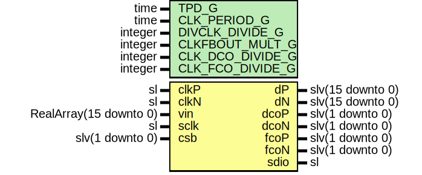

# Entity: Ad9249

- **File**: Ad9249.vhd
## Diagram

## Description

-----------------------------------------------------------------------------
 Company    : SLAC National Accelerator Laboratory
-----------------------------------------------------------------------------
 Description: AD9249 Module
-----------------------------------------------------------------------------
 This file is part of 'SLAC Firmware Standard Library'.
 It is subject to the license terms in the LICENSE.txt file found in the
 top-level directory of this distribution and at:
    https://confluence.slac.stanford.edu/display/ppareg/LICENSE.html.
 No part of 'SLAC Firmware Standard Library', including this file,
 may be copied, modified, propagated, or distributed except according to
 the terms contained in the LICENSE.txt file.
-----------------------------------------------------------------------------
## Generics

| Generic name     | Type    | Value | Description |
| ---------------- | ------- | ----- | ----------- |
| TPD_G            | time    | 1 ns  |             |
| CLK_PERIOD_G     | time    | 24 ns |             |
| DIVCLK_DIVIDE_G  | integer | 1     |             |
| CLKFBOUT_MULT_G  | integer | 49    |             |
| CLK_DCO_DIVIDE_G | integer | 49    |             |
| CLK_FCO_DIVIDE_G | integer | 7     |             |
## Ports

| Port name | Direction | Type                   | Description |
| --------- | --------- | ---------------------- | ----------- |
| clkP      | in        | sl                     |             |
| clkN      | in        | sl                     |             |
| vin       | in        | RealArray(15 downto 0) |             |
| dP        | out       | slv(15 downto 0)       |             |
| dN        | out       | slv(15 downto 0)       |             |
| dcoP      | out       | slv(1 downto 0)        |             |
| dcoN      | out       | slv(1 downto 0)        |             |
| fcoP      | out       | slv(1 downto 0)        |             |
| fcoN      | out       | slv(1 downto 0)        |             |
| sclk      | in        | sl                     |             |
| sdio      | inout     | sl                     |             |
| csb       | in        | slv(1 downto 0)        |             |
## Signals

| Name | Type | Description |
| ---- | ---- | ----------- |
| clk  | sl   |             |
## Instantiations

- CLK_BUFG: IBUFGDS
- U_Ad9249Group_0: surf.Ad9249Group
- U_Ad9249Group_1: surf.Ad9249Group
 **Description**
 [in]

