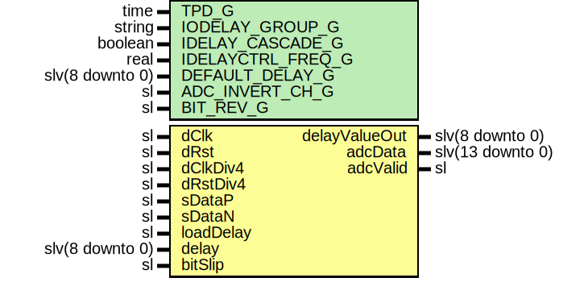

# Entity: Ad9249Deserializer

- **File**: Ad9249Deserializer.vhd
## Diagram

## Description

-----------------------------------------------------------------------------
 Company    : SLAC National Accelerator Laboratory
-----------------------------------------------------------------------------
 Description:
 ADC Readout Controller
 Receives ADC Data from an AD9592 chip.
 Designed specifically for Xilinx 7 series FPGAs
-----------------------------------------------------------------------------
 This file is part of 'SLAC Firmware Standard Library'.
 It is subject to the license terms in the LICENSE.txt file found in the
 top-level directory of this distribution and at:
    https://confluence.slac.stanford.edu/display/ppareg/LICENSE.html.
 No part of 'SLAC Firmware Standard Library', including this file,
 may be copied, modified, propagated, or distributed except according to
 the terms contained in the LICENSE.txt file.
-----------------------------------------------------------------------------
## Generics

| Generic name      | Type            | Value           | Description |
| ----------------- | --------------- | --------------- | ----------- |
| TPD_G             | time            | 1 ns            |             |
| IODELAY_GROUP_G   | string          | "DEFAULT_GROUP" |             |
| IDELAY_CASCADE_G  | boolean         | false           |             |
| IDELAYCTRL_FREQ_G | real            | 300.0           |             |
| DEFAULT_DELAY_G   | slv(8 downto 0) | (others => '0') |             |
| ADC_INVERT_CH_G   | sl              | '0'             |             |
| BIT_REV_G         | sl              | '0'             |             |
## Ports

| Port name     | Direction | Type             | Description                      |
| ------------- | --------- | ---------------- | -------------------------------- |
| dClk          | in        | sl               |  Data clock                      |
| dRst          | in        | sl               |  Data reset                      |
| dClkDiv4      | in        | sl               |                                  |
| dRstDiv4      | in        | sl               |                                  |
| sDataP        | in        | sl               |  Frame clock                     |
| sDataN        | in        | sl               |                                  |
| loadDelay     | in        | sl               | Signal to control data gearboxes |
| delay         | in        | slv(8 downto 0)  |                                  |
| delayValueOut | out       | slv(8 downto 0)  |                                  |
| bitSlip       | in        | sl               |  dClkDiv4 domain                 |
| adcData       | out       | slv(13 downto 0) |  dClkDiv4 domain                 |
| adcValid      | out       | sl               |  dClkDiv4 domain                 |
## Signals

| Name            | Type             | Description      |
| --------------- | ---------------- | ---------------- |
| sDataPadP       | sl               |  Local signals   |
| sDataPadN       | sl               |                  |
| sData_i         | sl               |                  |
| sData_d         | sl               |                  |
| masterCntValue1 | slv(8 downto 0)  |  idelay signals  |
| masterCntValue2 | slv(8 downto 0)  |                  |
| cascOut         | sl               |                  |
| cascRet         | sl               |                  |
| masterData      | slv(7 downto 0)  |  iserdes signal  |
| iAdcData        | slv(13 downto 0) |                  |
## Constants

| Name      | Type   | Value                                                                                                            | Description                                                                                                                                                                                                                     |
| --------- | ------ | ---------------------------------------------------------------------------------------------------------------- | ------------------------------------------------------------------------------------------------------------------------------------------------------------------------------------------------------------------------------- |
| CASCADE_C | string |  ite(IDELAY_CASCADE_G,  "MASTER",  "NONE") | -----------------------------------------------------------------------------------------------  ADC Readout Clocked Registers -----------------------------------------------------------------------------------------------  |
## Instantiations

- U_IBUFDS_sData: IBUFDS_DIFF_OUT
- U_IDELAYE3_0: surf.Idelaye3Wrapper
**Description**
--------------------------------------------------------------------------
 idelay3
--------------------------------------------------------------------------

- U_ISERDESE3_master: ISERDESE3
**Description**
--------------------------------------------------------------------------
 iserdes3
--------------------------------------------------------------------------

- U_Gearbox: surf.Gearbox
