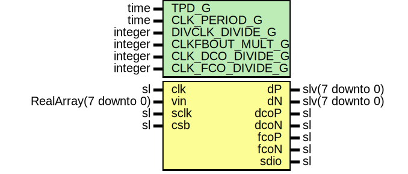

# Entity: Ad9249Group

- **File**: Ad9249Group.vhd
## Diagram

## Description

-----------------------------------------------------------------------------
 Company    : SLAC National Accelerator Laboratory
-----------------------------------------------------------------------------
 Description: AD9249 Group Module
-----------------------------------------------------------------------------
 This file is part of 'SLAC Firmware Standard Library'.
 It is subject to the license terms in the LICENSE.txt file found in the
 top-level directory of this distribution and at:
    https://confluence.slac.stanford.edu/display/ppareg/LICENSE.html.
 No part of 'SLAC Firmware Standard Library', including this file,
 may be copied, modified, propagated, or distributed except according to
 the terms contained in the LICENSE.txt file.
-----------------------------------------------------------------------------
## Generics

| Generic name     | Type    | Value | Description |
| ---------------- | ------- | ----- | ----------- |
| TPD_G            | time    | 1 ns  |             |
| CLK_PERIOD_G     | time    | 24 ns |             |
| DIVCLK_DIVIDE_G  | integer | 1     |             |
| CLKFBOUT_MULT_G  | integer | 49    |             |
| CLK_DCO_DIVIDE_G | integer | 49    |             |
| CLK_FCO_DIVIDE_G | integer | 7     |             |
## Ports

| Port name | Direction | Type                  | Description |
| --------- | --------- | --------------------- | ----------- |
| clk       | in        | sl                    |             |
| vin       | in        | RealArray(7 downto 0) |             |
| dP        | out       | slv(7 downto 0)       |             |
| dN        | out       | slv(7 downto 0)       |             |
| dcoP      | out       | sl                    |             |
| dcoN      | out       | sl                    |             |
| fcoP      | out       | sl                    |             |
| fcoN      | out       | sl                    |             |
| sclk      | in        | sl                    |             |
| sdio      | inout     | sl                    |             |
| csb       | in        | sl                    |             |
## Signals

| Name      | Type             | Description                                                                                                                                                                                                                                                                            |
| --------- | ---------------- | -------------------------------------------------------------------------------------------------------------------------------------------------------------------------------------------------------------------------------------------------------------------------------------- |
| wrEn      | sl               |  ConfigSlave signals                                                                                                                                                                                                                                                                   |
| addr      | slv(12 downto 0) |                                                                                                                                                                                                                                                                                        |
| wrData    | slv(31 downto 0) |                                                                                                                                                                                                                                                                                        |
| byteValid | slv(3 downto 0)  |                                                                                                                                                                                                                                                                                        |
| r         | ConfigRegType    |                                                                                                                                                                                                                                                                                        |
| rin       | ConfigRegType    |                                                                                                                                                                                                                                                                                        |
| adcR      | AdcRegType       |                                                                                                                                                                                                                                                                                        |
| adcRin    | AdcRegType       |                                                                                                                                                                                                                                                                                        |
| pllRst    | sl               | -----------------------------------------------------------------------------------------------  Output constants and signals -----------------------------------------------------------------------------------------------    constant DCLK_PERIOD_C : time := CLK_PERIOD_G / 7.0;  |
| locked    | sl               |                                                                                                                                                                                                                                                                                        |
| rst       | sl               |                                                                                                                                                                                                                                                                                        |
| dClk      | sl               |                                                                                                                                                                                                                                                                                        |
| fClk      | sl               |                                                                                                                                                                                                                                                                                        |
| dco       | sl               |                                                                                                                                                                                                                                                                                        |
| fco       | sl               |                                                                                                                                                                                                                                                                                        |
| serData   | slv(7 downto 0)  |                                                                                                                                                                                                                                                                                        |
| cfgClk    | sl               |                                                                                                                                                                                                                                                                                        |
## Constants

| Name                  | Type              | Value                                                                                                                                                                                                                                                                                                                                                                                                                                                                                                                                                                                                                                                                                                                                                                                                                                                                                                                                                                                                                                                                                                       | Description |
| --------------------- | ----------------- | ----------------------------------------------------------------------------------------------------------------------------------------------------------------------------------------------------------------------------------------------------------------------------------------------------------------------------------------------------------------------------------------------------------------------------------------------------------------------------------------------------------------------------------------------------------------------------------------------------------------------------------------------------------------------------------------------------------------------------------------------------------------------------------------------------------------------------------------------------------------------------------------------------------------------------------------------------------------------------------------------------------------------------------------------------------------------------------------------------------- | ----------- |
| CLK_PERIOD_C          | real              |  real(CLK_PERIOD_G / 1 ns)                                                                                                                                                                                                                                                                                                                                                                                                                                                                                                                                                                                                                                                                                                                                                                                                                                                                                                                                                                                                                                                                                  |             |
| PN_SHORT_TAPS_C       | NaturalArray      |  (0 => 4,  1 => 8)                                                                                                                                                                                                                                                                                                                                                                                                                                                                                                                                                                                                                                                                                                                                                                                                                                                                                                                                                                                                                                                       |  X9+X5+1    |
| PN_SHORT_INIT_C       | slv(8 downto 0)   |  "011011111"                                                                                                                                                                                                                                                                                                                                                                                                                                                                                                                                                                                                                                                                                                                                                                                                                                                                                                                                                                                                                                                                                                |             |
| PN_LONG_TAPS_C        | NaturalArray      |  (0 => 16,  1 => 22)                                                                                                                                                                                                                                                                                                                                                                                                                                                                                                                                                                                                                                                                                                                                                                                                                                                                                                                                                                                                                                                     |  X23+X18+1  |
| PN_LONG_INIT_C        | slv(22 downto 0)  |  "01001101110000000101000"                                                                                                                                                                                                                                                                                                                                                                                                                                                                                                                                                                                                                                                                                                                                                                                                                                                                                                                                                                                                                                                                                  |             |
| GLOBAL_CONFIG_INIT_C  | GlobalConfigType  |  (       pdwnMode          => "000",        pdwnPin           => '0',        stabilizer        => '1',        clockDivRatio     => "000",        outputLvds        => '0',        outputInvert      => '0',        binFormat         => "00",        termination       => "00",        driveStrength     => '0',        lsbFirst          => '0',        lowRate           => '0',        bits              => "000",        fullScaleAdj      => "100",        sampleRate        => "000",        resolution        => "00",        resSampleOverride => '0') |             |
| CHANNEL_CONFIG_INIT_C | ChannelConfigType |  (       pn23            => PN_LONG_INIT_C,        resetPnLongGen  => '0',        pn9             => PN_SHORT_INIT_C,        resetPnShortGen => '0',        userTestMode    => "00",        outputTestMode  => "0000",        outputPhase     => "0011",        userPattern1    => X"0000",        userPattern2    => X"0000",        outputReset     => '0',        powerDown       => '0',        chopMode        => '0',        offsetAdjust    => X"00")                                                                                                                                                                                                            |             |
| CONFIG_REG_INIT_C     | ConfigRegType     |  (       rdData          => X"00000000",        lsbFirst        => '0',        softReset       => '0',        channelConfigEn => "1111111111",        global          => GLOBAL_CONFIG_INIT_C,        channel         => (others => CHANNEL_CONFIG_INIT_C))                                                                                                                                                                                                                                                                                                                                                                                                                                                                                                                                                                                                                                                                  |             |
| ADC_REG_INIT_C        | AdcRegType        |  (       sample => (others => (others => (others => '0'))),        word   => '0')                                                                                                                                                                                                                                                                                                                                                                                                                                                                                                                                                                                                                                                                                                                                                                                                                                                                                                                                                                                        |             |
## Types

| Name               | Type                                                | Description                                                                                      |
| ------------------ | --------------------------------------------------- | ------------------------------------------------------------------------------------------------ |
| GlobalConfigType   |                                                     |                                                                                                  |
| ChannelConfigType  |                                                     |                                                                                                  |
| ChannelConfigArray | array (natural range <>) of ChannelConfigType       |                                                                                                  |
| Slv14x8Array       | array (natural range <>) of Slv14Array(7 downto 0)  |                                                                                                  |
| ConfigRegType      |                                                     |                                                                                                  |
| AdcRegType         |                                                     | -----------------------------------------------------------------------------------------------  |
## Processes
- unnamed: (  )
 **Description**
 [out] -----------------------------------------------------------------------------------------------  Create local clocks -----------------------------------------------------------------------------------------------    ClkRst_1 : entity surf.ClkRst       generic map (          RST_HOLD_TIME_G => 50 us)       port map (          rst => pllRst); 
- comb: ( addr, r, vin, wrData, wrEn )
 **Description**
-----------------------------------------------------------------------------------------------  Configuration register logic ----------------------------------------------------------------------------------------------- 
- seq: ( cfgClk )
- adcComb: ( adcR )
- adcSeq: ( fClk )
## Instantiations

- U_ClkRst_1: surf.ClkRst
- U_CtrlClockManager7: surf.ClockManager7
 **Description**
-----------------------------------------------------------------------------------------------
 Use a clock manager to create the serial clock
 There's probably a better way but this works.
-----------------------------------------------------------------------------------------------

- RstSync_1: surf.RstSync
- AdiConfigSlave_1: surf.AdiConfigSlave
 **Description**
-----------------------------------------------------------------------------------------------
 Instantiate configuration interface
-----------------------------------------------------------------------------------------------

- FCLK_OUT_BUFF: surf.ClkOutBufDiff
- DCLK_OUT_BUFF: surf.ClkOutBufDiff
