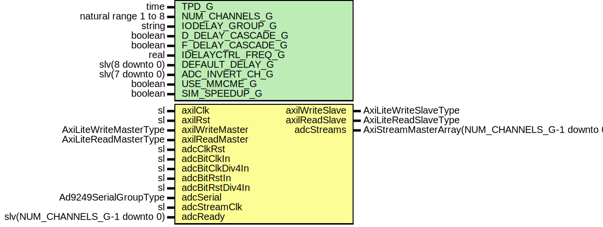

# Entity: Ad9249ReadoutGroup

- **File**: Ad9249ReadoutGroup.vhd
## Diagram

## Description

Company    : SLAC National Accelerator Laboratory
Description:
ADC Readout Controller
Receives ADC Data from an AD9592 chip.
Designed specifically for Xilinx Ultrascale series FPGAs
This file is part of 'SLAC Firmware Standard Library'.
It is subject to the license terms in the LICENSE.txt file found in the
top-level directory of this distribution and at:
   https://confluence.slac.stanford.edu/display/ppareg/LICENSE.html.
No part of 'SLAC Firmware Standard Library', including this file,
may be copied, modified, propagated, or distributed except according to
the terms contained in the LICENSE.txt file.
## Generics

| Generic name      | Type                 | Value           | Description |
| ----------------- | -------------------- | --------------- | ----------- |
| TPD_G             | time                 | 1 ns            |             |
| NUM_CHANNELS_G    | natural range 1 to 8 | 8               |             |
| IODELAY_GROUP_G   | string               | "DEFAULT_GROUP" |             |
| D_DELAY_CASCADE_G | boolean              | false           |             |
| F_DELAY_CASCADE_G | boolean              | false           |             |
| IDELAYCTRL_FREQ_G | real                 | 200.0           |             |
| DEFAULT_DELAY_G   | slv(8 downto 0)      | (others => '0') |             |
| ADC_INVERT_CH_G   | slv(7 downto 0)      | "00000000"      |             |
| USE_MMCME_G       | boolean              | false           |             |
| SIM_SPEEDUP_G     | boolean              | false           |             |
## Ports

| Port name       | Direction | Type                                            | Description                                                     |
| --------------- | --------- | ----------------------------------------------- | --------------------------------------------------------------- |
| axilClk         | in        | sl                                              | Master system clock, 125Mhz                                     |
| axilRst         | in        | sl                                              |                                                                 |
| axilWriteMaster | in        | AxiLiteWriteMasterType                          | Axi Interface                                                   |
| axilWriteSlave  | out       | AxiLiteWriteSlaveType                           |                                                                 |
| axilReadMaster  | in        | AxiLiteReadMasterType                           |                                                                 |
| axilReadSlave   | out       | AxiLiteReadSlaveType                            |                                                                 |
| adcClkRst       | in        | sl                                              | Reset for adc deserializer (axilClk domain)                     |
| adcBitClkIn     | in        | sl                                              | 350.0 MHz                                                       |
| adcBitClkDiv4In | in        | sl                                              |  87.5 MHz                                                       |
| adcBitRstIn     | in        | sl                                              |                                                                 |
| adcBitRstDiv4In | in        | sl                                              |                                                                 |
| adcSerial       | in        | Ad9249SerialGroupType                           | Serial Data from ADC                                            |
| adcStreamClk    | in        | sl                                              | Deserialized ADC Data                                           |
| adcStreams      | out       | AxiStreamMasterArray(NUM_CHANNELS_G-1 downto 0) |                                                                 |
| adcReady        | in        | slv(NUM_CHANNELS_G-1 downto 0)                  | optional ready to allow evenout samples readout in adcStreamClk |
## Signals

| Name            | Type                                  | Description   |
| --------------- | ------------------------------------- | ------------- |
| lockedSync      | sl                                    |               |
| lockedFallCount | slv(15 downto 0)                      |               |
| axilR           | AxilRegType                           |               |
| axilRin         | AxilRegType                           |               |
| adcR            | AdcRegType                            |               |
| adcRin          | AdcRegType                            |               |
| adcDataValid    | slv(NUM_CHANNELS_G-1 downto 0)        |               |
| adcFrameValid   | sl                                    |               |
| adcDclk         | sl                                    | Local Signals |
| adcBitClk       | sl                                    |               |
| adcBitClkDiv4   | sl                                    |               |
| adcBitRstDiv4   | sl                                    |               |
| adcBitRst       | sl                                    |               |
| adcClkRstSync   | sl                                    |               |
| adcFrame        | slv(13 downto 0)                      |               |
| adcFrameSync    | slv(13 downto 0)                      |               |
| adcData         | Slv14Array(NUM_CHANNELS_G-1 downto 0) |               |
| curDelayFrame   | slv(8 downto 0)                       |               |
| curDelayData    | slv9Array(NUM_CHANNELS_G-1 downto 0)  |               |
| fifoDataValid   | slv(NUM_CHANNELS_G-1 downto 0)        |               |
| fifoDataRdEn    | slv(NUM_CHANNELS_G-1 downto 0)        |               |
| debugDataValid  | slv(NUM_CHANNELS_G-1 downto 0)        |               |
| debugData       | slv16Array(NUM_CHANNELS_G-1 downto 0) |               |
| frameDelay      | slv(8 downto 0)                       |               |
| frameDelaySet   | sl                                    |               |
| invertSync      | sl                                    |               |
## Constants

| Name            | Type             | Value                                                                                                                                                                                                                                                                                                                                                                                                                                                                                                                                                                                                                                                                                                                                                               | Description |
| --------------- | ---------------- | ------------------------------------------------------------------------------------------------------------------------------------------------------------------------------------------------------------------------------------------------------------------------------------------------------------------------------------------------------------------------------------------------------------------------------------------------------------------------------------------------------------------------------------------------------------------------------------------------------------------------------------------------------------------------------------------------------------------------------------------------------------------- | ----------- |
| FRAME_PATTERN_C | slv(13 downto 0) |  "11111110000000"                                                                                                                                                                                                                                                                                                                                                                                                                                                                                                                                                                                                                                                                                                                                                   |             |
| AXIL_REG_INIT_C | AxilRegType      |  (       axilWriteSlave => AXI_LITE_WRITE_SLAVE_INIT_C,        axilReadSlave  => AXI_LITE_READ_SLAVE_INIT_C,        delay          => DEFAULT_DELAY_G,        dataDelaySet   => (others => '1'),        frameDelaySet  => '1',        freezeDebug    => '0',        readoutDebug0  => (others => (others => '0')),        readoutDebug1  => (others => (others => '0')),        lockedCountRst => '0',        invert         => '0'    ) |             |
| ADC_REG_INIT_C  | AdcRegType       |  (       slip          => '0',        count         => (others => '0'),        --loadDelay      => '0',        --delayValue     => (others => '0'),        locked        => '0',        fifoWrData    => (others => (others => '0')),        fifoWrDataEn  => (others => '0')    )                                                                                                                                                                                                                                                                |             |
## Types

| Name        | Type | Description |
| ----------- | ---- | ----------- |
| AxilRegType |      |             |
| AdcRegType  |      |             |
## Processes
- axilComb: ( adcFrameSync, axilR, axilReadMaster, axilRst, axilWriteMaster, curDelayData,
                       curDelayFrame, debugData, debugDataValid, lockedFallCount, lockedSync, adcClkRst )
**Description**
AXIL Interface

- axilSeq: ( axilClk )
- adcComb: ( adcData, adcDataValid, adcFrame, adcFrameValid, adcR, invertSync )
**Description**
ADC Bit Clocked Logic

- adcSeq: ( adcBitClkDiv4 )
## Instantiations

- SynchronizerOneShotCnt_1: surf.SynchronizerOneShotCnt
- Synchronizer_1: surf.Synchronizer
- SynchronizerVec_1: surf.SynchronizerVector
- Synchronizer_2: surf.Synchronizer
- AdcClk_I_Ibufds: IBUFDS
- U_FRAME_DESERIALIZER: surf.Ad9249Deserializer
**Description**
Deserializers

- U_FrmDlyFifo: surf.SynchronizerFifo
- RstSync_1: surf.RstSync
