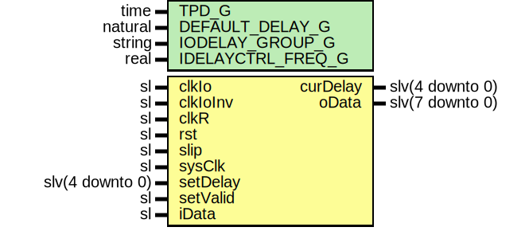

# Entity: Ad9681Deserializer

- **File**: Ad9681Deserializer.vhd
## Diagram

## Description

-----------------------------------------------------------------------------
 Company    : SLAC National Accelerator Laboratory
-----------------------------------------------------------------------------
 Description: 14 bit DDR deserializer using 7 series IDELAYE2 and ISERDESE2.
-----------------------------------------------------------------------------
 This file is part of 'SLAC Firmware Standard Library'.
 It is subject to the license terms in the LICENSE.txt file found in the
 top-level directory of this distribution and at:
    https://confluence.slac.stanford.edu/display/ppareg/LICENSE.html.
 No part of 'SLAC Firmware Standard Library', including this file,
 may be copied, modified, propagated, or distributed except according to
 the terms contained in the LICENSE.txt file.
-----------------------------------------------------------------------------
## Generics

| Generic name      | Type    | Value | Description |
| ----------------- | ------- | ----- | ----------- |
| TPD_G             | time    | 1 ns  |             |
| DEFAULT_DELAY_G   | natural | 0     |             |
| IODELAY_GROUP_G   | string  |       |             |
| IDELAYCTRL_FREQ_G | real    | 200.0 |             |
## Ports

| Port name | Direction | Type            | Description |
| --------- | --------- | --------------- | ----------- |
| clkIo     | in        | sl              |             |
| clkIoInv  | in        | sl              |             |
| clkR      | in        | sl              |             |
| rst       | in        | sl              |             |
| slip      | in        | sl              |             |
| sysClk    | in        | sl              |             |
| curDelay  | out       | slv(4 downto 0) |             |
| setDelay  | in        | slv(4 downto 0) |             |
| setValid  | in        | sl              |             |
| iData     | in        | sl              |             |
| oData     | out       | slv(7 downto 0) |             |
## Signals

| Name    | Type | Description |
| ------- | ---- | ----------- |
| dlyData | sl   |             |
## Instantiations

- U_DELAY: IDELAYE2
- U_ISERDES_MASTER: ISERDESE2
