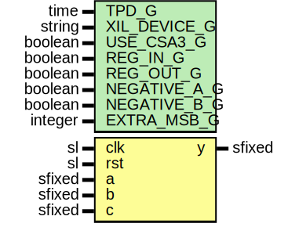

# Entity: add3

## Diagram

## Description

Company    : SLAC National Accelerator Laboratory
Description: 3 input add/sub module y = +/- a +/- b + c
This file is part of 'SLAC Firmware Standard Library'.
It is subject to the license terms in the LICENSE.txt file found in the
top-level directory of this distribution and at:
   https://confluence.slac.stanford.edu/display/ppareg/LICENSE.html.
No part of 'SLAC Firmware Standard Library', including this file,
may be copied, modified, propagated, or distributed except according to
the terms contained in the LICENSE.txt file.
See UG579 p. 62 == 3:2 compressor followed by 2 input adder
## Generics

| Generic name | Type    | Value             | Description                      |
| ------------ | ------- | ----------------- | -------------------------------- |
| TPD_G        | time    | 1 ns              |                                  |
| XIL_DEVICE_G | string  | "ULTRASCALE_PLUS" | used with USE_CSA3_G             |
| USE_CSA3_G   | boolean | false             | Use CSA3 primitive instantiation |
| REG_IN_G     | boolean | false             |                                  |
| REG_OUT_G    | boolean | true              |                                  |
| NEGATIVE_A_G | boolean | false             |                                  |
| NEGATIVE_B_G | boolean | false             |                                  |
| EXTRA_MSB_G  | integer | 2                 |                                  |
## Ports

| Port name | Direction | Type   | Description |
| --------- | --------- | ------ | ----------- |
| clk       | in        | sl     |             |
| rst       | in        | sl     |             |
| a         | in        | sfixed |             |
| b         | in        | sfixed |             |
| c         | in        | sfixed |             |
| y         | out       | sfixed |             |
