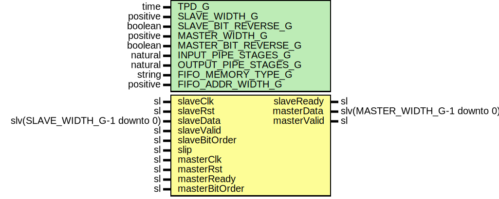

# Entity: AsyncGearbox

- **File**: AsyncGearbox.vhd
## Diagram

## Description

-----------------------------------------------------------------------------
 Title      : Asynchronous Gearbox
-----------------------------------------------------------------------------
 Company    : SLAC National Accelerator Laboratory
-----------------------------------------------------------------------------
 Description: A generic gearbox with asynchronous input and output clocks
-----------------------------------------------------------------------------
 This file is part of 'SLAC Firmware Standard Library'.
 It is subject to the license terms in the LICENSE.txt file found in the
 top-level directory of this distribution and at:
    https://confluence.slac.stanford.edu/display/ppareg/LICENSE.html.
 No part of 'SLAC Firmware Standard Library', including this file,
 may be copied, modified, propagated, or distributed except according to
 the terms contained in the LICENSE.txt file.
-----------------------------------------------------------------------------
## Generics

| Generic name         | Type     | Value         | Description          |
| -------------------- | -------- | ------------- | -------------------- |
| TPD_G                | time     | 1 ns          |                      |
| SLAVE_WIDTH_G        | positive |               |                      |
| SLAVE_BIT_REVERSE_G  | boolean  | false         |                      |
| MASTER_WIDTH_G       | positive |               |                      |
| MASTER_BIT_REVERSE_G | boolean  | false         |                      |
| INPUT_PIPE_STAGES_G  | natural  | 0             | Pipelining generics  |
| OUTPUT_PIPE_STAGES_G | natural  | 0             |                      |
| FIFO_MEMORY_TYPE_G   | string   | "distributed" | Async FIFO generics  |
| FIFO_ADDR_WIDTH_G    | positive | 4             |                      |
## Ports

| Port name      | Direction | Type                           | Description                                          |
| -------------- | --------- | ------------------------------ | ---------------------------------------------------- |
| slaveClk       | in        | sl                             | input side data and flow control (slaveClk domain)   |
| slaveRst       | in        | sl                             |                                                      |
| slaveData      | in        | slv(SLAVE_WIDTH_G-1 downto 0)  |                                                      |
| slaveValid     | in        | sl                             |                                                      |
| slaveReady     | out       | sl                             |                                                      |
| slaveBitOrder  | in        | sl                             |                                                      |
| slip           | in        | sl                             | sequencing and slip (ASYNC input)                    |
| masterClk      | in        | sl                             | output side data and flow control (masterClk domain) |
| masterRst      | in        | sl                             |                                                      |
| masterData     | out       | slv(MASTER_WIDTH_G-1 downto 0) |                                                      |
| masterValid    | out       | sl                             |                                                      |
| masterReady    | in        | sl                             |                                                      |
| masterBitOrder | in        | sl                             |                                                      |
## Signals

| Name                  | Type                           | Description |
| --------------------- | ------------------------------ | ----------- |
| fastClk               | sl                             |             |
| fastRst               | sl                             |             |
| gearboxDataIn         | slv(SLAVE_WIDTH_G-1 downto 0)  |             |
| gearboxValidIn        | sl                             |             |
| gearboxReadyIn        | sl                             |             |
| gearboxDataOut        | slv(MASTER_WIDTH_G-1 downto 0) |             |
| gearboxValidOut       | sl                             |             |
| gearboxReadyOut       | sl                             |             |
| gearboxSlip           | sl                             |             |
| gearboxSlaveBitOrder  | sl                             |             |
| gearboxMasterBitOrder | sl                             |             |
| almostFull            | sl                             |             |
| writeEnable           | sl                             |             |
| asyncFifoRst          | sl                             |             |
## Constants

| Name           | Type    | Value                            | Description |
| -------------- | ------- | -------------------------------- | ----------- |
| SLAVE_FASTER_C | boolean |  SLAVE_WIDTH_G <= MASTER_WIDTH_G |             |
## Instantiations

- U_SynchronizerOneShot_1: surf.SynchronizerOneShot
- U_slaveBitOrder: surf.Synchronizer
 **Description**
 [out]

- U_masterBitOrder: surf.Synchronizer
- U_Gearbox_1: surf.Gearbox
