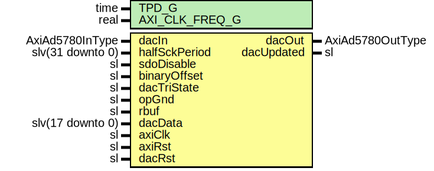

# Entity: AxiAd5780Ser

- **File**: AxiAd5780Ser.vhd
## Diagram

## Description

-----------------------------------------------------------------------------
 Company    : SLAC National Accelerator Laboratory
-----------------------------------------------------------------------------
 Description: AD5780 DAC Module's serializer
-----------------------------------------------------------------------------
 This file is part of 'SLAC Firmware Standard Library'.
 It is subject to the license terms in the LICENSE.txt file found in the
 top-level directory of this distribution and at:
    https://confluence.slac.stanford.edu/display/ppareg/LICENSE.html.
 No part of 'SLAC Firmware Standard Library', including this file,
 may be copied, modified, propagated, or distributed except according to
 the terms contained in the LICENSE.txt file.
-----------------------------------------------------------------------------
## Generics

| Generic name   | Type | Value    | Description |
| -------------- | ---- | -------- | ----------- |
| TPD_G          | time | 1 ns     |             |
| AXI_CLK_FREQ_G | real | 200.0E+6 |             |
## Ports

| Port name     | Direction | Type             | Description                        |
| ------------- | --------- | ---------------- | ---------------------------------- |
| dacIn         | in        | AxiAd5780InType  | DAC Ports                          |
| dacOut        | out       | AxiAd5780OutType |                                    |
| halfSckPeriod | in        | slv(31 downto 0) | DAC Data Interface (axiClk domain) |
| sdoDisable    | in        | sl               |                                    |
| binaryOffset  | in        | sl               |                                    |
| dacTriState   | in        | sl               |                                    |
| opGnd         | in        | sl               |                                    |
| rbuf          | in        | sl               |                                    |
| dacData       | in        | slv(17 downto 0) |  2's complement by default         |
| dacUpdated    | out       | sl               |                                    |
| axiClk        | in        | sl               | Clocks and Resets                  |
| axiRst        | in        | sl               |                                    |
| dacRst        | in        | sl               |                                    |
## Signals

| Name | Type    | Description |
| ---- | ------- | ----------- |
| r    | RegType |             |
| rin  | RegType |             |
## Constants

| Name       | Type    | Value                                                                                                                                                                                                                                                                                                                                                                                                                                                                                    | Description      |
| ---------- | ------- | ---------------------------------------------------------------------------------------------------------------------------------------------------------------------------------------------------------------------------------------------------------------------------------------------------------------------------------------------------------------------------------------------------------------------------------------------------------------------------------------- | ---------------- |
| CS_WAIT_C  | natural |  (getTimeRatio(AXI_CLK_FREQ_G,  20.0E+6))                                                                                                                                                                                                                                                                                                                                                                                                             |  50 ns wait min. |
| REG_INIT_C | RegType |  (       '0',        '1',        '1',        '1',        '0',        (others => '0'),        (others => '0'),        0,        (others => '0'),        RST_S) |                  |
## Types

| Name      | Type                                                                                                                                                                                                  | Description |
| --------- | ----------------------------------------------------------------------------------------------------------------------------------------------------------------------------------------------------- | ----------- |
| StateType | ( RST_S,  RST_WAIT_S,  SCK_HIGH_S,  SCK_LOW_S,  CS_HI_S)  |             |
| RegType   |                                                                                                                                                                                                       |             |
## Processes
- comb: ( binaryOffset, dacData, dacRst, dacTriState, halfSckPeriod, opGnd, r, rbuf,
                   sdoDisable )
- seq: ( axiClk )
