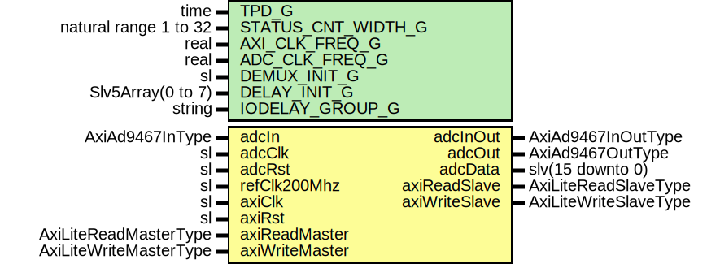

# Entity: AxiAd9467Core

- **File**: AxiAd9467Core.vhd
## Diagram

## Description

Company    : SLAC National Accelerator Laboratory
Description: AXI-Lite interface to AD9467 ADC IC
This file is part of 'SLAC Firmware Standard Library'.
It is subject to the license terms in the LICENSE.txt file found in the
top-level directory of this distribution and at:
   https://confluence.slac.stanford.edu/display/ppareg/LICENSE.html.
No part of 'SLAC Firmware Standard Library', including this file,
may be copied, modified, propagated, or distributed except according to
the terms contained in the LICENSE.txt file.
## Generics

| Generic name       | Type                  | Value                    | Description |
| ------------------ | --------------------- | ------------------------ | ----------- |
| TPD_G              | time                  | 1 ns                     |             |
| STATUS_CNT_WIDTH_G | natural range 1 to 32 | 32                       |             |
| AXI_CLK_FREQ_G     | real                  | 125.0E+6                 | units of Hz |
| ADC_CLK_FREQ_G     | real                  | 250.0E+6                 | units of Hz |
| DEMUX_INIT_G       | sl                    | '0'                      |             |
| DELAY_INIT_G       | Slv5Array(0 to 7)     | (others => "00000")      |             |
| IODELAY_GROUP_G    | string                | "AXI_AD9467_IODELAY_GRP" |             |
## Ports

| Port name      | Direction | Type                   | Description                                 |
| -------------- | --------- | ---------------------- | ------------------------------------------- |
| adcIn          | in        | AxiAd9467InType        | ADC Ports                                   |
| adcInOut       | inout     | AxiAd9467InOutType     |                                             |
| adcOut         | out       | AxiAd9467OutType       |                                             |
| adcClk         | in        | sl                     | ADC Data Interface (adcClk domain)          |
| adcRst         | in        | sl                     |                                             |
| adcData        | out       | slv(15 downto 0)       |                                             |
| refClk200Mhz   | in        | sl                     | IDELAY Reference clock                      |
| axiClk         | in        | sl                     | AXI-Lite Register Interface (axiClk domain) |
| axiRst         | in        | sl                     |                                             |
| axiReadMaster  | in        | AxiLiteReadMasterType  |                                             |
| axiReadSlave   | out       | AxiLiteReadSlaveType   |                                             |
| axiWriteMaster | in        | AxiLiteWriteMasterType |                                             |
| axiWriteSlave  | out       | AxiLiteWriteSlaveType  |                                             |
## Signals

| Name   | Type                | Description |
| ------ | ------------------- | ----------- |
| status | AxiAd9467StatusType |             |
| config | AxiAd9467ConfigType |             |
## Instantiations

- AxiAd9467Reg_Inst: surf.AxiAd9467Reg
- AxiAd9467Spi_Inst: surf.AxiAd9467Spi
- AxiAd9467Pll_Inst: surf.AxiAd9467Pll
- AxiAd9467Deser_Inst: surf.AxiAd9467Deser
- AxiAd9467Mon_Inst: surf.AxiAd9467Mon
