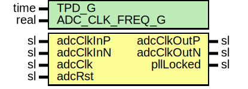

# Entity: AxiAd9467Pll

- **File**: AxiAd9467Pll.vhd
## Diagram

## Description

-----------------------------------------------------------------------------
 Company    : SLAC National Accelerator Laboratory
-----------------------------------------------------------------------------
 Description: AD9467 PLL Module
-----------------------------------------------------------------------------
 This file is part of 'SLAC Firmware Standard Library'.
 It is subject to the license terms in the LICENSE.txt file found in the
 top-level directory of this distribution and at:
    https://confluence.slac.stanford.edu/display/ppareg/LICENSE.html.
 No part of 'SLAC Firmware Standard Library', including this file,
 may be copied, modified, propagated, or distributed except according to
 the terms contained in the LICENSE.txt file.
-----------------------------------------------------------------------------
## Generics

| Generic name   | Type | Value    | Description |
| -------------- | ---- | -------- | ----------- |
| TPD_G          | time | 1 ns     |             |
| ADC_CLK_FREQ_G | real | 250.0E+6 |             |
## Ports

| Port name  | Direction | Type | Description           |
| ---------- | --------- | ---- | --------------------- |
| adcClkOutP | out       | sl   | ADC Clocking ports    |
| adcClkOutN | out       | sl   |                       |
| adcClkInP  | in        | sl   |                       |
| adcClkInN  | in        | sl   |                       |
| pllLocked  | out       | sl   | PLL Status            |
| adcClk     | in        | sl   | ADC Reference Signals |
| adcRst     | in        | sl   |                       |
## Signals

| Name           | Type | Description |
| -------------- | ---- | ----------- |
| clkFeedBackIn  | sl   |             |
| clkFeedBack    | sl   |             |
| clkFeedBackOut | sl   |             |
## Constants

| Name                | Type | Value                      | Description |
| ------------------- | ---- | -------------------------- | ----------- |
| ADC_CLK_PERIOD_C    | real |  1.0 / ADC_CLK_FREQ_G      |             |
| ADC_CLK_PERIOD_NS_C | real |  1.0E+9 * ADC_CLK_PERIOD_C |             |
| CLKFBOUT_MULT_F_C   | real |  1.0E+9 / ADC_CLK_FREQ_G   |             |
## Instantiations

- IBUFGDS_Inst: IBUFGDS
- MMCME2_ADV_Inst: MMCME2_ADV
- BUFH_West: BUFH
- ClkOutBufDiff_Inst: surf.ClkOutBufDiff
