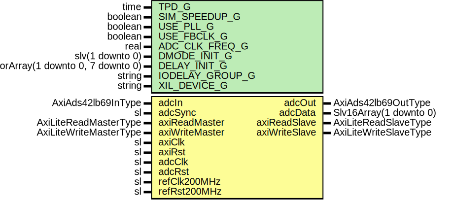

# Entity: AxiAds42lb69Core

- **File**: AxiAds42lb69Core.vhd
## Diagram

## Description

-----------------------------------------------------------------------------
 Company    : SLAC National Accelerator Laboratory
-----------------------------------------------------------------------------
 Description: AXI-Lite interface to ADS42LB69 ADC IC
-----------------------------------------------------------------------------
 This file is part of 'SLAC Firmware Standard Library'.
 It is subject to the license terms in the LICENSE.txt file found in the
 top-level directory of this distribution and at:
    https://confluence.slac.stanford.edu/display/ppareg/LICENSE.html.
 No part of 'SLAC Firmware Standard Library', including this file,
 may be copied, modified, propagated, or distributed except according to
 the terms contained in the LICENSE.txt file.
-----------------------------------------------------------------------------
## Generics

| Generic name    | Type                                    | Value                                   | Description                               |
| --------------- | --------------------------------------- | --------------------------------------- | ----------------------------------------- |
| TPD_G           | time                                    | 1 ns                                    |                                           |
| SIM_SPEEDUP_G   | boolean                                 | false                                   |                                           |
| USE_PLL_G       | boolean                                 | false                                   |  true = phase compensate the ADC data bus |
| USE_FBCLK_G     | boolean                                 | true                                    |                                           |
| ADC_CLK_FREQ_G  | real                                    | 250.00E+6                               |  units of Hz                              |
| DMODE_INIT_G    | slv(1 downto 0)                         | "00"                                    |                                           |
| DELAY_INIT_G    | Slv9VectorArray(1 downto 0, 7 downto 0) | (others => (others => (others => '0'))) |                                           |
| IODELAY_GROUP_G | string                                  | "AXI_ADS42LB69_IODELAY_GRP"             |                                           |
| XIL_DEVICE_G    | string                                  | "7SERIES"                               |                                           |
## Ports

| Port name      | Direction | Type                   | Description                                 |
| -------------- | --------- | ---------------------- | ------------------------------------------- |
| adcIn          | in        | AxiAds42lb69InType     | ADC Ports                                   |
| adcOut         | out       | AxiAds42lb69OutType    |                                             |
| adcSync        | in        | sl                     | ADC signals (adcClk domain)                 |
| adcData        | out       | Slv16Array(1 downto 0) |                                             |
| axiReadMaster  | in        | AxiLiteReadMasterType  | AXI-Lite Register Interface (axiClk domain) |
| axiReadSlave   | out       | AxiLiteReadSlaveType   |                                             |
| axiWriteMaster | in        | AxiLiteWriteMasterType |                                             |
| axiWriteSlave  | out       | AxiLiteWriteSlaveType  |                                             |
| axiClk         | in        | sl                     | Clocks and Resets                           |
| axiRst         | in        | sl                     |                                             |
| adcClk         | in        | sl                     |                                             |
| adcRst         | in        | sl                     |                                             |
| refClk200MHz   | in        | sl                     |                                             |
| refRst200MHz   | in        | sl                     |                                             |
## Signals

| Name       | Type                   | Description |
| ---------- | ---------------------- | ----------- |
| status     | AxiAds42lb69StatusType |             |
| config     | AxiAds42lb69ConfigType |             |
| adcDataCnv | Slv16Array(1 downto 0) |             |
| convert    | slv(1 downto 0)        |             |
| invert     | slv(1 downto 0)        |             |
## Instantiations

- SynchVector0_Inst: surf.SynchronizerVector
- SynchVector1_Inst: surf.SynchronizerVector
- AxiAds42lb69Reg_Inst: surf.AxiAds42lb69Reg
- AxiAds42lb69Deser_Inst: surf.AxiAds42lb69Deser
