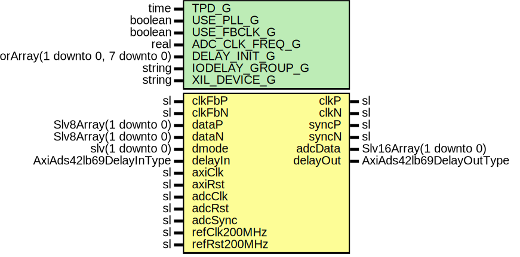

# Entity: AxiAds42lb69Deser

- **File**: AxiAds42lb69Deser.vhd
## Diagram

## Description

Company    : SLAC National Accelerator Laboratory
Description: ADC DDR Deserializer
This file is part of 'SLAC Firmware Standard Library'.
It is subject to the license terms in the LICENSE.txt file found in the
top-level directory of this distribution and at:
   https://confluence.slac.stanford.edu/display/ppareg/LICENSE.html.
No part of 'SLAC Firmware Standard Library', including this file,
may be copied, modified, propagated, or distributed except according to
the terms contained in the LICENSE.txt file.
## Generics

| Generic name    | Type                                    | Value                                   | Description |
| --------------- | --------------------------------------- | --------------------------------------- | ----------- |
| TPD_G           | time                                    | 1 ns                                    |             |
| USE_PLL_G       | boolean                                 | false                                   |             |
| USE_FBCLK_G     | boolean                                 | true                                    |             |
| ADC_CLK_FREQ_G  | real                                    | 250.0E+6                                |             |
| DELAY_INIT_G    | Slv9VectorArray(1 downto 0, 7 downto 0) | (others => (others => (others => '0'))) |             |
| IODELAY_GROUP_G | string                                  | "AXI_ADS42LB69_IODELAY_GRP"             |             |
| XIL_DEVICE_G    | string                                  | "7SERIES"                               |             |
## Ports

| Port name    | Direction | Type                     | Description                        |
| ------------ | --------- | ------------------------ | ---------------------------------- |
| clkP         | out       | sl                       | ADC Ports                          |
| clkN         | out       | sl                       |                                    |
| syncP        | out       | sl                       |                                    |
| syncN        | out       | sl                       |                                    |
| clkFbP       | in        | sl                       |                                    |
| clkFbN       | in        | sl                       |                                    |
| dataP        | in        | Slv8Array(1 downto 0)    |                                    |
| dataN        | in        | Slv8Array(1 downto 0)    |                                    |
| adcData      | out       | Slv16Array(1 downto 0)   | ADC Data Interface (adcClk domain) |
| dmode        | in        | slv(1 downto 0)          | Register Interface                 |
| delayIn      | in        | AxiAds42lb69DelayInType  | Register Interface (axiClk domain) |
| delayOut     | out       | AxiAds42lb69DelayOutType |                                    |
| axiClk       | in        | sl                       | Clocks and Resets                  |
| axiRst       | in        | sl                       |                                    |
| adcClk       | in        | sl                       |                                    |
| adcRst       | in        | sl                       |                                    |
| adcSync      | in        | sl                       |                                    |
| refClk200MHz | in        | sl                       |                                    |
| refRst200MHz | in        | sl                       |                                    |
## Signals

| Name      | Type                   | Description |
| --------- | ---------------------- | ----------- |
| adcClock  | sl                     |             |
| dmux      | slv(1 downto 0)        |             |
| adcDataPs | Slv8Array(1 downto 0)  |             |
| adcDataNs | Slv8Array(1 downto 0)  |             |
| adcDataP  | Slv8Array(1 downto 0)  |             |
| adcDataN  | Slv8Array(1 downto 0)  |             |
| adcDataNd | Slv8Array(1 downto 0)  |             |
| adcDmuxA  | Slv8Array(1 downto 0)  |             |
| adcDmuxB  | Slv8Array(1 downto 0)  |             |
| data      | Slv16Array(1 downto 0) |             |
## Instantiations

- AxiAds42lb69Pll_Inst: surf.AxiAds42lb69Pll
- SynchVector_Inst: surf.SynchronizerVector
