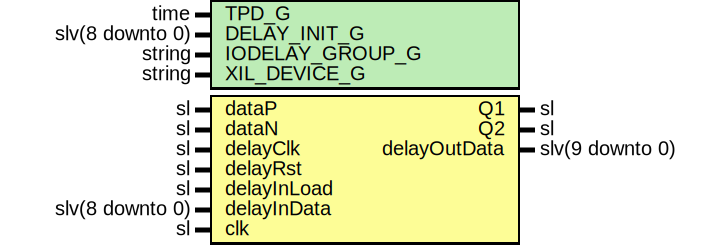

# Entity: AxiAds42lb69DeserBit

- **File**: AxiAds42lb69DeserBit.vhd
## Diagram

## Description

Company    : SLAC National Accelerator Laboratory
Description: ADC DDR Deserializer
This file is part of 'SLAC Firmware Standard Library'.
It is subject to the license terms in the LICENSE.txt file found in the
top-level directory of this distribution and at:
   https://confluence.slac.stanford.edu/display/ppareg/LICENSE.html.
No part of 'SLAC Firmware Standard Library', including this file,
may be copied, modified, propagated, or distributed except according to
the terms contained in the LICENSE.txt file.
## Generics

| Generic name    | Type            | Value                       | Description |
| --------------- | --------------- | --------------------------- | ----------- |
| TPD_G           | time            | 1 ns                        |             |
| DELAY_INIT_G    | slv(8 downto 0) | (others => '0')             |             |
| IODELAY_GROUP_G | string          | "AXI_ADS42LB69_IODELAY_GRP" |             |
| XIL_DEVICE_G    | string          | "7SERIES"                   |             |
## Ports

| Port name    | Direction | Type            | Description                |
| ------------ | --------- | --------------- | -------------------------- |
| dataP        | in        | sl              | ADC Data (clk domain)      |
| dataN        | in        | sl              |                            |
| Q1           | out       | sl              |                            |
| Q2           | out       | sl              |                            |
| delayClk     | in        | sl              | IO_Delay (delayClk domain) |
| delayRst     | in        | sl              |                            |
| delayInLoad  | in        | sl              |                            |
| delayInData  | in        | slv(8 downto 0) |                            |
| delayOutData | out       | slv(9 downto 0) |                            |
| clk          | in        | sl              | Clocks                     |
## Signals

| Name          | Type            | Description |
| ------------- | --------------- | ----------- |
| data          | sl              |             |
| dataDly       | sl              |             |
| clkb          | sl              |             |
| cascOut       | sl              |             |
| cascRet       | sl              |             |
| delayOutData1 | slv(8 downto 0) |             |
| delayOutData2 | slv(8 downto 0) |             |
