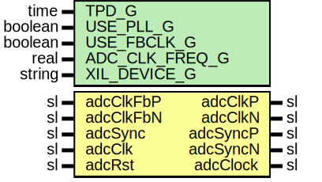

# Entity: AxiAds42lb69Pll

- **File**: AxiAds42lb69Pll.vhd
## Diagram

## Description

Company    : SLAC National Accelerator Laboratory
Description: PLL Module
This file is part of 'SLAC Firmware Standard Library'.
It is subject to the license terms in the LICENSE.txt file found in the
top-level directory of this distribution and at:
   https://confluence.slac.stanford.edu/display/ppareg/LICENSE.html.
No part of 'SLAC Firmware Standard Library', including this file,
may be copied, modified, propagated, or distributed except according to
the terms contained in the LICENSE.txt file.
## Generics

| Generic name   | Type    | Value     | Description |
| -------------- | ------- | --------- | ----------- |
| TPD_G          | time    | 1 ns      |             |
| USE_PLL_G      | boolean | true      |             |
| USE_FBCLK_G    | boolean | true      |             |
| ADC_CLK_FREQ_G | real    | 250.0E+6  |             |
| XIL_DEVICE_G   | string  | "7SERIES" |             |
## Ports

| Port name | Direction | Type | Description           |
| --------- | --------- | ---- | --------------------- |
| adcClkP   | out       | sl   | ADC Clocking ports    |
| adcClkN   | out       | sl   |                       |
| adcSyncP  | out       | sl   |                       |
| adcSyncN  | out       | sl   |                       |
| adcClkFbP | in        | sl   |                       |
| adcClkFbN | in        | sl   |                       |
| adcSync   | in        | sl   | ADC Reference Signals |
| adcClk    | in        | sl   |                       |
| adcRst    | in        | sl   |                       |
| adcClock  | out       | sl   |                       |
## Signals

| Name           | Type | Description |
| -------------- | ---- | ----------- |
| clkFeedBack    | sl   |             |
| clkFeedBackIn  | sl   |             |
| clkFeedBackOut | sl   |             |
| sync           | sl   |             |
| syncOut        | sl   |             |
| adcInClk       | sl   |             |
## Constants

| Name                | Type | Value                    | Description |
| ------------------- | ---- | ------------------------ | ----------- |
| ADC_CLK_PERIOD_NS_C | real |  1.0E+9 / ADC_CLK_FREQ_G |             |
