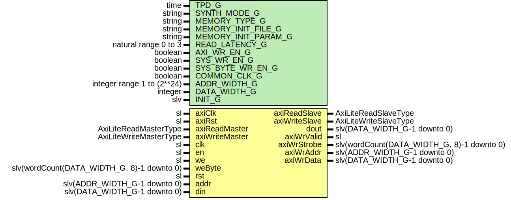

# Entity: AxiDualPortRam

- **File**: AxiDualPortRam.vhd
## Diagram

## Description

-----------------------------------------------------------------------------
 Company    : SLAC National Accelerator Laboratory
-----------------------------------------------------------------------------
 Description: A wrapper of StdLib DualPortRam that places an AxiLite
 interface on the read/write port.
-----------------------------------------------------------------------------
 This file is part of 'SLAC Firmware Standard Library'.
 It is subject to the license terms in the LICENSE.txt file found in the
 top-level directory of this distribution and at:
    https://confluence.slac.stanford.edu/display/ppareg/LICENSE.html.
 No part of 'SLAC Firmware Standard Library', including this file,
 may be copied, modified, propagated, or distributed except according to
 the terms contained in the LICENSE.txt file.
-----------------------------------------------------------------------------
## Generics

| Generic name        | Type                       | Value      | Description                       |
| ------------------- | -------------------------- | ---------- | --------------------------------- |
| TPD_G               | time                       | 1 ns       |                                   |
| SYNTH_MODE_G        | string                     | "inferred" |                                   |
| MEMORY_TYPE_G       | string                     | "block"    |                                   |
| MEMORY_INIT_FILE_G  | string                     | "none"     |  Used for MEMORY_TYPE_G="XPM only |
| MEMORY_INIT_PARAM_G | string                     | "0"        |  Used for MEMORY_TYPE_G="XPM only |
| READ_LATENCY_G      | natural range 0 to 3       | 2          |                                   |
| AXI_WR_EN_G         | boolean                    | true       |                                   |
| SYS_WR_EN_G         | boolean                    | false      |                                   |
| SYS_BYTE_WR_EN_G    | boolean                    | false      |                                   |
| COMMON_CLK_G        | boolean                    | false      |                                   |
| ADDR_WIDTH_G        | integer range 1 to (2**24) | 5          |                                   |
| DATA_WIDTH_G        | integer                    | 32         |                                   |
| INIT_G              | slv                        | "0"        |                                   |
## Ports

| Port name      | Direction | Type                                       | Description   |
| -------------- | --------- | ------------------------------------------ | ------------- |
| axiClk         | in        | sl                                         | Axi Port      |
| axiRst         | in        | sl                                         |               |
| axiReadMaster  | in        | AxiLiteReadMasterType                      |               |
| axiReadSlave   | out       | AxiLiteReadSlaveType                       |               |
| axiWriteMaster | in        | AxiLiteWriteMasterType                     |               |
| axiWriteSlave  | out       | AxiLiteWriteSlaveType                      |               |
| clk            | in        | sl                                         | Standard Port |
| en             | in        | sl                                         |               |
| we             | in        | sl                                         |               |
| weByte         | in        | slv(wordCount(DATA_WIDTH_G, 8)-1 downto 0) |               |
| rst            | in        | sl                                         |               |
| addr           | in        | slv(ADDR_WIDTH_G-1 downto 0)               |               |
| din            | in        | slv(DATA_WIDTH_G-1 downto 0)               |               |
| dout           | out       | slv(DATA_WIDTH_G-1 downto 0)               |               |
| axiWrValid     | out       | sl                                         |               |
| axiWrStrobe    | out       | slv(wordCount(DATA_WIDTH_G, 8)-1 downto 0) |               |
| axiWrAddr      | out       | slv(ADDR_WIDTH_G-1 downto 0)               |               |
| axiWrData      | out       | slv(DATA_WIDTH_G-1 downto 0)               |               |
## Signals

| Name            | Type                                                                           | Description |
| --------------- | ------------------------------------------------------------------------------ | ----------- |
| r               | RegType                                                                        |             |
| rin             | RegType                                                                        |             |
| axiWrDataFanout | slv(RAM_WIDTH_C-1 downto 0)                                                    |             |
| axiDout         | slv(RAM_WIDTH_C-1 downto 0)                                                    |             |
| axiSyncWrEn     | sl                                                                             |             |
| axiSyncIn       | slv(DATA_WIDTH_G + ADDR_WIDTH_G + ADDR_AXI_BYTES_C - 1 downto 0)               |             |
| axiSyncOut      | slv(DATA_WIDTH_G + ADDR_WIDTH_G + ADDR_AXI_BYTES_C - 1 downto 0)               |             |
| weByteMask      | slv(wordCount(DATA_WIDTH_G,  8)-1 downto 0) |             |
| doutInt         | slv(DATA_WIDTH_G-1 downto 0)                                                   |             |
## Constants

| Name                | Type    | Value                                                                                                                                                                                                                                                                                                                                                                                                                                  | Description |
| ------------------- | ------- | -------------------------------------------------------------------------------------------------------------------------------------------------------------------------------------------------------------------------------------------------------------------------------------------------------------------------------------------------------------------------------------------------------------------------------------- | ----------- |
| AXI_DEC_BITS_C      | integer |  ite(DATA_WIDTH_G <= 32,  0,  log2((DATA_WIDTH_G-1)/32))                                                                                                                                                                                                                                                                                                         |             |
| AXI_DEC_ADDR_HIGH_C | integer |  1+AXI_DEC_BITS_C                                                                                                                                                                                                                                                                                                                                                                                                                      |             |
| AXI_DEC_ADDR_LOW_C  | integer |  2                                                                                                                                                                                                                                                                                                                                                                                                                                     |             |
| AXI_RAM_ADDR_HIGH_C | integer |  ADDR_WIDTH_G+AXI_DEC_ADDR_RANGE_C'high                                                                                                                                                                                                                                                                                                                                                                                                |             |
| AXI_RAM_ADDR_LOW_C  | integer |  AXI_DEC_ADDR_RANGE_C'high+1                                                                                                                                                                                                                                                                                                                                                                                                           |             |
| ADDR_AXI_WORDS_C    | natural |  wordCount(DATA_WIDTH_G,  32)                                                                                                                                                                                                                                                                                                                                                                       |             |
| ADDR_AXI_BYTES_C    | natural |  wordCount(DATA_WIDTH_G,  8)                                                                                                                                                                                                                                                                                                                                                                        |             |
| RAM_WIDTH_C         | natural |  ADDR_AXI_WORDS_C*32                                                                                                                                                                                                                                                                                                                                                                                                                   |             |
| STRB_WIDTH_C        | natural |  minimum(4,  ADDR_AXI_BYTES_C)                                                                                                                                                                                                                                                                                                                                                                      |             |
| REG_INIT_C          | RegType |  (       axiWriteSlave => AXI_LITE_WRITE_SLAVE_INIT_C,        axiReadSlave  => AXI_LITE_READ_SLAVE_INIT_C,        axiAddr       => (others => '0'),        axiWrStrobe   => (others => '0'),        rdLatecy      => 0,        state         => IDLE_S) |             |
## Types

| Name      | Type                                                 | Description |
| --------- | ---------------------------------------------------- | ----------- |
| StateType | ( IDLE_S,  RD_S)  |             |
| RegType   |                                                      |             |
## Processes
- comb: ( axiDout, axiReadMaster, axiRst, axiWriteMaster, r )
- seq: ( axiClk )
## Instantiations

- U_SynchronizerFifo_1: surf.SynchronizerFifo
