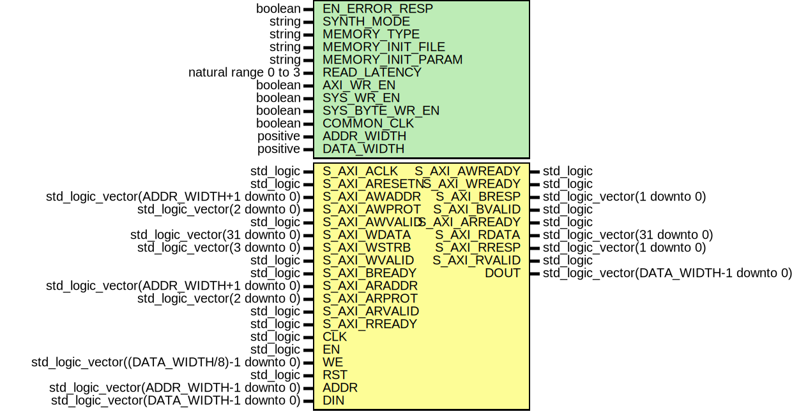

# Entity: AxiDualPortRamIpIntegrator

- **File**: AxiDualPortRamIpIntegrator.vhd
## Diagram

## Description

-----------------------------------------------------------------------------
 Company    : SLAC National Accelerator Laboratory
-----------------------------------------------------------------------------
 Description: IP Integrator Wrapper for surf.AxiVersion
-----------------------------------------------------------------------------
 TCL Command: create_bd_cell -type module -reference AxiDualPortRamIpIntegrator AxiDualPortRam_0
-----------------------------------------------------------------------------
 This file is part of 'SLAC Firmware Standard Library'.
 It is subject to the license terms in the LICENSE.txt file found in the
 top-level directory of this distribution and at:
    https://confluence.slac.stanford.edu/display/ppareg/LICENSE.html.
 No part of 'SLAC Firmware Standard Library', including this file,
 may be copied, modified, propagated, or distributed except according to
 the terms contained in the LICENSE.txt file.
-----------------------------------------------------------------------------
## Generics

| Generic name      | Type                 | Value      | Description                     |
| ----------------- | -------------------- | ---------- | ------------------------------- |
| EN_ERROR_RESP     | boolean              | false      |                                 |
| SYNTH_MODE        | string               | "inferred" |                                 |
| MEMORY_TYPE       | string               | "block"    |                                 |
| MEMORY_INIT_FILE  | string               | "none"     |  Used for MEMORY_TYPE="XPM only |
| MEMORY_INIT_PARAM | string               | "0"        |  Used for MEMORY_TYPE="XPM only |
| READ_LATENCY      | natural range 0 to 3 | 3          |                                 |
| AXI_WR_EN         | boolean              | true       |                                 |
| SYS_WR_EN         | boolean              | false      |                                 |
| SYS_BYTE_WR_EN    | boolean              | false      |                                 |
| COMMON_CLK        | boolean              | false      |                                 |
| ADDR_WIDTH        | positive             | 5          |                                 |
| DATA_WIDTH        | positive             | 32         |                                 |
## Ports

| Port name     | Direction | Type                                        | Description        |
| ------------- | --------- | ------------------------------------------- | ------------------ |
| S_AXI_ACLK    | in        | std_logic                                   | AXI-Lite Interface |
| S_AXI_ARESETN | in        | std_logic                                   |                    |
| S_AXI_AWADDR  | in        | std_logic_vector(ADDR_WIDTH+1 downto 0)     |                    |
| S_AXI_AWPROT  | in        | std_logic_vector(2 downto 0)                |                    |
| S_AXI_AWVALID | in        | std_logic                                   |                    |
| S_AXI_AWREADY | out       | std_logic                                   |                    |
| S_AXI_WDATA   | in        | std_logic_vector(31 downto 0)               |                    |
| S_AXI_WSTRB   | in        | std_logic_vector(3 downto 0)                |                    |
| S_AXI_WVALID  | in        | std_logic                                   |                    |
| S_AXI_WREADY  | out       | std_logic                                   |                    |
| S_AXI_BRESP   | out       | std_logic_vector(1 downto 0)                |                    |
| S_AXI_BVALID  | out       | std_logic                                   |                    |
| S_AXI_BREADY  | in        | std_logic                                   |                    |
| S_AXI_ARADDR  | in        | std_logic_vector(ADDR_WIDTH+1 downto 0)     |                    |
| S_AXI_ARPROT  | in        | std_logic_vector(2 downto 0)                |                    |
| S_AXI_ARVALID | in        | std_logic                                   |                    |
| S_AXI_ARREADY | out       | std_logic                                   |                    |
| S_AXI_RDATA   | out       | std_logic_vector(31 downto 0)               |                    |
| S_AXI_RRESP   | out       | std_logic_vector(1 downto 0)                |                    |
| S_AXI_RVALID  | out       | std_logic                                   |                    |
| S_AXI_RREADY  | in        | std_logic                                   |                    |
| CLK           | in        | std_logic                                   | SYS RAM Interface  |
| EN            | in        | std_logic                                   |                    |
| WE            | in        | std_logic_vector((DATA_WIDTH/8)-1 downto 0) |                    |
| RST           | in        | std_logic                                   |                    |
| ADDR          | in        | std_logic_vector(ADDR_WIDTH-1 downto 0)     |                    |
| DIN           | in        | std_logic_vector(DATA_WIDTH-1 downto 0)     |                    |
| DOUT          | out       | std_logic_vector(DATA_WIDTH-1 downto 0)     |                    |
## Signals

| Name            | Type                                                                         | Description |
| --------------- | ---------------------------------------------------------------------------- | ----------- |
| uOrWe           | sl                                                                           |             |
| intWe           | sl                                                                           |             |
| intWeByte       | slv(wordCount(DATA_WIDTH,  8)-1 downto 0) |             |
| axilClk         | sl                                                                           |             |
| axilRst         | sl                                                                           |             |
| axilReadMaster  | AxiLiteReadMasterType                                                        |             |
| axilReadSlave   | AxiLiteReadSlaveType                                                         |             |
| axilWriteMaster | AxiLiteWriteMasterType                                                       |             |
| axilWriteSlave  | AxiLiteWriteSlaveType                                                        |             |
## Instantiations

- U_ShimLayer: surf.SlaveAxiLiteIpIntegrator
- U_AxiDualPortRam: surf.AxiDualPortRam
