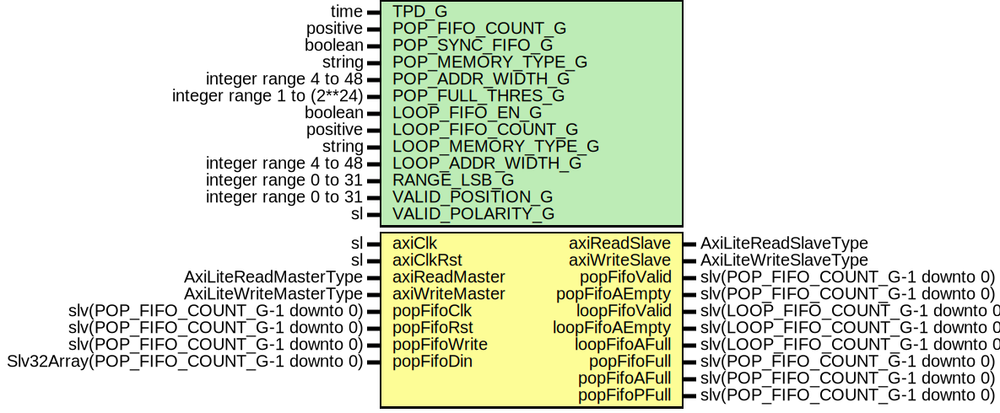

# Entity: AxiLiteFifoPop

- **File**: AxiLiteFifoPop.vhd
## Diagram

## Description

Company    : SLAC National Accelerator Laboratory
Description:
Supports reading of general purpose FIFOs from the AxiLite bus.
One address location per FIFO.
Address map depends on the POP and LOOP FIFO counts.
RANGE_LSB_G sets the address bit which seperates the
POP FIFO address space from the loop FIFO address space.
RANGE_LSB_G must be large enough for the number of POP and LOOP FIFOs
enabled. I.E. if POP_FIFO_COUNT_C is 8, RANGE_FIFO_G must be > 5.
POP Fifos exist at 0x0, 0x4, 0x8, 0xC ...
LOOP Fifos exist at 2^(RANGE_LSB_C) + 0x0, + 0x4, etc.
This file is part of 'SLAC Firmware Standard Library'.
It is subject to the license terms in the LICENSE.txt file found in the
top-level directory of this distribution and at:
   https://confluence.slac.stanford.edu/display/ppareg/LICENSE.html.
No part of 'SLAC Firmware Standard Library', including this file,
may be copied, modified, propagated, or distributed except according to
the terms contained in the LICENSE.txt file.
## Generics

| Generic name       | Type                       | Value   | Description |
| ------------------ | -------------------------- | ------- | ----------- |
| TPD_G              | time                       | 1 ns    |             |
| POP_FIFO_COUNT_G   | positive                   | 1       |             |
| POP_SYNC_FIFO_G    | boolean                    | false   |             |
| POP_MEMORY_TYPE_G  | string                     | "block" |             |
| POP_ADDR_WIDTH_G   | integer range 4 to 48      | 4       |             |
| POP_FULL_THRES_G   | integer range 1 to (2**24) | 1       |             |
| LOOP_FIFO_EN_G     | boolean                    | false   |             |
| LOOP_FIFO_COUNT_G  | positive                   | 1       |             |
| LOOP_MEMORY_TYPE_G | string                     | "block" |             |
| LOOP_ADDR_WIDTH_G  | integer range 4 to 48      | 4       |             |
| RANGE_LSB_G        | integer range 0 to 31      | 8       |             |
| VALID_POSITION_G   | integer range 0 to 31      | 0       |             |
| VALID_POLARITY_G   | sl                         | '0'     |             |
## Ports

| Port name      | Direction | Type                                    | Description                           |
| -------------- | --------- | --------------------------------------- | ------------------------------------- |
| axiClk         | in        | sl                                      | AXI Interface (axiClk)                |
| axiClkRst      | in        | sl                                      |                                       |
| axiReadMaster  | in        | AxiLiteReadMasterType                   |                                       |
| axiReadSlave   | out       | AxiLiteReadSlaveType                    |                                       |
| axiWriteMaster | in        | AxiLiteWriteMasterType                  |                                       |
| axiWriteSlave  | out       | AxiLiteWriteSlaveType                   |                                       |
| popFifoValid   | out       | slv(POP_FIFO_COUNT_G-1 downto 0)        |                                       |
| popFifoAEmpty  | out       | slv(POP_FIFO_COUNT_G-1 downto 0)        |                                       |
| loopFifoValid  | out       | slv(LOOP_FIFO_COUNT_G-1 downto 0)       |                                       |
| loopFifoAEmpty | out       | slv(LOOP_FIFO_COUNT_G-1 downto 0)       |                                       |
| loopFifoAFull  | out       | slv(LOOP_FIFO_COUNT_G-1 downto 0)       |                                       |
| popFifoClk     | in        | slv(POP_FIFO_COUNT_G-1 downto 0)        | POP FIFO Write Interface (popFifoClk) |
| popFifoRst     | in        | slv(POP_FIFO_COUNT_G-1 downto 0)        |                                       |
| popFifoWrite   | in        | slv(POP_FIFO_COUNT_G-1 downto 0)        |                                       |
| popFifoDin     | in        | Slv32Array(POP_FIFO_COUNT_G-1 downto 0) |                                       |
| popFifoFull    | out       | slv(POP_FIFO_COUNT_G-1 downto 0)        |                                       |
| popFifoAFull   | out       | slv(POP_FIFO_COUNT_G-1 downto 0)        |                                       |
| popFifoPFull   | out       | slv(POP_FIFO_COUNT_G-1 downto 0)        |                                       |
## Signals

| Name           | Type                                | Description   |
| -------------- | ----------------------------------- | ------------- |
| ipopFifoValid  | slv(POP_COUNT_C-1 downto 0)         | Local Signals |
| ipopFifoDout   | Slv32Array(POP_COUNT_C-1 downto 0)  |               |
| ipopFifoRead   | slv(POP_COUNT_C-1 downto 0)         |               |
| iloopFifoDin   | slv(31 downto 0)                    |               |
| iloopFifoWrite | Slv(LOOP_COUNT_C-1 downto 0)        |               |
| iloopFifoValid | slv(LOOP_COUNT_C-1 downto 0)        |               |
| iloopFifoDout  | Slv32Array(LOOP_COUNT_C-1 downto 0) |               |
| iloopFifoRead  | slv(LOOP_COUNT_C-1 downto 0)        |               |
| r              | RegType                             |               |
| rin            | RegType                             |               |
## Constants

| Name         | Type    | Value                                                                                                                                                                                                                                                                                                                                                                                                                                                             | Description |
| ------------ | ------- | ----------------------------------------------------------------------------------------------------------------------------------------------------------------------------------------------------------------------------------------------------------------------------------------------------------------------------------------------------------------------------------------------------------------------------------------------------------------- | ----------- |
| POP_SIZE_C   | integer |  bitSize(POP_FIFO_COUNT_G-1)                                                                                                                                                                                                                                                                                                                                                                                                                                      |             |
| POP_COUNT_C  | integer |  2**POP_SIZE_C                                                                                                                                                                                                                                                                                                                                                                                                                                                    |             |
| LOOP_SIZE_C  | integer |  bitSize(LOOP_FIFO_COUNT_G-1)                                                                                                                                                                                                                                                                                                                                                                                                                                     |             |
| LOOP_COUNT_C | integer |  2**LOOP_SIZE_C                                                                                                                                                                                                                                                                                                                                                                                                                                                   |             |
| REG_INIT_C   | RegType |  (       loopFifoDin   => (others => '0'),        loopFifoWrite => (others => '0'),        loopFifoRead  => (others => '0'),        popFifoRead   => (others => '0'),        axiReadSlave  => AXI_LITE_READ_SLAVE_INIT_C,        axiWriteSlave => AXI_LITE_WRITE_SLAVE_INIT_C    ) |             |
## Types

| Name    | Type | Description |
| ------- | ---- | ----------- |
| RegType |      |             |
## Processes
- unnamed: ( axiClk )
**Description**
AXI Lite
Sync

- unnamed: ( r, axiClkRst, axiReadMaster, axiWriteMaster, ipopFifoDout, ipopFifoValid, iloopFifoDout, iloopFifoValid )
**Description**
Async

