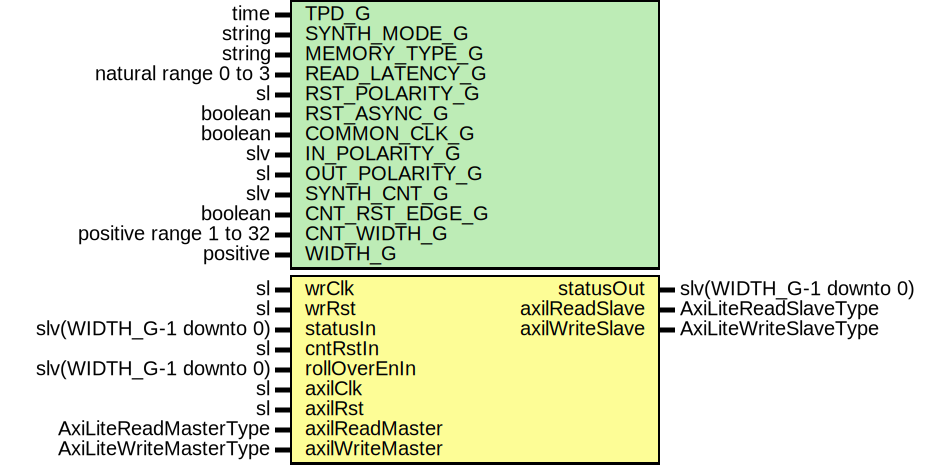

# Entity: AxiLiteRamSyncStatusVector

## Diagram

## Description

Company    : SLAC National Accelerator Laboratory
Description: A wrapper of AxiDualPortRam & SyncStatusVector
This file is part of 'SLAC Firmware Standard Library'.
It is subject to the license terms in the LICENSE.txt file found in the
top-level directory of this distribution and at:
   https://confluence.slac.stanford.edu/display/ppareg/LICENSE.html.
No part of 'SLAC Firmware Standard Library', including this file,
may be copied, modified, propagated, or distributed except according to
the terms contained in the LICENSE.txt file.
## Generics

| Generic name   | Type                   | Value      | Description                                                             |
| -------------- | ---------------------- | ---------- | ----------------------------------------------------------------------- |
| TPD_G          | time                   | 1 ns       | Simulation FF output delay                                              |
| SYNTH_MODE_G   | string                 | "inferred" | AxiDualPortRam Generics                                                 |
| MEMORY_TYPE_G  | string                 | "block"    |                                                                         |
| READ_LATENCY_G | natural range 0 to 3   | 3          |                                                                         |
| RST_POLARITY_G | sl                     | '1'        | '1' for active HIGH reset, '0' for active LOW reset                     |
| RST_ASYNC_G    | boolean                | false      | true if reset is asynchronous, false if reset is synchronous            |
| COMMON_CLK_G   | boolean                | false      | True if wrClk and rdClk are the same clock                              |
| IN_POLARITY_G  | slv                    | "1"        | 0 for active LOW, 1 for active HIGH (for statusIn port)                 |
| OUT_POLARITY_G | sl                     | '1'        | 0 for active LOW, 1 for active HIGH (for irqOut port)                   |
| SYNTH_CNT_G    | slv                    | "1"        | Set to 1 for synthesising counter RTL, '0' to not synthesis the counter |
| CNT_RST_EDGE_G | boolean                | true       | true if counter reset should be edge detected, else level detected      |
| CNT_WIDTH_G    | positive range 1 to 32 | 32         | Counters' width                                                         |
| WIDTH_G        | positive               |            |                                                                         |
## Ports

| Port name       | Direction | Type                    | Description                               |
| --------------- | --------- | ----------------------- | ----------------------------------------- |
| wrClk           | in        | sl                      | Inbound Status bit Signals (wrClk domain) |
| wrRst           | in        | sl                      |                                           |
| statusIn        | in        | slv(WIDTH_G-1 downto 0) | Data to be 'synced'                       |
| statusOut       | out       | slv(WIDTH_G-1 downto 0) | Synced data                               |
| cntRstIn        | in        | sl                      |                                           |
| rollOverEnIn    | in        | slv(WIDTH_G-1 downto 0) | No roll over for all counters by default  |
| axilClk         | in        | sl                      | AXI-Lite Interface                        |
| axilRst         | in        | sl                      |                                           |
| axilReadMaster  | in        | AxiLiteReadMasterType   |                                           |
| axilReadSlave   | out       | AxiLiteReadSlaveType    |                                           |
| axilWriteMaster | in        | AxiLiteWriteMasterType  |                                           |
| axilWriteSlave  | out       | AxiLiteWriteSlaveType   |                                           |
## Signals

| Name      | Type                                                                                          | Description |
| --------- | --------------------------------------------------------------------------------------------- | ----------- |
| r         | RegType                                                                                       |             |
| rin       | RegType                                                                                       |             |
| statusCnt | SlVectorArray(WIDTH_G-1 downto 0,  CNT_WIDTH_G-1 downto 0) |             |
## Constants

| Name         | Type     | Value                                                                                                                                                                                                            | Description |
| ------------ | -------- | ---------------------------------------------------------------------------------------------------------------------------------------------------------------------------------------------------------------- | ----------- |
| ADDR_WIDTH_C | positive |  bitSize(WIDTH_G-1)                                                                                                                                                                                              |             |
| REG_INIT_C   | RegType  |  (       we   => '0',        addr => (others => '0'),        data => (others => '0'),        cnt  => 0) |             |
## Types

| Name    | Type | Description |
| ------- | ---- | ----------- |
| RegType |      |             |
## Processes
- unnamed: ( axilRst, r, statusCnt )
- unnamed: ( axilClk )
## Instantiations

- U_AxiDualPortRam: surf.AxiDualPortRam
- U_SyncStatusVector: surf.SyncStatusVector
