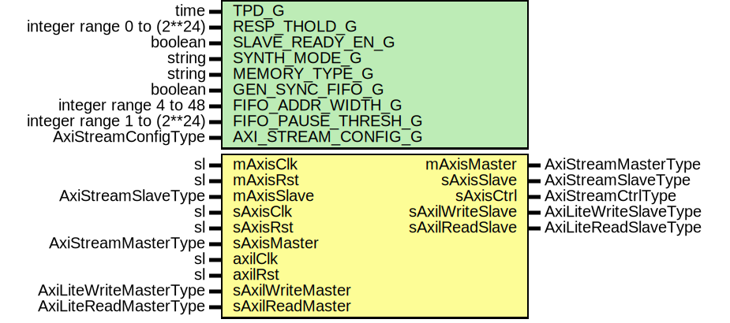

# Entity: AxiLiteSrpV0

- **File**: AxiLiteSrpV0.vhd
## Diagram

## Description

-----------------------------------------------------------------------------
 Title      : SRPv0 Protocol: https://confluence.slac.stanford.edu/x/aRmVD
-----------------------------------------------------------------------------
 Company    : SLAC National Accelerator Laboratory
-----------------------------------------------------------------------------
 Description: SLAC Register Protocol Version 0, AXI-Lite Interface

 Note: This module only supports 32-bit aligned addresses and 32-bit transactions.
-----------------------------------------------------------------------------
 This file is part of 'SLAC Firmware Standard Library'.
 It is subject to the license terms in the LICENSE.txt file found in the
 top-level directory of this distribution and at:
    https://confluence.slac.stanford.edu/display/ppareg/LICENSE.html.
 No part of 'SLAC Firmware Standard Library', including this file,
 may be copied, modified, propagated, or distributed except according to
 the terms contained in the LICENSE.txt file.
-----------------------------------------------------------------------------
## Generics

| Generic name        | Type                       | Value      | Description            |
| ------------------- | -------------------------- | ---------- | ---------------------- |
| TPD_G               | time                       | 1 ns       | General Config         |
| RESP_THOLD_G        | integer range 0 to (2**24) | 1          |  =1 = normal operation |
| SLAVE_READY_EN_G    | boolean                    | false      |                        |
| SYNTH_MODE_G        | string                     | "inferred" |                        |
| MEMORY_TYPE_G       | string                     | "block"    |                        |
| GEN_SYNC_FIFO_G     | boolean                    | false      |                        |
| FIFO_ADDR_WIDTH_G   | integer range 4 to 48      | 9          |                        |
| FIFO_PAUSE_THRESH_G | integer range 1 to (2**24) | 2**8       |                        |
| AXI_STREAM_CONFIG_G | AxiStreamConfigType        |            | AXI Stream IO Config   |
## Ports

| Port name        | Direction | Type                   | Description                                            |
| ---------------- | --------- | ---------------------- | ------------------------------------------------------ |
| mAxisClk         | in        | sl                     | Streaming Master (Tx) Data Interface (mAxisClk domain) |
| mAxisRst         | in        | sl                     |                                                        |
| mAxisMaster      | out       | AxiStreamMasterType    |                                                        |
| mAxisSlave       | in        | AxiStreamSlaveType     |                                                        |
| sAxisClk         | in        | sl                     | Streaming Slave (Rx) Interface (sAxisClk domain)       |
| sAxisRst         | in        | sl                     |                                                        |
| sAxisMaster      | in        | AxiStreamMasterType    |                                                        |
| sAxisSlave       | out       | AxiStreamSlaveType     |                                                        |
| sAxisCtrl        | out       | AxiStreamCtrlType      |                                                        |
| axilClk          | in        | sl                     | AXI Lite Bus Slave (axiLiteClk domain)                 |
| axilRst          | in        | sl                     |                                                        |
| sAxilWriteMaster | in        | AxiLiteWriteMasterType |                                                        |
| sAxilWriteSlave  | out       | AxiLiteWriteSlaveType  |                                                        |
| sAxilReadMaster  | in        | AxiLiteReadMasterType  |                                                        |
| sAxilReadSlave   | out       | AxiLiteReadSlaveType   |                                                        |
## Signals

| Name             | Type                | Description |
| ---------------- | ------------------- | ----------- |
| rxFifoAxisMaster | AxiStreamMasterType |             |
| rxFifoAxisSlave  | AxiStreamSlaveType  |             |
| txFifoAxisMaster | AxiStreamMasterType |             |
| txFifoAxisSlave  | AxiStreamSlaveType  |             |
| r                | RegType             |             |
| rin              | RegType             |             |
## Constants

| Name                | Type                | Value                                                                                                                                                                                                                                                                                                                                                                                                                                                                                                                                                                           | Description |
| ------------------- | ------------------- | ------------------------------------------------------------------------------------------------------------------------------------------------------------------------------------------------------------------------------------------------------------------------------------------------------------------------------------------------------------------------------------------------------------------------------------------------------------------------------------------------------------------------------------------------------------------------------- | ----------- |
| INTERNAL_AXIS_CFG_C | AxiStreamConfigType |  ssiAxiStreamConfig(16,  TKEEP_COMP_C)                                                                                                                                                                                                                                                                                                                                                                                                                                                                                                       |             |
| TIMEOUT_COUNT_C     | integer             |  156250000                                                                                                                                                                                                                                                                                                                                                                                                                                                                                                                                                                      |             |
| REG_INIT_C          | RegType             |  (       state            => WAIT_AXIL_REQ_S,        txnCount         => (others => '0'),        timeoutCount     => (others => '0'),        sAxilWriteSlave  => AXI_LITE_WRITE_SLAVE_INIT_C,        sAxilReadSlave   => AXI_LITE_READ_SLAVE_INIT_C,        txFifoAxisMaster => AXI_STREAM_MASTER_INIT_C,        rxFifoAxisSlave  => AXI_STREAM_SLAVE_INIT_C) |             |
## Types

| Name      | Type                                                                                                                  | Description |
| --------- | --------------------------------------------------------------------------------------------------------------------- | ----------- |
| StateType | (WAIT_AXIL_REQ_S,  WAIT_AXIS_RESP_S,  BLEED_S)  |             |
| RegType   |                                                                                                                       |             |
## Processes
- comb: ( axilRst, r, rxFifoAxisMaster, sAxilReadMaster, sAxilWriteMaster, txFifoAxisSlave )
**Description**
-----------------------------------  Master State Machine ----------------------------------- 
- seq: ( axilClk )
## Instantiations

- TxAxiStreamFifo: surf.AxiStreamFifoV2
- RxAxiStreamFifo: surf.AxiStreamFifoV2
**Description**
--------------------------------
 Input FIFO
--------------------------------

