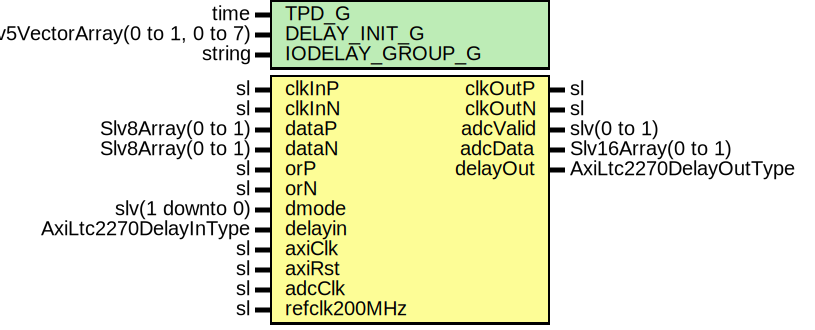

# Entity: AxiLtc2270Deser

- **File**: AxiLtc2270Deser.vhd
## Diagram

## Description

-----------------------------------------------------------------------------
 Company    : SLAC National Accelerator Laboratory
-----------------------------------------------------------------------------
 Description: ADC DDR Deserializer
-----------------------------------------------------------------------------
 This file is part of 'SLAC Firmware Standard Library'.
 It is subject to the license terms in the LICENSE.txt file found in the
 top-level directory of this distribution and at:
    https://confluence.slac.stanford.edu/display/ppareg/LICENSE.html.
 No part of 'SLAC Firmware Standard Library', including this file,
 may be copied, modified, propagated, or distributed except according to
 the terms contained in the LICENSE.txt file.
-----------------------------------------------------------------------------
## Generics

| Generic name    | Type                            | Value                                   | Description |
| --------------- | ------------------------------- | --------------------------------------- | ----------- |
| TPD_G           | time                            | 1 ns                                    |             |
| DELAY_INIT_G    | Slv5VectorArray(0 to 1, 0 to 7) | (others => (others => (others => '0'))) |             |
| IODELAY_GROUP_G | string                          | "AXI_LTC2270_IODELAY_GRP"               |             |
## Ports

| Port name    | Direction | Type                   | Description                              |
| ------------ | --------- | ---------------------- | ---------------------------------------- |
| clkInP       | in        | sl                     | ADC Ports                                |
| clkInN       | in        | sl                     |                                          |
| clkOutP      | out       | sl                     |                                          |
| clkOutN      | out       | sl                     |                                          |
| dataP        | in        | Slv8Array(0 to 1)      |                                          |
| dataN        | in        | Slv8Array(0 to 1)      |                                          |
| orP          | in        | sl                     |                                          |
| orN          | in        | sl                     |                                          |
| adcValid     | out       | slv(0 to 1)            | ADC Data Interface (axiClk domain)       |
| adcData      | out       | Slv16Array(0 to 1)     |  2's complement                          |
| dmode        | in        | slv(1 downto 0)        | Register Interface (axiClk domain)       |
| delayin      | in        | AxiLtc2270DelayInType  | Register Interface (refclk200MHz domain) |
| delayOut     | out       | AxiLtc2270DelayOutType |                                          |
| axiClk       | in        | sl                     | Clocks and Resets                        |
| axiRst       | in        | sl                     |                                          |
| adcClk       | in        | sl                     |  Up to 20 MHz                            |
| refclk200MHz | in        | sl                     |                                          |
## Signals

| Name             | Type               | Description |
| ---------------- | ------------------ | ----------- |
| adcInClk         | sl                 |             |
| 
      adcClock  | sl                 |             |
| dmux             | slv(1 downto 0)    |             |
| adcDataPs        | Slv8Array(0 to 1)  |             |
| 
      adcDataNs | Slv8Array(0 to 1)  |             |
| 
      adcDataP  | Slv8Array(0 to 1)  |             |
| 
      adcDataN  | Slv8Array(0 to 1)  |             |
| 
      adcDataNd | Slv8Array(0 to 1)  |             |
| 
      adcDmuxA  | Slv8Array(0 to 1)  |             |
| 
      adcDmuxB  | Slv8Array(0 to 1)  |             |
| data             | Slv16Array(0 to 1) |             |
## Instantiations

- ClkOutBufDiff_0: surf.ClkOutBufDiff
- IBUFDS_OR: IBUFDS
- IBUFGDS_0: IBUFGDS
- BUFG_0: BUFG
- SynchVector_Inst: surf.SynchronizerVector
- IDELAYCTRL_Inst: IDELAYCTRL
