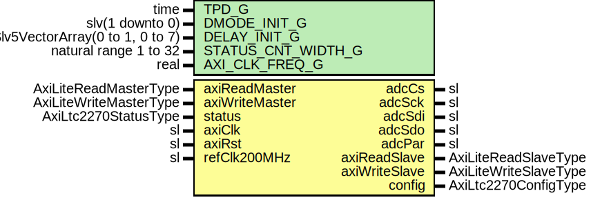

# Entity: AxiLtc2270Reg

- **File**: AxiLtc2270Reg.vhd
## Diagram

## Description

-----------------------------------------------------------------------------
 Company    : SLAC National Accelerator Laboratory
-----------------------------------------------------------------------------
 Description: AXI-Lite Register Access Module
-----------------------------------------------------------------------------
 This file is part of 'SLAC Firmware Standard Library'.
 It is subject to the license terms in the LICENSE.txt file found in the
 top-level directory of this distribution and at:
    https://confluence.slac.stanford.edu/display/ppareg/LICENSE.html.
 No part of 'SLAC Firmware Standard Library', including this file,
 may be copied, modified, propagated, or distributed except according to
 the terms contained in the LICENSE.txt file.
-----------------------------------------------------------------------------
## Generics

| Generic name       | Type                            | Value                                   | Description |
| ------------------ | ------------------------------- | --------------------------------------- | ----------- |
| TPD_G              | time                            | 1 ns                                    |             |
| DMODE_INIT_G       | slv(1 downto 0)                 | "00"                                    |             |
| DELAY_INIT_G       | Slv5VectorArray(0 to 1, 0 to 7) | (others => (others => (others => '0'))) |             |
| STATUS_CNT_WIDTH_G | natural range 1 to 32           | 32                                      |             |
| AXI_CLK_FREQ_G     | real                            | 200.0E+6                                |             |
## Ports

| Port name      | Direction | Type                   | Description                                 |
| -------------- | --------- | ---------------------- | ------------------------------------------- |
| adcCs          | out       | sl                     | ADC Ports                                   |
| adcSck         | out       | sl                     |                                             |
| adcSdi         | out       | sl                     |                                             |
| adcSdo         | inout     | sl                     |                                             |
| adcPar         | out       | sl                     |                                             |
| axiReadMaster  | in        | AxiLiteReadMasterType  | AXI-Lite Register Interface (axiClk domain) |
| axiReadSlave   | out       | AxiLiteReadSlaveType   |                                             |
| axiWriteMaster | in        | AxiLiteWriteMasterType |                                             |
| axiWriteSlave  | out       | AxiLiteWriteSlaveType  |                                             |
| status         | in        | AxiLtc2270StatusType   | Register Inputs/Outputs (axiClk domain)     |
| config         | out       | AxiLtc2270ConfigType   |                                             |
| axiClk         | in        | sl                     | Global Signals                              |
| axiRst         | in        | sl                     |                                             |
| refClk200MHz   | in        | sl                     |                                             |
## Signals

| Name       | Type                 | Description |
| ---------- | -------------------- | ----------- |
| r          | RegType              |             |
| rin        | RegType              |             |
| regIn      | AxiLtc2270StatusType |             |
| regOut     | AxiLtc2270ConfigType |             |
| cntRst     | sl                   |             |
| 
      sdo | sl                   |             |
## Constants

| Name         | Type    | Value                                                                                                                                                                                                                                                                                                                                                                                                                                                                                                                                                                                                                                                                                                                                                                                                                                                                                                              | Description |
| ------------ | ------- | ------------------------------------------------------------------------------------------------------------------------------------------------------------------------------------------------------------------------------------------------------------------------------------------------------------------------------------------------------------------------------------------------------------------------------------------------------------------------------------------------------------------------------------------------------------------------------------------------------------------------------------------------------------------------------------------------------------------------------------------------------------------------------------------------------------------------------------------------------------------------------------------------------------------ | ----------- |
| HALF_SCLK_C  | natural |  getTimeRatio(AXI_CLK_FREQ_G,  8.0E+06)                                                                                                                                                                                                                                                                                                                                                                                                                                                                                                                                                                                                                                                                                                                                                                                                                                         |             |
| TIMEOUT_1S_C | natural |  getTimeRatio(AXI_CLK_FREQ_G,  1.0E+00)                                                                                                                                                                                                                                                                                                                                                                                                                                                                                                                                                                                                                                                                                                                                                                                                                                         |             |
| REG_INIT_C   | RegType |  (       '0',        '0',        '1',        '1',        '1',        (others => '0'),        (others => '0'),        0,        0,        (others => (others => '0')),        (others => '0'),        (others => (others => (others => '0'))),        AXI_LTC2270_CONFIG_INIT_C,        IDLE_S,        AXI_LITE_READ_SLAVE_INIT_C,        AXI_LITE_WRITE_SLAVE_INIT_C) |             |
## Types

| Name      | Type                                                                                                      | Description |
| --------- | --------------------------------------------------------------------------------------------------------- | ----------- |
| StateType | ( IDLE_S,  SCK_LOW_S,  SCK_HIGH_S)  |             |
| RegType   |                                                                                                           |             |
## Processes
- comb: ( axiReadMaster, axiRst, axiWriteMaster, r, regIn, sdo )
 **Description**
 3-state enable input, high=input, low=output -----------------------------  Configuration Register ----------------------------- 
- seq: ( axiClk )
## Instantiations

- IOBUF_INST: IOBUF
 **Description**
 '0' = Normal Operation

- SyncOut_delayIn_load: surf.RstSync
- SyncOut_delayIn_rst: surf.RstSync
- SyncIn_delayOut_rdy: surf.Synchronizer
