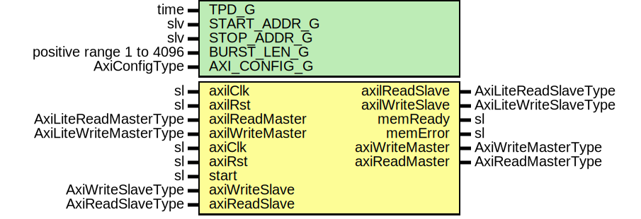

# Entity: AxiMemTester

- **File**: AxiMemTester.vhd
## Diagram

## Description

-----------------------------------------------------------------------------
 Company    : SLAC National Accelerator Laboratory
-----------------------------------------------------------------------------
 Description: General Purpose AXI4 memory tester
-----------------------------------------------------------------------------
 This file is part of 'SLAC Firmware Standard Library'.
 It is subject to the license terms in the LICENSE.txt file found in the
 top-level directory of this distribution and at:
    https://confluence.slac.stanford.edu/display/ppareg/LICENSE.html.
 No part of 'SLAC Firmware Standard Library', including this file,
 may be copied, modified, propagated, or distributed except according to
 the terms contained in the LICENSE.txt file.
-----------------------------------------------------------------------------
## Generics

| Generic name | Type                     | Value       | Description |
| ------------ | ------------------------ | ----------- | ----------- |
| TPD_G        | time                     | 1 ns        |             |
| START_ADDR_G | slv                      | X"00000000" |             |
| STOP_ADDR_G  | slv                      | X"FFFFFFFF" |             |
| BURST_LEN_G  | positive range 1 to 4096 | 4096        |             |
| AXI_CONFIG_G | AxiConfigType            |             |             |
## Ports

| Port name       | Direction | Type                   | Description           |
| --------------- | --------- | ---------------------- | --------------------- |
| axilClk         | in        | sl                     | AXI-Lite Interface    |
| axilRst         | in        | sl                     |                       |
| axilReadMaster  | in        | AxiLiteReadMasterType  |                       |
| axilReadSlave   | out       | AxiLiteReadSlaveType   |                       |
| axilWriteMaster | in        | AxiLiteWriteMasterType |                       |
| axilWriteSlave  | out       | AxiLiteWriteSlaveType  |                       |
| memReady        | out       | sl                     |                       |
| memError        | out       | sl                     |                       |
| axiClk          | in        | sl                     | AXI4 Memory Interface |
| axiRst          | in        | sl                     |                       |
| start           | in        | sl                     |                       |
| axiWriteMaster  | out       | AxiWriteMasterType     |                       |
| axiWriteSlave   | in        | AxiWriteSlaveType      |                       |
| axiReadMaster   | out       | AxiReadMasterType      |                       |
| axiReadSlave    | in        | AxiReadSlaveType       |                       |
## Signals

| Name        | Type                             | Description |
| ----------- | -------------------------------- | ----------- |
| r           | RegType                          |             |
| rin         | RegType                          |             |
| startSync   | sl                               |             |
| busy        | sl                               |             |
| done        | sl                               |             |
| error       | sl                               |             |
| wTimer      | slv(31 downto 0)                 |             |
| rTimer      | slv(31 downto 0)                 |             |
| wErrResp    | sl                               |             |
| rErrResp    | sl                               |             |
| rErrData    | sl                               |             |
| rDataIn     | slv(DATA_SYNC_BITS_C-1 downto 0) |             |
| rPatternIn  | slv(DATA_SYNC_BITS_C-1 downto 0) |             |
| rDataOut    | slv(1023 downto 0)               |             |
| rPatternOut | slv(1023 downto 0)               |             |
| rLite       | RegLiteType                      |             |
| rinLite     | RegLiteType                      |             |
## Constants

| Name             | Type                                      | Value                                                                                                                                                                                                                                                                                                                                                                                                                                                                                                                                                                                                                                                                                                                                                                                                                                                                                                                                                                                                                                                                                                                                                                                                                                                                                                | Description |
| ---------------- | ----------------------------------------- | ---------------------------------------------------------------------------------------------------------------------------------------------------------------------------------------------------------------------------------------------------------------------------------------------------------------------------------------------------------------------------------------------------------------------------------------------------------------------------------------------------------------------------------------------------------------------------------------------------------------------------------------------------------------------------------------------------------------------------------------------------------------------------------------------------------------------------------------------------------------------------------------------------------------------------------------------------------------------------------------------------------------------------------------------------------------------------------------------------------------------------------------------------------------------------------------------------------------------------------------------------------------------------------------------------- | ----------- |
| START_C          | slv(AXI_CONFIG_G.ADDR_WIDTH_C-1 downto 0) |  START_ADDR_G(AXI_CONFIG_G.ADDR_WIDTH_C-1 downto 0)                                                                                                                                                                                                                                                                                                                                                                                                                                                                                                                                                                                                                                                                                                                                                                                                                                                                                                                                                                                                                                                                                                                                                                                                                                                  |             |
| START_ADDR_C     | slv(AXI_CONFIG_G.ADDR_WIDTH_C-1 downto 0) |  START_C(AXI_CONFIG_G.ADDR_WIDTH_C-1 downto 12) & x"000"                                                                                                                                                                                                                                                                                                                                                                                                                                                                                                                                                                                                                                                                                                                                                                                                                                                                                                                                                                                                                                                                                                                                                                                                                                             |             |
| STOP_C           | slv(AXI_CONFIG_G.ADDR_WIDTH_C-1 downto 0) |  STOP_ADDR_G(AXI_CONFIG_G.ADDR_WIDTH_C-1 downto 0)                                                                                                                                                                                                                                                                                                                                                                                                                                                                                                                                                                                                                                                                                                                                                                                                                                                                                                                                                                                                                                                                                                                                                                                                                                                   |             |
| STOP_ADDR_C      | slv(AXI_CONFIG_G.ADDR_WIDTH_C-1 downto 0) |  STOP_C(AXI_CONFIG_G.ADDR_WIDTH_C-1 downto 12) & x"000"                                                                                                                                                                                                                                                                                                                                                                                                                                                                                                                                                                                                                                                                                                                                                                                                                                                                                                                                                                                                                                                                                                                                                                                                                                              |             |
| DATA_BITS_C      | natural                                   |  8*AXI_CONFIG_G.DATA_BYTES_C                                                                                                                                                                                                                                                                                                                                                                                                                                                                                                                                                                                                                                                                                                                                                                                                                                                                                                                                                                                                                                                                                                                                                                                                                                                                         |             |
| AXI_LEN_C        | slv(7 downto 0)                           |  getAxiLen(AXI_CONFIG_G,  BURST_LEN_G)                                                                                                                                                                                                                                                                                                                                                                                                                                                                                                                                                                                                                                                                                                                                                                                                                                                                                                                                                                                                                                                                                                                                                                                                                            |             |
| PRBS_TAPS_C      | NaturalArray                              |  (0 => (DATA_BITS_C-1),  1 => (DATA_BITS_C/2),  2 => (DATA_BITS_C/4))                                                                                                                                                                                                                                                                                                                                                                                                                                                                                                                                                                                                                                                                                                                                                                                                                                                                                                                                                                                                                                                                                                                                                          |             |
| DATA_SYNC_BITS_C | natural                                   |  ite(DATA_BITS_C<1024,  DATA_BITS_C,  1024)                                                                                                                                                                                                                                                                                                                                                                                                                                                                                                                                                                                                                                                                                                                                                                                                                                                                                                                                                                                                                                                                                                                                                                                    |             |
| PRBS_SEED_C      | slv(DATA_BITS_C-1 downto 0)               |  GenSeed                                                                                                                                                                                                                                                                                                                                                                                                                                                                                                                                                                                                                                                                                                                                                                                                                                                                                                                                                                                                                                                                                                                                                                                                                                                                                             |             |
| REG_INIT_C       | RegType                                   |  (       busy           => '0',        done           => '0',        error          => '0',        wErrResp       => '0',        rErrResp       => '0',        rErrData       => '0',        wTimerEn       => '0',        rTimerEn       => '0',        wTimer         => (others => '0'),        rTimer         => (others => '0'),        len            => AXI_LEN_C,        address        => (others => '0'),        randomData     => PRBS_SEED_C,        rData          => (others => '0'),        rPattern       => (others => '0'),        state          => IDLE_S,        axiWriteMaster => AXI_WRITE_MASTER_INIT_C,        axiReadMaster  => AXI_READ_MASTER_INIT_C) |             |
| REG_LITE_INIT_C  | RegLiteType                               |  (       memReady       => '0',        memError       => '0',        axilReadSlave  => AXI_LITE_READ_SLAVE_INIT_C,        axilWriteSlave => AXI_LITE_WRITE_SLAVE_INIT_C)                                                                                                                                                                                                                                                                                                                                                                                                                                                                                                                                                                                                                                                                                                                                                                                                                                                                                                                                                                                                                    |             |
## Types

| Name        | Type                                                                                                                                                                                                                                                                                                                                                        | Description |
| ----------- | ----------------------------------------------------------------------------------------------------------------------------------------------------------------------------------------------------------------------------------------------------------------------------------------------------------------------------------------------------------- | ----------- |
| StateType   | ( IDLE_S,  WRITE_ADDR_S,  WRITE_DATA_S,  WRITE_RESP_S,  READ_ADDR_S,  READ_DATA_S,  DONE_S,  ERROR_S)  |             |
| RegType     |                                                                                                                                                                                                                                                                                                                                                             |             |
| RegLiteType |                                                                                                                                                                                                                                                                                                                                                             |             |
## Functions
- GenSeed () return slv 
## Processes
- comb: ( axiReadSlave, axiRst, axiWriteSlave, r, start )
- seq: ( axiClk )
- combLite: ( axilReadMaster, axilRst, axilWriteMaster, done, error, busy, startSync,
                       rLite, rTimer, wTimer, wErrResp, rErrResp, rErrData, rDataOut, rPatternOut )
- seqLite: ( axilClk )
## Instantiations

- U_SyncBits: surf.SynchronizerVector
- U_wTimer: surf.SynchronizerFifo
- U_rTimer: surf.SynchronizerFifo
- U_rData: surf.SynchronizerVector
- U_rPattern: surf.SynchronizerVector
