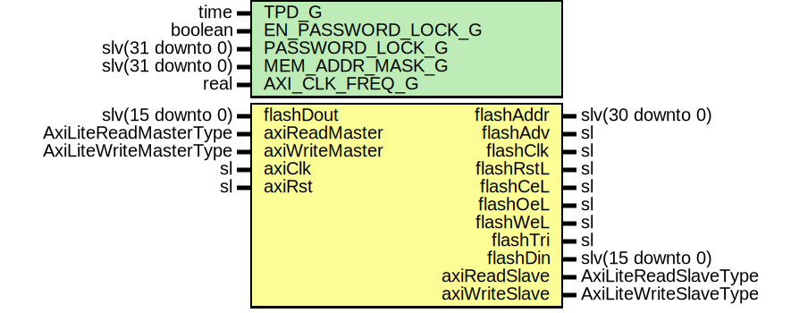

# Entity: AxiMicronP30Reg

- **File**: AxiMicronP30Reg.vhd
## Diagram

## Description

-----------------------------------------------------------------------------
 Company    : SLAC National Accelerator Laboratory
-----------------------------------------------------------------------------
 Description: This controller is designed around the Micron PC28F FLASH IC.
-----------------------------------------------------------------------------
 This file is part of 'SLAC Firmware Standard Library'.
 It is subject to the license terms in the LICENSE.txt file found in the
 top-level directory of this distribution and at:
    https://confluence.slac.stanford.edu/display/ppareg/LICENSE.html.
 No part of 'SLAC Firmware Standard Library', including this file,
 may be copied, modified, propagated, or distributed except according to
 the terms contained in the LICENSE.txt file.
-----------------------------------------------------------------------------
## Generics

| Generic name       | Type             | Value       | Description |
| ------------------ | ---------------- | ----------- | ----------- |
| TPD_G              | time             | 1 ns        |             |
| EN_PASSWORD_LOCK_G | boolean          | false       |             |
| PASSWORD_LOCK_G    | slv(31 downto 0) | x"DEADBEEF" |             |
| MEM_ADDR_MASK_G    | slv(31 downto 0) | x"00000000" |             |
| AXI_CLK_FREQ_G     | real             | 200.0E+6    |             |
## Ports

| Port name      | Direction | Type                   | Description                 |
| -------------- | --------- | ---------------------- | --------------------------- |
| flashAddr      | out       | slv(30 downto 0)       | FLASH Interface             |
| flashAdv       | out       | sl                     |                             |
| flashClk       | out       | sl                     |                             |
| flashRstL      | out       | sl                     |                             |
| flashCeL       | out       | sl                     |                             |
| flashOeL       | out       | sl                     |                             |
| flashWeL       | out       | sl                     |                             |
| flashTri       | out       | sl                     |                             |
| flashDin       | out       | slv(15 downto 0)       |                             |
| flashDout      | in        | slv(15 downto 0)       |                             |
| axiReadMaster  | in        | AxiLiteReadMasterType  | AXI-Lite Register Interface |
| axiReadSlave   | out       | AxiLiteReadSlaveType   |                             |
| axiWriteMaster | in        | AxiLiteWriteMasterType |                             |
| axiWriteSlave  | out       | AxiLiteWriteSlaveType  |                             |
| axiClk         | in        | sl                     | Clocks and Resets           |
| axiRst         | in        | sl                     |                             |
## Signals

| Name    | Type             | Description |
| ------- | ---------------- | ----------- |
| r       | RegType          |             |
| rin     | RegType          |             |
| ramDout | slv(15 downto 0) |             |
## Constants

| Name                | Type    | Value                                                                                                                                                                                                                                                                                                                                                                                                                                                                                                                                                                                                                                                                                                                                                                                                                                                                                                                                                                                                                                                                                                                                                                                                                                                                                                                                                                                                                                                                                                                                                                                                                                                                                                                                                                                                                                                                                                                                                      | Description       |
| ------------------- | ------- | ---------------------------------------------------------------------------------------------------------------------------------------------------------------------------------------------------------------------------------------------------------------------------------------------------------------------------------------------------------------------------------------------------------------------------------------------------------------------------------------------------------------------------------------------------------------------------------------------------------------------------------------------------------------------------------------------------------------------------------------------------------------------------------------------------------------------------------------------------------------------------------------------------------------------------------------------------------------------------------------------------------------------------------------------------------------------------------------------------------------------------------------------------------------------------------------------------------------------------------------------------------------------------------------------------------------------------------------------------------------------------------------------------------------------------------------------------------------------------------------------------------------------------------------------------------------------------------------------------------------------------------------------------------------------------------------------------------------------------------------------------------------------------------------------------------------------------------------------------------------------------------------------------------------------------------------------------------- | ----------------- |
| HALF_CYCLE_PERIOD_C | real    |  128.0E-9                                                                                                                                                                                                                                                                                                                                                                                                                                                                                                                                                                                                                                                                                                                                                                                                                                                                                                                                                                                                                                                                                                                                                                                                                                                                                                                                                                                                                                                                                                                                                                                                                                                                                                                                                                                                                                                                                                                                                  |  units of seconds |
| HALF_CYCLE_FREQ_C   | real    |  (1.0 / HALF_CYCLE_PERIOD_C)                                                                                                                                                                                                                                                                                                                                                                                                                                                                                                                                                                                                                                                                                                                                                                                                                                                                                                                                                                                                                                                                                                                                                                                                                                                                                                                                                                                                                                                                                                                                                                                                                                                                                                                                                                                                                                                                                                                               |  units of Hz      |
| MAX_CNT_C           | natural |  getTimeRatio(AXI_CLK_FREQ_G,  HALF_CYCLE_FREQ_C)                                                                                                                                                                                                                                                                                                                                                                                                                                                                                                                                                                                                                                                                                                                                                                                                                                                                                                                                                                                                                                                                                                                                                                                                                                                                                                                                                                                                                                                                                                                                                                                                                                                                                                                                                                                                                                                                       |                   |
| REG_INIT_C          | RegType |  (       -- PROM Control Signals       tristate      => '1',        ceL           => '1',        oeL           => '1',        RnW           => '1',        weL           => '1',        cnt           => 0,        din           => x"0000",        dataReg       => x"0000",        addr          => (others => '0'),        wrCmd         => (others => '0'),        wrData        => (others => '0'),        test          => (others => '0'),        -- Block Transfer signals       lockCmd       => '0',        blockRd       => '0',        blockWr       => '0',        blockCnt      => (others => '0'),        xferSize      => (others => '0'),        -- RAM Buffer Signals       ramRd         => (others => '0'),        ramWe         => '0',        ramDin        => (others => '0'),        waddr         => (others => '0'),        raddr         => (others => '0'),        -- AXI-Lite Signals       axiReadSlave  => AXI_LITE_READ_SLAVE_INIT_C,        axiWriteSlave => AXI_LITE_WRITE_SLAVE_INIT_C,        -- Status Machine       state         => IDLE_S) |                   |
## Types

| Name      | Type                                                                                                                                                                                                                                                                                                                                                                                                   | Description |
| --------- | ------------------------------------------------------------------------------------------------------------------------------------------------------------------------------------------------------------------------------------------------------------------------------------------------------------------------------------------------------------------------------------------------------ | ----------- |
| stateType | ( IDLE_S,  RAM_READ_S,  BLOCK_RD_S,  BLOCK_WR_S,  CMD_LOW_S,  CMD_HIGH_S,  WAIT_S,  DATA_LOW_S,  DATA_HIGH_S)  |             |
| RegType   |                                                                                                                                                                                                                                                                                                                                                                                                        |             |
## Processes
- comb: ( axiReadMaster, axiRst, axiWriteMaster, flashDout, r,
                   ramDout )
- seq: ( axiClk )
## Instantiations

- U_Ram: surf.SimpleDualPortRam
