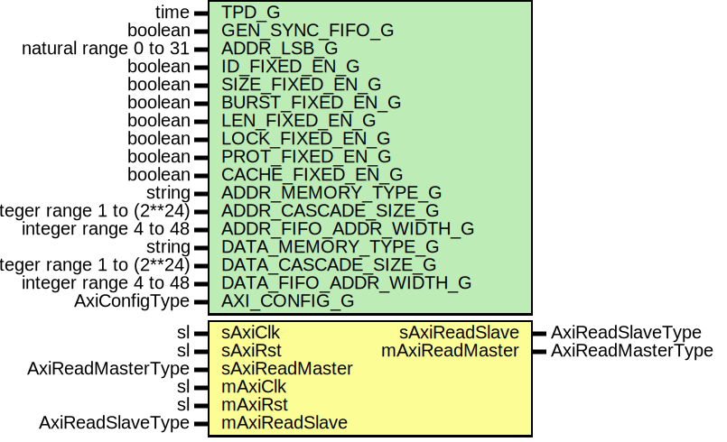

# Entity: AxiReadPathFifo

- **File**: AxiReadPathFifo.vhd
## Diagram

## Description

-----------------------------------------------------------------------------
 Company    : SLAC National Accelerator Laboratory
-----------------------------------------------------------------------------
 Description: FIFO for AXI write path transactions.
-----------------------------------------------------------------------------
 This file is part of 'SLAC Firmware Standard Library'.
 It is subject to the license terms in the LICENSE.txt file found in the
 top-level directory of this distribution and at:
    https://confluence.slac.stanford.edu/display/ppareg/LICENSE.html.
 No part of 'SLAC Firmware Standard Library', including this file,
 may be copied, modified, propagated, or distributed except according to
 the terms contained in the LICENSE.txt file.
-----------------------------------------------------------------------------
## Generics

| Generic name           | Type                       | Value   | Description                  |
| ---------------------- | -------------------------- | ------- | ---------------------------- |
| TPD_G                  | time                       | 1 ns    | General Configurations       |
| GEN_SYNC_FIFO_G        | boolean                    | false   | General FIFO configurations  |
| ADDR_LSB_G             | natural range 0 to 31      | 0       | Bit Optimizations            |
| ID_FIXED_EN_G          | boolean                    | false   |                              |
| SIZE_FIXED_EN_G        | boolean                    | false   |                              |
| BURST_FIXED_EN_G       | boolean                    | false   |                              |
| LEN_FIXED_EN_G         | boolean                    | false   |                              |
| LOCK_FIXED_EN_G        | boolean                    | false   |                              |
| PROT_FIXED_EN_G        | boolean                    | false   |                              |
| CACHE_FIXED_EN_G       | boolean                    | false   |                              |
| ADDR_MEMORY_TYPE_G     | string                     | "block" | Address FIFO Config          |
| ADDR_CASCADE_SIZE_G    | integer range 1 to (2**24) | 1       |                              |
| ADDR_FIFO_ADDR_WIDTH_G | integer range 4 to 48      | 9       |                              |
| DATA_MEMORY_TYPE_G     | string                     | "block" | Data FIFO Config             |
| DATA_CASCADE_SIZE_G    | integer range 1 to (2**24) | 1       |                              |
| DATA_FIFO_ADDR_WIDTH_G | integer range 4 to 48      | 9       |                              |
| AXI_CONFIG_G           | AxiConfigType              |         | BUS Config                   |
## Ports

| Port name      | Direction | Type              | Description |
| -------------- | --------- | ----------------- | ----------- |
| sAxiClk        | in        | sl                | Slave Port  |
| sAxiRst        | in        | sl                |             |
| sAxiReadMaster | in        | AxiReadMasterType |             |
| sAxiReadSlave  | out       | AxiReadSlaveType  |             |
| mAxiClk        | in        | sl                | Master Port |
| mAxiRst        | in        | sl                |             |
| mAxiReadMaster | out       | AxiReadMasterType |             |
| mAxiReadSlave  | in        | AxiReadSlaveType  |             |
## Signals

| Name          | Type                             | Description |
| ------------- | -------------------------------- | ----------- |
| addrFifoWrite | sl                               |             |
| addrFifoDin   | slv(ADDR_FIFO_SIZE_C-1 downto 0) |             |
| addrFifoDout  | slv(ADDR_FIFO_SIZE_C-1 downto 0) |             |
| addrFifoValid | sl                               |             |
| addrFifoAFull | sl                               |             |
| addrFifoRead  | sl                               |             |
| dataFifoWrite | sl                               |             |
| dataFifoDin   | slv(DATA_FIFO_SIZE_C-1 downto 0) |             |
| dataFifoDout  | slv(DATA_FIFO_SIZE_C-1 downto 0) |             |
| dataFifoValid | sl                               |             |
| dataFifoAFull | sl                               |             |
| dataFifoRead  | sl                               |             |
## Constants

| Name             | Type    | Value                                                                                                                                                       | Description |
| ---------------- | ------- | ----------------------------------------------------------------------------------------------------------------------------------------------------------- | ----------- |
| ADDR_BITS_C      | integer |  AXI_CONFIG_G.ADDR_WIDTH_C - ADDR_LSB_G                                                                                                                     |             |
| ID_BITS_C        | integer |  ite(ID_FIXED_EN_G, 0, AXI_CONFIG_G.ID_BITS_C)                                        |             |
| LEN_BITS_C       | integer |  ite(LEN_FIXED_EN_G, 0, AXI_CONFIG_G.LEN_BITS_C)                                      |             |
| SIZE_BITS_C      | integer |  ite(SIZE_FIXED_EN_G, 0, 3)                                                           |             |
| BURST_BITS_C     | integer |  ite(BURST_FIXED_EN_G, 0, 2)                                                          |             |
| LOCK_BITS_C      | integer |  ite(LOCK_FIXED_EN_G, 0, 2)                                                           |             |
| PROT_BITS_C      | integer |  ite(PROT_FIXED_EN_G, 0, 3)                                                           |             |
| CACHE_BITS_C     | integer |  ite(CACHE_FIXED_EN_G, 0, 4)                                                          |             |
| DATA_BITS_C      | integer |  AXI_CONFIG_G.DATA_BYTES_C*8                                                                                                                                |             |
| STRB_BITS_C      | integer |  AXI_CONFIG_G.DATA_BYTES_C                                                                                                                                  |             |
| RESP_BITS_C      | integer |  2                                                                                                                                                          |             |
| ADDR_FIFO_SIZE_C | integer |  ADDR_BITS_C  + ID_BITS_C   + LEN_BITS_C  + SIZE_BITS_C +                                           BURST_BITS_C + LOCK_BITS_C + PROT_BITS_C + CACHE_BITS_C |             |
| DATA_FIFO_SIZE_C | integer |  1 + DATA_BITS_C + RESP_BITS_C + ID_BITS_C                                                                                                                  |             |
## Functions
- addrToSlv (din : AxiReadMasterType)  return slv 
 **Description**
 Convert address record to slv

- slvToAddr (din    : in    slv(ADDR_FIFO_SIZE_C-1 downto 0);  valid  : in    sl;  slave  : in    AxiReadMasterType;  master : inout AxiReadMasterType )  return ()
 **Description**
 Convert slv to address record

- dataToSlv (din : AxiReadSlaveType)  return slv 
 **Description**
 Convert data record to slv

- slvToData (din    : in    slv(DATA_FIFO_SIZE_C-1 downto 0);  valid  : in    sl;  master : in    AxiReadMasterType;  slave  : inout AxiReadSlaveType )  return ()
 **Description**
 Convert slv to data record

## Processes
- unnamed: ( sAxiReadMaster, mAxiReadSlave,
             addrFifoDout, addrFifoAFull, addrFifoValid,
             dataFifoDout, dataFifoAFull, dataFifoValid )
 **Description**
-----------------------  Fifo Outputs ----------------------- 
## Instantiations

- U_AddrFifo: surf.FifoCascade
- U_DataFifo: surf.FifoCascade
