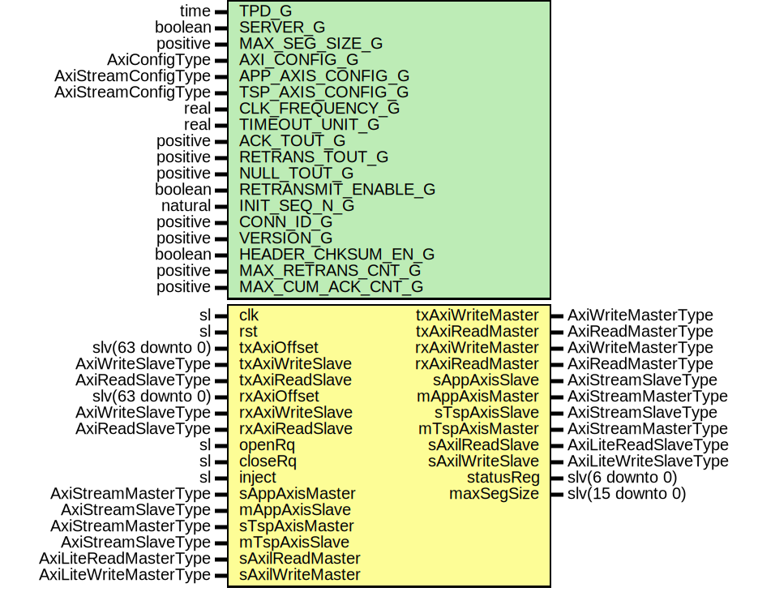

# Entity: AxiRssiCore

## Diagram

## Description

Title      : RSSI Protocol: https://confluence.slac.stanford.edu/x/1IyfD
Company    : SLAC National Accelerator Laboratory
Description: The module is based upon RUDP (Cisco implementation) RFC-908, RFC-1151, draft-ietf-sigtran-reliable-udp-00.
             The specifications in the drafts are modified by internal simplifications and improvements.
             Interfaces to transport and application side through AxiStream ports
             The AxiStream IO port widths can be adjusted (AxiStream FIFOs added to IO)
             Optional AxiLite Register interface. More info on registers is in RssiAxiLiteRegItf.vhd
             The module can act as Server or Client:
                - Server: - Passively listens for connection request from client,
                          - Monitors connection activity NULL segment timeouts
                - Client: - Actively requests connection
                          - Sends NULL packages if there is no incoming data
 Status register:
   statusReg_o(0) : Connection Active
   statusReg_o(1) : Maximum retransmissions exceeded r.retransMax and
   statusReg_o(2) : Null timeout reached (server) r.nullTout;
   statusReg_o(3) : Error in acknowledgment mechanism
   statusReg_o(4) : SSI Frame length too long
   statusReg_o(5) : Connection to peer timed out
   statusReg_o(6) : Client rejected the connection (parameters out of range)
                    Server proposed new parameters (parameters out of range)
This file is part of 'SLAC Firmware Standard Library'.
It is subject to the license terms in the LICENSE.txt file found in the
top-level directory of this distribution and at:
   https://confluence.slac.stanford.edu/display/ppareg/LICENSE.html.
No part of 'SLAC Firmware Standard Library', including this file,
may be copied, modified, propagated, or distributed except according to
the terms contained in the LICENSE.txt file.
## Generics

| Generic name        | Type                | Value        | Description                |
| ------------------- | ------------------- | ------------ | -------------------------- |
| TPD_G               | time                | 1 ns         |                            |
| SERVER_G            | boolean             | true         |                            |
| MAX_SEG_SIZE_G      | positive            | 1024         | AXI Configurations         |
| AXI_CONFIG_G        | AxiConfigType       |              |                            |
| APP_AXIS_CONFIG_G   | AxiStreamConfigType |              | AXIS Configurations        |
| TSP_AXIS_CONFIG_G   | AxiStreamConfigType |              |                            |
| CLK_FREQUENCY_G     | real                | 156.25E+6    | RSSI Timeouts              |
| TIMEOUT_UNIT_G      | real                | 1.0E-3       |                            |
| ACK_TOUT_G          | positive            | 25           |                            |
| RETRANS_TOUT_G      | positive            | 50           |                            |
| NULL_TOUT_G         | positive            | 200          |                            |
| RETRANSMIT_ENABLE_G | boolean             | true         |                            |
| INIT_SEQ_N_G        | natural             | 16#80#       | Version and connection ID  |
| CONN_ID_G           | positive            | 16#12345678# |                            |
| VERSION_G           | positive            | 1            |                            |
| HEADER_CHKSUM_EN_G  | boolean             | true         |                            |
| MAX_RETRANS_CNT_G   | positive            | 8            | Counters                   |
| MAX_CUM_ACK_CNT_G   | positive            | 3            |                            |
## Ports

| Port name        | Direction | Type                   | Description                            |
| ---------------- | --------- | ---------------------- | -------------------------------------- |
| clk              | in        | sl                     |                                        |
| rst              | in        | sl                     |                                        |
| txAxiOffset      | in        | slv(63 downto 0)       | AXI TX Segment Buffer Interface        |
| txAxiWriteMaster | out       | AxiWriteMasterType     |                                        |
| txAxiWriteSlave  | in        | AxiWriteSlaveType      |                                        |
| txAxiReadMaster  | out       | AxiReadMasterType      |                                        |
| txAxiReadSlave   | in        | AxiReadSlaveType       |                                        |
| rxAxiOffset      | in        | slv(63 downto 0)       | AXI RX Segment Buffer Interface        |
| rxAxiWriteMaster | out       | AxiWriteMasterType     |                                        |
| rxAxiWriteSlave  | in        | AxiWriteSlaveType      |                                        |
| rxAxiReadMaster  | out       | AxiReadMasterType      |                                        |
| rxAxiReadSlave   | in        | AxiReadSlaveType       |                                        |
| openRq           | in        | sl                     | High level  Application side interface |
| closeRq          | in        | sl                     |                                        |
| inject           | in        | sl                     |                                        |
| sAppAxisMaster   | in        | AxiStreamMasterType    | SSI Application side                   |
| sAppAxisSlave    | out       | AxiStreamSlaveType     |                                        |
| mAppAxisMaster   | out       | AxiStreamMasterType    |                                        |
| mAppAxisSlave    | in        | AxiStreamSlaveType     |                                        |
| sTspAxisMaster   | in        | AxiStreamMasterType    | SSI Transport side                     |
| sTspAxisSlave    | out       | AxiStreamSlaveType     |                                        |
| mTspAxisMaster   | out       | AxiStreamMasterType    |                                        |
| mTspAxisSlave    | in        | AxiStreamSlaveType     |                                        |
| sAxilReadMaster  | in        | AxiLiteReadMasterType  | AXI-Lite Register Interface            |
| sAxilReadSlave   | out       | AxiLiteReadSlaveType   |                                        |
| sAxilWriteMaster | in        | AxiLiteWriteMasterType |                                        |
| sAxilWriteSlave  | out       | AxiLiteWriteSlaveType  |                                        |
| statusReg        | out       | slv(6 downto 0)        | Internal statuses                      |
| maxSegSize       | out       | slv(15 downto 0)       |                                        |
## Signals

| Name              | Type                                          | Description                                                               |
| ----------------- | --------------------------------------------- | ------------------------------------------------------------------------- |
| s_appRssiParam    | RssiParamType                                 | RSSI Parameters                                                           |
| s_rxRssiParam     | RssiParamType                                 |                                                                           |
| s_rssiParam       | RssiParamType                                 |                                                                           |
| s_txBufferEmpty   | sl                                            | Monitor input signals                                                     |
| s_lenErr          | sl                                            |                                                                           |
| s_ackErr          | sl                                            |                                                                           |
| s_peerConnTout    | sl                                            |                                                                           |
| s_paramReject     | sl                                            |                                                                           |
| s_initSeqN        | slv(7 downto 0)                               | Connection control and parameters                                         |
| s_connActive      | sl                                            |                                                                           |
| s_closeRq         | sl                                            |                                                                           |
| s_closed          | sl                                            |                                                                           |
| s_openRq          | sl                                            |                                                                           |
| s_intCloseRq      | sl                                            |                                                                           |
| s_txAckF          | sl                                            |                                                                           |
| s_injectFaultReg  | sl                                            | Fault injection                                                           |
| s_injectFault     | sl                                            |                                                                           |
| s_synHeadSt       | sl                                            | Header states                                                             |
| s_rstHeadSt       | sl                                            |                                                                           |
| s_dataHeadSt      | sl                                            |                                                                           |
| s_nullHeadSt      | sl                                            |                                                                           |
| s_ackHeadSt       | sl                                            |                                                                           |
| s_sndResend       | sl                                            | Tx Segment requests                                                       |
| s_sndSyn          | sl                                            |                                                                           |
| s_sndAck          | sl                                            |                                                                           |
| s_sndAckMon       | sl                                            |                                                                           |
| s_sndAckCon       | sl                                            |                                                                           |
| s_sndRst          | sl                                            |                                                                           |
| s_sndNull         | sl                                            |                                                                           |
| s_txSeqN          | slv(7 downto 0)                               | Current transmitted or received SeqN and AckN                             |
| s_txAckN          | slv(7 downto 0)                               |                                                                           |
| s_rxSeqN          | slv(7 downto 0)                               |                                                                           |
| s_rxLastSeqN      | slv(7 downto 0)                               |                                                                           |
| s_rxAckN          | slv(7 downto 0)                               |                                                                           |
| s_rxLastAckN      | slv(7 downto 0)                               |                                                                           |
| s_headerAddr      | slv(7 downto 0)                               | Tx Header Interface                                                       |
| s_headerData      | slv(RSSI_WORD_WIDTH_C*8-1 downto 0)           |                                                                           |
| s_headerRdy       | sl                                            |                                                                           |
| s_headerLength    | positive                                      |                                                                           |
| s_rxValidSeg      | sl                                            | Rx Statuses                                                               |
| s_rxDropSeg       | sl                                            |                                                                           |
| s_rxFlags         | flagsType                                     |                                                                           |
| s_rxAck           | sl                                            | Acknowledge pulse when valid segment with acknowledge flag received       |
| s_rxBuffBusy      | sl                                            |                                                                           |
| s_rxBufferSize    | integer range 1 to 2 ** (SEGMENT_ADDR_SIZE_C) | Rx segment buffer                                                         |
| s_rxWindowSize    | integer range 1 to 2 ** (WINDOW_ADDR_SIZE_C)  |                                                                           |
| s_txBufferSize    | integer range 1 to 2 ** (SEGMENT_ADDR_SIZE_C) | Tx segment buffer                                                         |
| s_txWindowSize    | integer range 1 to 2 ** (WINDOW_ADDR_SIZE_C)  |                                                                           |
| s_sAppAxisMaster  | AxiStreamMasterType                           | AXIS Application Interface                                                |
| s_sAppAxisSlave   | AxiStreamSlaveType                            |                                                                           |
| s_mAppAxisMaster  | AxiStreamMasterType                           |                                                                           |
| s_mAppAxisSlave   | AxiStreamSlaveType                            |                                                                           |
| s_sTspAxisMaster  | AxiStreamMasterType                           | AXIS Transport Interface                                                  |
| s_sTspAxisSlave   | AxiStreamSlaveType                            |                                                                           |
| s_mTspAxisMaster  | AxiStreamMasterType                           |                                                                           |
| s_mTspAxisSlave   | AxiStreamSlaveType                            |                                                                           |
| s_openRqReg       | sl                                            | AXI-Lite Control/Config Interface                                         |
| s_closeRqReg      | sl                                            |                                                                           |
| s_modeReg         | sl                                            | '0': Use internal parameters from generics, '1': Use parameters from Axil |
| s_initSeqNReg     | slv(7 downto 0)                               |                                                                           |
| s_appRssiParamReg | RssiParamType                                 |                                                                           |
| s_statusReg       | slv(statusReg'range)                          | AXI-Lite Status/Monitoring Interface                                      |
| s_dropCntReg      | slv(31 downto 0)                              |                                                                           |
| s_validCntReg     | slv(31 downto 0)                              |                                                                           |
| s_reconCntReg     | slv(31 downto 0)                              |                                                                           |
| s_resendCntReg    | slv(31 downto 0)                              |                                                                           |
| s_monMasters      | AxiStreamMasterArray(1 downto 0)              |                                                                           |
| s_monSlaves       | AxiStreamSlaveArray(1 downto 0)               |                                                                           |
| s_frameRate       | Slv32Array(1 downto 0)                        |                                                                           |
| s_bandwidth       | Slv64Array(1 downto 0)                        |                                                                           |
## Constants

| Name                | Type     | Value                                                                                                                           | Description                                |
| ------------------- | -------- | ------------------------------------------------------------------------------------------------------------------------------- | ------------------------------------------ |
| MAX_SEGS_BITS_C     | positive |  bitSize(MAX_SEG_SIZE_G-1)                                                                                                      |                                            |
| SEGMENT_ADDR_SIZE_C | positive |  (MAX_SEGS_BITS_C-3)                                                                                                            |                                            |
| WINDOW_ADDR_SIZE_C  | positive |  (AXI_CONFIG_G.ADDR_WIDTH_C-MAX_SEGS_BITS_C)                                                                                    |                                            |
| MAX_NUM_OUTS_SEG_C  | positive |  (2**WINDOW_ADDR_SIZE_C)                                                                                                        |                                            |
| AXI_BURST_BYTES_C   | positive |  ite((MAX_SEG_SIZE_G > 4096),  4096,  2**MAX_SEGS_BITS_C) | Enforce power of 2 and up to 4kB AXI burst |
## Processes
- unnamed: ( closeRq, openRq, s_appRssiParamReg, s_closeRqReg, s_initSeqNReg,
            s_intCloseRq, s_modeReg, s_openRqReg )
**Description**
            Connection, Auto Negotiation and Monitoring                --
Parameter assignment

## Instantiations

- U_Reg: surf.RssiAxiLiteRegItf
**Description**
Register interface

- U_ConnFSM: surf.RssiConnFsm
**Description**
Connection Finite State Machine

- U_Monitor: surf.RssiMonitor
**Description**
Connection Monitoring Module

- U_HeaderReg: surf.RssiHeaderReg
**Description**
Outbound Header Generation Module

- U_AppIn: surf.AxiStreamResize
**Description**
               From Application layer to Transport Layer               --
Application Layer

- U_TxFSM: surf.AxiRssiTxFsm
**Description**
Transmitter Finite State Machine

- U_TspOut: surf.AxiStreamResize
**Description**
Transport Layer

- U_TspIn: surf.AxiStreamResize
**Description**
               From Transport layer to Application Layer               --
Transport Layer

- U_RxFSM: surf.AxiRssiRxFsm
**Description**
Receiver Finite State Machine

- U_AppOut: surf.AxiStreamResize
**Description**
Acknowledge valid packet
Application Layer

