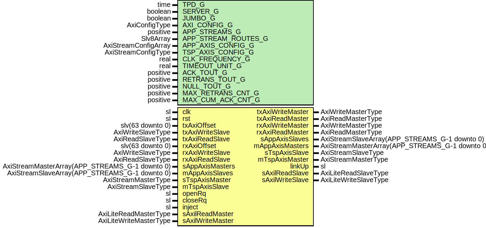

# Entity: AxiRssiCoreWrapper

- **File**: AxiRssiCoreWrapper.vhd
## Diagram

## Description

-----------------------------------------------------------------------------
 Title      : RSSI Protocol: https://confluence.slac.stanford.edu/x/1IyfD
-----------------------------------------------------------------------------
 Company    : SLAC National Accelerator Laboratory
-----------------------------------------------------------------------------
 Description: Wrapper for RSSI + AXIS packetizer
-----------------------------------------------------------------------------
 This file is part of 'SLAC Firmware Standard Library'.
 It is subject to the license terms in the LICENSE.txt file found in the
 top-level directory of this distribution and at:
    https://confluence.slac.stanford.edu/display/ppareg/LICENSE.html.
 No part of 'SLAC Firmware Standard Library', including this file,
 may be copied, modified, propagated, or distributed except according to
 the terms contained in the LICENSE.txt file.
-----------------------------------------------------------------------------
## Generics

| Generic name        | Type                 | Value             | Description                                                                                                                                        |
| ------------------- | -------------------- | ----------------- | -------------------------------------------------------------------------------------------------------------------------------------------------- |
| TPD_G               | time                 | 1 ns              |                                                                                                                                                    |
| SERVER_G            | boolean              | true              | ! Module is server or client                                                                                                                       |
| JUMBO_G             | boolean              | false             | ! true=8192 byte payload, false=1024 byte payload                                                                                                  |
| AXI_CONFIG_G        | AxiConfigType        |                   | ! Defines the AXI configuration but ADDR_WIDTH_C should be defined as the space for RSSI and "maybe" not the entire memory address space available |
| APP_STREAMS_G       | positive             | 1                 | AXIS Configurations                                                                                                                                |
| APP_STREAM_ROUTES_G | Slv8Array            | (0 => "--------") |                                                                                                                                                    |
| APP_AXIS_CONFIG_G   | AxiStreamConfigArray |                   |                                                                                                                                                    |
| TSP_AXIS_CONFIG_G   | AxiStreamConfigType  |                   |                                                                                                                                                    |
| CLK_FREQUENCY_G     | real                 | 156.25E+6         |  In units of Hz                                                                                                                                    |
| TIMEOUT_UNIT_G      | real                 | 1.0E-3            |  In units of seconds                                                                                                                               |
| ACK_TOUT_G          | positive             | 25                |  unit depends on TIMEOUT_UNIT_G                                                                                                                    |
| RETRANS_TOUT_G      | positive             | 50                |  unit depends on TIMEOUT_UNIT_G  (Recommended >= MAX_NUM_OUTS_SEG_G*Data segment transmission time)                                                |
| NULL_TOUT_G         | positive             | 200               |  unit depends on TIMEOUT_UNIT_G  (Recommended >= 4*RETRANS_TOUT_G)                                                                                 |
| MAX_RETRANS_CNT_G   | positive             | 8                 | Counters                                                                                                                                           |
| MAX_CUM_ACK_CNT_G   | positive             | 3                 |                                                                                                                                                    |
## Ports

| Port name        | Direction | Type                                           | Description                                                      |
| ---------------- | --------- | ---------------------------------------------- | ---------------------------------------------------------------- |
| clk              | in        | sl                                             | Clock and Reset                                                  |
| rst              | in        | sl                                             |                                                                  |
| txAxiOffset      | in        | slv(63 downto 0)                               | ! Used to apply an address offset to the master AXI transactions |
| txAxiWriteMaster | out       | AxiWriteMasterType                             |                                                                  |
| txAxiWriteSlave  | in        | AxiWriteSlaveType                              |                                                                  |
| txAxiReadMaster  | out       | AxiReadMasterType                              |                                                                  |
| txAxiReadSlave   | in        | AxiReadSlaveType                               |                                                                  |
| rxAxiOffset      | in        | slv(63 downto 0)                               | ! Used to apply an address offset to the master AXI transactions |
| rxAxiWriteMaster | out       | AxiWriteMasterType                             |                                                                  |
| rxAxiWriteSlave  | in        | AxiWriteSlaveType                              |                                                                  |
| rxAxiReadMaster  | out       | AxiReadMasterType                              |                                                                  |
| rxAxiReadSlave   | in        | AxiReadSlaveType                               |                                                                  |
| sAppAxisMasters  | in        | AxiStreamMasterArray(APP_STREAMS_G-1 downto 0) | SSI Application side                                             |
| sAppAxisSlaves   | out       | AxiStreamSlaveArray(APP_STREAMS_G-1 downto 0)  |                                                                  |
| mAppAxisMasters  | out       | AxiStreamMasterArray(APP_STREAMS_G-1 downto 0) |                                                                  |
| mAppAxisSlaves   | in        | AxiStreamSlaveArray(APP_STREAMS_G-1 downto 0)  |                                                                  |
| sTspAxisMaster   | in        | AxiStreamMasterType                            | SSI Transport side                                               |
| sTspAxisSlave    | out       | AxiStreamSlaveType                             |                                                                  |
| mTspAxisMaster   | out       | AxiStreamMasterType                            |                                                                  |
| mTspAxisSlave    | in        | AxiStreamSlaveType                             |                                                                  |
| openRq           | in        | sl                                             | High level  Application side interface                           |
| closeRq          | in        | sl                                             |                                                                  |
| inject           | in        | sl                                             |                                                                  |
| linkUp           | out       | sl                                             |                                                                  |
| sAxilReadMaster  | in        | AxiLiteReadMasterType                          | Optional AXI-Lite Register Interface                             |
| sAxilReadSlave   | out       | AxiLiteReadSlaveType                           |                                                                  |
| sAxilWriteMaster | in        | AxiLiteWriteMasterType                         |                                                                  |
| sAxilWriteSlave  | out       | AxiLiteWriteSlaveType                          |                                                                  |
## Signals

| Name                | Type                                           | Description |
| ------------------- | ---------------------------------------------- | ----------- |
| maxSegs             | slv(MAX_SEGS_BITS_C-1 downto 0)                |             |
| maxObSegSize        | slv(15 downto 0)                               |             |
| ileaveRearb         | slv(11 downto 0)                               |             |
| status              | slv(6 downto 0)                                |             |
| rssiNotConnected    | sl                                             |             |
| rssiConnected       | sl                                             |             |
| rxMasters           | AxiStreamMasterArray(APP_STREAMS_G-1 downto 0) |             |
| rxSlaves            | AxiStreamSlaveArray(APP_STREAMS_G-1 downto 0)  |             |
| depacketizerMasters | AxiStreamMasterArray(1 downto 0)               |             |
| depacketizerSlaves  | AxiStreamSlaveArray(1 downto 0)                |             |
| packetizerMasters   | AxiStreamMasterArray(1 downto 0)               |             |
| packetizerSlaves    | AxiStreamSlaveArray(1 downto 0)                |             |
| txMasters           | AxiStreamMasterArray(APP_STREAMS_G-1 downto 0) |             |
| txSlaves            | AxiStreamSlaveArray(APP_STREAMS_G-1 downto 0)  |             |
## Constants

| Name                     | Type                | Value                                                                                                                                                                                                                                                                                                                                                                                                                                            | Description |
| ------------------------ | ------------------- | ------------------------------------------------------------------------------------------------------------------------------------------------------------------------------------------------------------------------------------------------------------------------------------------------------------------------------------------------------------------------------------------------------------------------------------------------ | ----------- |
| PACKETIZER_AXIS_CONFIG_C | AxiStreamConfigType |  (       TSTRB_EN_C    => false,        TDATA_BYTES_C => 8,        TDEST_BITS_C  => 8,        TID_BITS_C    => 8,        TKEEP_MODE_C  => TKEEP_COMP_C,        TUSER_BITS_C  => 8,        TUSER_MODE_C  => TUSER_FIRST_LAST_C) |             |
| MAX_SEG_SIZE_C           | positive            |  ite(JUMBO_G,  8192,  1024)                                                                                                                                                                                                                                                                                                                                                |             |
| MAX_SEGS_BITS_C          | positive            |  bitSize(MAX_SEG_SIZE_C)                                                                                                                                                                                                                                                                                                                                                                                                                         |             |
## Processes
- unnamed: ( clk )
## Instantiations

- U_AxiStreamMux: surf.AxiStreamMux
- U_Packetizer: surf.AxiStreamPacketizer2
- U_RssiCore: surf.AxiRssiCore
- U_Depacketizer: surf.AxiStreamDepacketizer2
- U_AxiStreamDeMux: surf.AxiStreamDeMux
