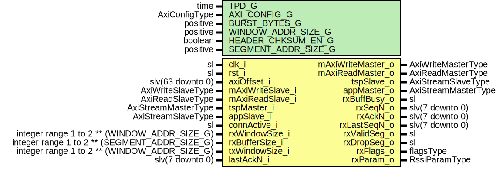

# Entity: AxiRssiRxFsm

- **File**: AxiRssiRxFsm.vhd
## Diagram

## Description

-----------------------------------------------------------------------------
 Title      : RSSI Protocol: https://confluence.slac.stanford.edu/x/1IyfD
-----------------------------------------------------------------------------
 Company    : SLAC National Accelerator Laboratory
-----------------------------------------------------------------------------
 Description: Receiver FSM
              Receiver has the following functionality:
              Transport side FSM. Receive check and save segments to RX buffer.
               - WAIT_SOF Waits for Transport side SOF,
               - CHECK Determines the segment type and checks:
                    ACK, NULL, DATA, or RST segment
                    1. Validates checksum (when valid),
                    2. Header length (number of bytes),
                    3. Sequence number (Only current seqN or lastSeqN+1 allowed)
                    4. Acknowledgment number (Valid range is lastAckN to lastAckN + txWindowSize)
               - CHECK_SYN Toggles through SYN header addresses and saves the RSSI parameters
                    Checks the following:
                    1. Validates checksum (when valid),
                    2. Validates Ack number if the ack is sent with the SYN segment
               - DATA Receives the payload part of the DATA segment
               - VALID Checks if next valid SEQn is received. If yes:
                      1. increment the in order SEQn
                      2. save seqN, type, and occupied to the window buffer at current rxBufferAddr
                      3. increment rxBufferAddr
               - DROP Just report dropped packet and got back to WAIT_SOF
              Receiver side FSM. Send data to App side.
                - CHECK_BUFFER and DATA Send the data frame to the Application
                  when the data at the next txSegmentAddr is ready.
                - SENT Release the windowbuffer at txBufferAddr.
                       Increment txBufferAddr.
                       Register the received SeqN for acknowledgment.
-----------------------------------------------------------------------------
 This file is part of 'SLAC Firmware Standard Library'.
 It is subject to the license terms in the LICENSE.txt file found in the
 top-level directory of this distribution and at:
    https://confluence.slac.stanford.edu/display/ppareg/LICENSE.html.
 No part of 'SLAC Firmware Standard Library', including this file,
 may be copied, modified, propagated, or distributed except according to
 the terms contained in the LICENSE.txt file.
-----------------------------------------------------------------------------
## Generics

| Generic name        | Type          | Value | Description                                 |
| ------------------- | ------------- | ----- | ------------------------------------------- |
| TPD_G               | time          | 1 ns  |                                             |
| AXI_CONFIG_G        | AxiConfigType |       |                                             |
| BURST_BYTES_G       | positive      | 1024  |                                             |
| WINDOW_ADDR_SIZE_G  | positive      | 7     |  2^WINDOW_ADDR_SIZE_G  = Number of segments |
| HEADER_CHKSUM_EN_G  | boolean       | true  |                                             |
| SEGMENT_ADDR_SIZE_G | positive      | 3     |                                             |
## Ports

| Port name         | Direction | Type                                          | Description                                                               |
| ----------------- | --------- | --------------------------------------------- | ------------------------------------------------------------------------- |
| clk_i             | in        | sl                                            |                                                                           |
| rst_i             | in        | sl                                            |                                                                           |
| axiOffset_i       | in        | slv(63 downto 0)                              | AXI Segment Buffer Interface                                              |
| mAxiWriteMaster_o | out       | AxiWriteMasterType                            |                                                                           |
| mAxiWriteSlave_i  | in        | AxiWriteSlaveType                             |                                                                           |
| mAxiReadMaster_o  | out       | AxiReadMasterType                             |                                                                           |
| mAxiReadSlave_i   | in        | AxiReadSlaveType                              |                                                                           |
| tspMaster_i       | in        | AxiStreamMasterType                           | Inbound Transport Interface                                               |
| tspSlave_o        | out       | AxiStreamSlaveType                            |                                                                           |
| appMaster_o       | out       | AxiStreamMasterType                           | Outbound Application Interface                                            |
| appSlave_i        | in        | AxiStreamSlaveType                            |                                                                           |
| rxBuffBusy_o      | out       | sl                                            | RX Buffer Full                                                            |
| connActive_i      | in        | sl                                            | Connection FSM indicating active connection                               |
| rxWindowSize_i    | in        | integer range 1 to 2 ** (WINDOW_ADDR_SIZE_G)  | Window size different for Rx and Tx                                       |
| rxBufferSize_i    | in        | integer range 1 to 2 ** (SEGMENT_ADDR_SIZE_G) |  Units of 64-bit words                                                    |
| txWindowSize_i    | in        | integer range 1 to 2 ** (WINDOW_ADDR_SIZE_G)  |                                                                           |
| lastAckN_i        | in        | slv(7 downto 0)                               | Last acknowledged Sequence number connected to TX module                  |
| rxSeqN_o          | out       | slv(7 downto 0)                               | Current received seqN                                                     |
| rxAckN_o          | out       | slv(7 downto 0)                               | Current received ackN                                                     |
| rxLastSeqN_o      | out       | slv(7 downto 0)                               | Last seqN received and sent to application (this is the ackN transmitted) |
| rxValidSeg_o      | out       | sl                                            | Valid Segment received (1 c-c)                                            |
| rxDropSeg_o       | out       | sl                                            | Segment dropped (1 c-c)                                                   |
| rxFlags_o         | out       | flagsType                                     | Last segment received flags (active until next segment is received)       |
| rxParam_o         | out       | RssiParamType                                 | Parameters received from peer SYN packet                                  |
## Signals

| Name        | Type                | Description |
| ----------- | ------------------- | ----------- |
| r           | RegType             |             |
| rin         | RegType             |             |
| wrAck       | AxiWriteDmaAckType  |             |
| rdAck       | AxiReadDmaAckType   |             |
| wrDmaMaster | AxiStreamMasterType |             |
| wrDmaSlave  | AxiStreamSlaveType  |             |
## Constants

| Name       | Type    | Value                                                                                                                                                                                                                                                                                                                                                                                                                                                                                                                                                                                                                                                                                                                                                                                                                                                                                                                                                                                                                                                                                                                                                                                                                                                                                                                                                                                                                                                                                                                                                                                                                                                                                                                                                                                                                                                                                                                                                                                                                                                                                                                                                                                                                                                                                                                                                                                                                                                                                                                             | Description |
| ---------- | ------- | --------------------------------------------------------------------------------------------------------------------------------------------------------------------------------------------------------------------------------------------------------------------------------------------------------------------------------------------------------------------------------------------------------------------------------------------------------------------------------------------------------------------------------------------------------------------------------------------------------------------------------------------------------------------------------------------------------------------------------------------------------------------------------------------------------------------------------------------------------------------------------------------------------------------------------------------------------------------------------------------------------------------------------------------------------------------------------------------------------------------------------------------------------------------------------------------------------------------------------------------------------------------------------------------------------------------------------------------------------------------------------------------------------------------------------------------------------------------------------------------------------------------------------------------------------------------------------------------------------------------------------------------------------------------------------------------------------------------------------------------------------------------------------------------------------------------------------------------------------------------------------------------------------------------------------------------------------------------------------------------------------------------------------------------------------------------------------------------------------------------------------------------------------------------------------------------------------------------------------------------------------------------------------------------------------------------------------------------------------------------------------------------------------------------------------------------------------------------------------------------------------------------------------- | ----------- |
| REG_INIT_C | RegType |  (       -- Rx buffer window       windowArray  => (0 to 2 ** WINDOW_ADDR_SIZE_G-1 => WINDOW_INIT_C),        pending      => (others => '0'),        --------------------------------------------------       -- Transport side FSM (Receive and check segments)       --------------------------------------------------       wrReq        => AXI_WRITE_DMA_REQ_INIT_C,        -- Counters       inorderSeqN  => (others => '0'),   -- Next expected seqN       rxBufferAddr => (others => '0'),        -- Packet flags       rxF          => (others => ('0')),        -- Received RSSI parameters       rxParam      => RSSI_PARAM_INIT_C,        rxHeadLen    => (others => '0'),   -- Received seqN       rxSeqN       => (others => '0'),   -- Received seqN       rxAckN       => (others => '0'),   -- Received ackN       -- Checksum Calculation       csumAccum    => (others => '0'),        chksumOk     => '0',        chksumRdy    => '0',        checksum     => (others => '0'),        -- Strobing status flags       segValid     => '0',        segDrop      => '0',        simErrorDet  => '0',        -- Inbound Transport Interface       tspSlave     => AXI_STREAM_SLAVE_INIT_C,        -- Transport side state       tspState     => IDLE_S,        ----------------------------------------------------------------------------       -- Application side FSM (Send segments when received next in order received)       ----------------------------------------------------------------------------       rdReq        => AXI_READ_DMA_REQ_INIT_C,        txBufferAddr => (others => '0'),        rxLastSeqN   => (others => '0'),        -- Application side state       appState     => IDLE_S) |             |
## Types

| Name         | Type                                                                                                                                                                                                                                                                                                     | Description |
| ------------ | -------------------------------------------------------------------------------------------------------------------------------------------------------------------------------------------------------------------------------------------------------------------------------------------------------- | ----------- |
| tspStateType | ( IDLE_S,  SYN_WAIT0_S,  SYN_WAIT1_S,  SYN_CHECK_S,  NSYN_CHECK_S,  DATA_S,  VALID_S)  |             |
| AppStateType | ( IDLE_S,  DATA_S,  SENT_S)                                                                                                                                                                                                        |             |
| RegType      |                                                                                                                                                                                                                                                                                                          |             |
## Processes
- comb: ( axiOffset_i, connActive_i, lastAckN_i, r, rdAck, rst_i,
                   rxBufferSize_i, rxWindowSize_i, tspMaster_i, txWindowSize_i,
                   wrAck, wrDmaSlave )
 **Description**
--------------------------------------------------------------------------------------------- 
- seq: ( clk_i )
## Instantiations

- U_DmaWrite: surf.AxiStreamDmaWrite
- U_DmaRead: surf.AxiStreamDmaRead
