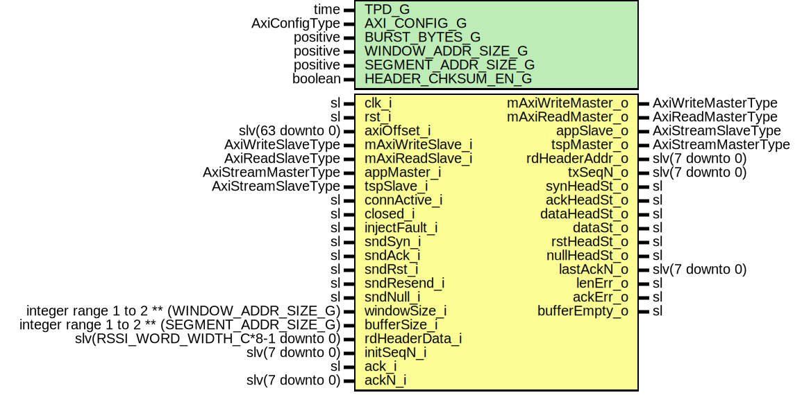

# Entity: AxiRssiTxFsm

- **File**: AxiRssiTxFsm.vhd
## Diagram

## Description

Title      : RSSI Protocol: https://confluence.slac.stanford.edu/x/1IyfD
Company    : SLAC National Accelerator Laboratory
Description: Transmitter FSM
             Transmitter has the following functionality:
             Handle buffer addresses and buffer window (firstUnackAddr,nextSentAddr,lastSentAddr, bufferFull, bufferEmpty)
             Application side FSM. Receive SSI frame and store into TX data buffer.
                  - IDLE Waits until buffer window is free (not bufferFull),
                  - Waits for Application side SOF,
                  - Save the segment to Rx buffer at nextSentAddr. Disable sending of NULL segments with appBusy flag,
                  - When EOF received save segment length and keep flags. Check length error,
                  - Request data send at Transport side FSM and increment nextSentAddr
                  - Wait until the data is processed and data segment sent by Transport side FSM
                  - Release appBusy flag and go back to INIT.
             Acknowledgment FSM.
                  - IDLE Waits for ack_i (ack request) and ackN_i(ack number)(from RxFSM),
                  - Increments firstUnackAddr until the ackN_i is found in Window buffer,
                  - If it does not find the SEQ number it reports Ack Error,
                  - Goes back to IDLE.
             Transport side FSM. Send and resend various segments to Transport side.
                  - INIT Initializes seqN to initSeqN. Waits until new connection requested. ConnFSM goin out od Closed state.
                  - DISS_CONN allows sending SYN, ACK, or RST segments. Goes to CONN when connection becomes active.
                  - CONN allows sending DATA, NULL, ACK, or RST segments.
                    In Resend procedure the FSM resends all the unacknowledged (DATA, NULL, RST) segments in the buffer window.
             Note:Sequence number is incremented with sending SYN, DATA, NULL, and RST segments.
             Note:Only the following segments are saved into Tx buffer DATA, NULL, and RST.
This file is part of 'SLAC Firmware Standard Library'.
It is subject to the license terms in the LICENSE.txt file found in the
top-level directory of this distribution and at:
   https://confluence.slac.stanford.edu/display/ppareg/LICENSE.html.
No part of 'SLAC Firmware Standard Library', including this file,
may be copied, modified, propagated, or distributed except according to
the terms contained in the LICENSE.txt file.
## Generics

| Generic name        | Type          | Value | Description                                              |
| ------------------- | ------------- | ----- | -------------------------------------------------------- |
| TPD_G               | time          | 1 ns  |                                                          |
| AXI_CONFIG_G        | AxiConfigType |       |                                                          |
| BURST_BYTES_G       | positive      | 1024  |                                                          |
| WINDOW_ADDR_SIZE_G  | positive      | 3     | 2^WINDOW_ADDR_SIZE_G  = Number of segments               |
| SEGMENT_ADDR_SIZE_G | positive      | 7     | 2^SEGMENT_ADDR_SIZE_G = Number of 64 bit wide data words |
| HEADER_CHKSUM_EN_G  | boolean       | true  |                                                          |
## Ports

| Port name         | Direction | Type                                          | Description                                                      |
| ----------------- | --------- | --------------------------------------------- | ---------------------------------------------------------------- |
| clk_i             | in        | sl                                            |                                                                  |
| rst_i             | in        | sl                                            |                                                                  |
| axiOffset_i       | in        | slv(63 downto 0)                              | AXI Segment Buffer Interface                                     |
| mAxiWriteMaster_o | out       | AxiWriteMasterType                            |                                                                  |
| mAxiWriteSlave_i  | in        | AxiWriteSlaveType                             |                                                                  |
| mAxiReadMaster_o  | out       | AxiReadMasterType                             |                                                                  |
| mAxiReadSlave_i   | in        | AxiReadSlaveType                              |                                                                  |
| appMaster_i       | in        | AxiStreamMasterType                           | Inbound Application Interface                                    |
| appSlave_o        | out       | AxiStreamSlaveType                            |                                                                  |
| tspMaster_o       | out       | AxiStreamMasterType                           | Outbound Transport Interface                                     |
| tspSlave_i        | in        | AxiStreamSlaveType                            |                                                                  |
| connActive_i      | in        | sl                                            | Connection FSM indicating active connection                      |
| closed_i          | in        | sl                                            | Closed state in connFSM (initialize seqN)                        |
| injectFault_i     | in        | sl                                            | Fault injection corrupts header checksum                         |
| sndSyn_i          | in        | sl                                            | Various segment requests                                         |
| sndAck_i          | in        | sl                                            |                                                                  |
| sndRst_i          | in        | sl                                            |                                                                  |
| sndResend_i       | in        | sl                                            |                                                                  |
| sndNull_i         | in        | sl                                            |                                                                  |
| windowSize_i      | in        | integer range 1 to 2 ** (WINDOW_ADDR_SIZE_G)  | Window buff size (Depends on the number of outstanding segments) |
| bufferSize_i      | in        | integer range 1 to 2 ** (SEGMENT_ADDR_SIZE_G) |                                                                  |
| rdHeaderAddr_o    | out       | slv(7 downto 0)                               | Header read                                                      |
| rdHeaderData_i    | in        | slv(RSSI_WORD_WIDTH_C*8-1 downto 0)           |                                                                  |
| initSeqN_i        | in        | slv(7 downto 0)                               | Initial sequence number                                          |
| txSeqN_o          | out       | slv(7 downto 0)                               | Tx data (input to header decoder module)                         |
| synHeadSt_o       | out       | sl                                            | FSM outs for header and data flow control                        |
| ackHeadSt_o       | out       | sl                                            |                                                                  |
| dataHeadSt_o      | out       | sl                                            |                                                                  |
| dataSt_o          | out       | sl                                            |                                                                  |
| rstHeadSt_o       | out       | sl                                            |                                                                  |
| nullHeadSt_o      | out       | sl                                            |                                                                  |
| lastAckN_o        | out       | slv(7 downto 0)                               | Last acked number (Used in Rx FSM to determine if AcnN is valid) |
| ack_i             | in        | sl                                            | From receiver module when a segment with valid ACK is received   |
| ackN_i            | in        | slv(7 downto 0)                               | Number being ACKed                                               |
| lenErr_o          | out       | sl                                            | Errors (1 cc pulse)                                              |
| ackErr_o          | out       | sl                                            |                                                                  |
| bufferEmpty_o     | out       | sl                                            | Segment buffer indicator                                         |
## Signals

| Name        | Type                | Description |
| ----------- | ------------------- | ----------- |
| r           | RegType             |             |
| rin         | RegType             |             |
| wrAck       | AxiWriteDmaAckType  |             |
| rdAck       | AxiReadDmaAckType   |             |
| wrDmaMaster | AxiStreamMasterType |             |
| wrDmaSlave  | AxiStreamSlaveType  |             |
| rdDmaMaster | AxiStreamMasterType |             |
| rdDmaSlave  | AxiStreamSlaveType  |             |
## Constants

| Name       | Type    | Value                                                                                                                                                                                                                                                                                                                                                                                                                                                                                                                                                                                                                                                                                                                                                                                                                                                                                                                                                                                                                                                                                                                                                                                                                                                                                                                                                                                                                                                                                                                                                                                                                                                                                                                                                                                                                                                                                                                                                                                                                                                                                                                                                                                                                                                                                                                                                                                                                                                                                                                                                                                                                                                                                                                                                                                                                                                                                                                                                                                                                                                                                                                                                                                                                                                                                                                                                                                                                                                                                                                                                                                                                                                                                                                                                               | Description |
| ---------- | ------- | ------------------------------------------------------------------------------------------------------------------------------------------------------------------------------------------------------------------------------------------------------------------------------------------------------------------------------------------------------------------------------------------------------------------------------------------------------------------------------------------------------------------------------------------------------------------------------------------------------------------------------------------------------------------------------------------------------------------------------------------------------------------------------------------------------------------------------------------------------------------------------------------------------------------------------------------------------------------------------------------------------------------------------------------------------------------------------------------------------------------------------------------------------------------------------------------------------------------------------------------------------------------------------------------------------------------------------------------------------------------------------------------------------------------------------------------------------------------------------------------------------------------------------------------------------------------------------------------------------------------------------------------------------------------------------------------------------------------------------------------------------------------------------------------------------------------------------------------------------------------------------------------------------------------------------------------------------------------------------------------------------------------------------------------------------------------------------------------------------------------------------------------------------------------------------------------------------------------------------------------------------------------------------------------------------------------------------------------------------------------------------------------------------------------------------------------------------------------------------------------------------------------------------------------------------------------------------------------------------------------------------------------------------------------------------------------------------------------------------------------------------------------------------------------------------------------------------------------------------------------------------------------------------------------------------------------------------------------------------------------------------------------------------------------------------------------------------------------------------------------------------------------------------------------------------------------------------------------------------------------------------------------------------------------------------------------------------------------------------------------------------------------------------------------------------------------------------------------------------------------------------------------------------------------------------------------------------------------------------------------------------------------------------------------------------------------------------------------------------------------------------------------- | ----------- |
| REG_INIT_C | RegType |  (       ----------------------------------------------------       -- Buffer window handling and acknowledgment control       ----------------------------------------------------       -- Window control       firstUnackAddr => (others => '0'),        lastSentAddr   => (others => '0'),        nextSentAddr   => (others => '0'),        lastAckSeqN    => (others => '0'),        --eackAddr       => (others => '0'),        --eackIndex      => 0,        bufferFull     => '0',        bufferEmpty    => '1',        windowArray    => (0 to 2 ** WINDOW_ADDR_SIZE_G-1 => WINDOW_INIT_C),        ackErr         => '0',        ackState       => IDLE_S,        -----------------------       -- Application side FSM       -----------------------       wrReq          => AXI_WRITE_DMA_REQ_INIT_C,        rxSegmentWe    => '0',        rxBufferAddr   => (others => '0'),        sndData        => '0',        lenErr         => '0',        appBusy        => '0',        appSlave       => AXI_STREAM_SLAVE_INIT_C,        appState       => IDLE_S,        ----------------------       -- Transport side FSM       ----------------------       rdReq          => AXI_READ_DMA_REQ_INIT_C,        --       csumAccum      => (others => '0'),        chksumOk       => '0',        checksum       => (others => '0'),        --       nextSeqN       => (others => '0'),        seqN           => (others => '0'),        txHeaderAddr   => (others => '0'),        txBufferAddr   => (others => '0'),        --       synH           => '0',        ackH           => '0',        rstH           => '0',        nullH          => '0',        dataH          => '0',        dataD          => '0',        resend         => '0',        ackSndData     => '0',        hdrAmrmed      => '0',        simErrorDet    => '0',        --       buffWe         => '0',        buffSent       => '0',        -- Fault injection       injectFaultD1  => '0',        injectFaultReg => '0',        -- Transport Interface       rdDmaSlave     => AXI_STREAM_SLAVE_INIT_C,        tspMaster      => AXI_STREAM_MASTER_INIT_C,        -- State Machine       tspState       => INIT_S) |             |
## Types

| Name         | Type                                                                                                                                                                                                                                                                                                                                                                                                                                                                                                                                                                                                                                                  | Description |
| ------------ | ----------------------------------------------------------------------------------------------------------------------------------------------------------------------------------------------------------------------------------------------------------------------------------------------------------------------------------------------------------------------------------------------------------------------------------------------------------------------------------------------------------------------------------------------------------------------------------------------------------------------------------------------------- | ----------- |
| TspStateType | ( INIT_S,  DISS_CONN_S,  CONN_S,  SYN_H_S,  SYN_XSUM_S,  NSYN_H_S,  NSYN_XSUM_S,  DATA_H_S,  DATA_XSUM_S,  DATA_S,  RESEND_INIT_S,  RESEND_H_S,  RESEND_XSUM_S,  RESEND_PP_S)  |             |
| AppStateType | ( IDLE_S,  WAIT_SOF_S,  DATA_S,  SEG_RDY_S)                                                                                                                                                                                                                                                                                                                                                                                                                                                                                                  |             |
| AckStateType | ( IDLE_S,  ERR_S,  ACK_S)                                                                                                                                                                                                                                                                                                                                                                                                                                                                                                                                                       |             |
| RegType      |                                                                                                                                                                                                                                                                                                                                                                                                                                                                                                                                                                                                                                                       |             |
## Processes
- comb: ( ackN_i, ack_i, appMaster_i, axiOffset_i, bufferSize_i,
                   closed_i, connActive_i, initSeqN_i, injectFault_i, r, rdAck,
                   rdDmaMaster, rdHeaderData_i, rst_i, sndAck_i, sndNull_i,
                   sndResend_i, sndRst_i, sndSyn_i, tspSlave_i, windowSize_i,
                   wrAck, wrDmaSlave )
- seq: ( clk_i )
## Instantiations

- U_DmaWrite: surf.AxiStreamDmaWrite
- U_DmaRead: surf.AxiStreamDmaRead
