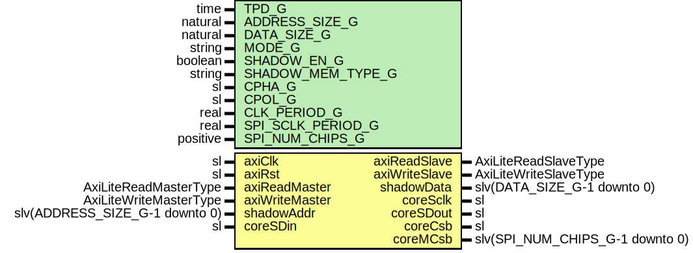

# Entity: AxiSpiMaster

- **File**: AxiSpiMaster.vhd
## Diagram

## Description

-----------------------------------------------------------------------------
 Company    : SLAC National Accelerator Laboratory
-----------------------------------------------------------------------------
 Description: Axi lite interface for a single chip "generic SPI master"
                For multiple chips on single bus connect multiple cores
                to multiple AXI crossbar slaves and use Chip select outputs
                (coreCsb) to multiplex select the addressed outputs (coreSDout and
                coreSclk).
                The coreCsb is active low. And active only if the corresponding
                Axi Crossbar Slave is addressed.
                DATA_SIZE_G - Corresponds to total read or write command size (not just data size).
                              Example: DATA_SIZE_G = 24
                                       1-bit command, 15-bit address word and 8-bit data
-----------------------------------------------------------------------------
 This file is part of 'SLAC Firmware Standard Library'.
 It is subject to the license terms in the LICENSE.txt file found in the
 top-level directory of this distribution and at:
    https://confluence.slac.stanford.edu/display/ppareg/LICENSE.html.
 No part of 'SLAC Firmware Standard Library', including this file,
 may be copied, modified, propagated, or distributed except according to
 the terms contained in the LICENSE.txt file.
-----------------------------------------------------------------------------
## Generics

| Generic name      | Type     | Value    | Description                              |
| ----------------- | -------- | -------- | ---------------------------------------- |
| TPD_G             | time     | 1 ns     |                                          |
| ADDRESS_SIZE_G    | natural  | 15       |                                          |
| DATA_SIZE_G       | natural  | 8        |                                          |
| MODE_G            | string   | "RW"     |  Or "WO" (write only),  "RO" (read only) |
| SHADOW_EN_G       | boolean  | false    |                                          |
| SHADOW_MEM_TYPE_G | string   | "block"  |                                          |
| CPHA_G            | sl       | '0'      |                                          |
| CPOL_G            | sl       | '0'      |                                          |
| CLK_PERIOD_G      | real     | 6.4E-9   |                                          |
| SPI_SCLK_PERIOD_G | real     | 100.0E-6 |                                          |
| SPI_NUM_CHIPS_G   | positive | 1        |                                          |
## Ports

| Port name      | Direction | Type                            | Description                                                     |
| -------------- | --------- | ------------------------------- | --------------------------------------------------------------- |
| axiClk         | in        | sl                              | AXI-Lite Interface                                              |
| axiRst         | in        | sl                              |                                                                 |
| axiReadMaster  | in        | AxiLiteReadMasterType           |                                                                 |
| axiReadSlave   | out       | AxiLiteReadSlaveType            |                                                                 |
| axiWriteMaster | in        | AxiLiteWriteMasterType          |                                                                 |
| axiWriteSlave  | out       | AxiLiteWriteSlaveType           |                                                                 |
| shadowAddr     | in        | slv(ADDRESS_SIZE_G-1 downto 0)  | Copy of the shadow memory (SHADOW_EN_G=true)                    |
| shadowData     | out       | slv(DATA_SIZE_G-1 downto 0)     |                                                                 |
| coreSclk       | out       | sl                              | SPI Interface                                                   |
| coreSDin       | in        | sl                              |                                                                 |
| coreSDout      | out       | sl                              |                                                                 |
| coreCsb        | out       | sl                              |  coreCsb is for legacy firmware without SPI_NUM_CHIPS_G generic |
| coreMCsb       | out       | slv(SPI_NUM_CHIPS_G-1 downto 0) |                                                                 |
## Signals

| Name    | Type                            | Description |
| ------- | ------------------------------- | ----------- |
| rdData  | slv(PACKET_SIZE_C-1 downto 0)   |             |
| rdEn    | sl                              |             |
| memData | slv(DATA_SIZE_G-1 downto 0)     |             |
| r       | RegType                         |             |
| rin     | RegType                         |             |
| csb     | slv(SPI_NUM_CHIPS_G-1 downto 0) |             |
## Constants

| Name          | Type     | Value                                                                                                                                                                                                                                                                                                                                                                                                                                            | Description               |
| ------------- | -------- | ------------------------------------------------------------------------------------------------------------------------------------------------------------------------------------------------------------------------------------------------------------------------------------------------------------------------------------------------------------------------------------------------------------------------------------------------ | ------------------------- |
| PACKET_SIZE_C | positive |  ite(MODE_G = "RW",  1,  0) + ADDRESS_SIZE_G + DATA_SIZE_G                                                                                                                                                                                                                                                                                                                 |  "1+" For R/W command bit |
| CHIP_BITS_C   | integer  |  log2(SPI_NUM_CHIPS_G)                                                                                                                                                                                                                                                                                                                                                                                                                           |                           |
| REG_INIT_C    | RegType  |  (       state         => WAIT_AXI_TXN_S,        axiReadSlave  => AXI_LITE_READ_SLAVE_INIT_C,        axiWriteSlave => AXI_LITE_WRITE_SLAVE_INIT_C,        wrData        => (others => '0'),        chipSel       => (others => '0'),        wrEn          => '0') |                           |
## Types

| Name      | Type                                                                                                                                                                                                                                          | Description |
| --------- | --------------------------------------------------------------------------------------------------------------------------------------------------------------------------------------------------------------------------------------------- | ----------- |
| StateType | (WAIT_AXI_TXN_S,  WAIT_CYCLE_S,  WAIT_CYCLE_SHADOW_S,  WAIT_SPI_TXN_DONE_S,  SHADOW_READ_DONE_S)  |             |
| RegType   |                                                                                                                                                                                                                                               |  Registers  |
## Processes
- comb: ( axiReadMaster, axiRst, axiWriteMaster, memData, r, rdData, rdEn )
- seq: ( axiClk )
## Instantiations

- SpiMaster_1: surf.SpiMaster
