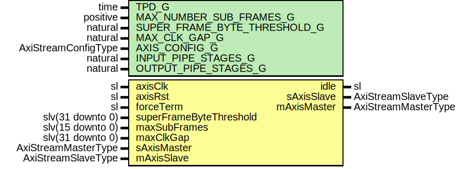

# Entity: AxiStreamBatcher

## Diagram

## Description

Title      : AxiStream BatcherV1 Protocol: https://confluence.slac.stanford.edu/x/th1SDg
Company    : SLAC National Accelerator Laboratory
Description: The firmware batcher combines sub-frames into a larger super-frame
This file is part of 'SLAC Firmware Standard Library'.
It is subject to the license terms in the LICENSE.txt file found in the
top-level directory of this distribution and at:
   https://confluence.slac.stanford.edu/display/ppareg/LICENSE.html.
No part of 'SLAC Firmware Standard Library', including this file,
may be copied, modified, propagated, or distributed except according to
the terms contained in the LICENSE.txt file.
## Generics

| Generic name                 | Type                | Value | Description           |
| ---------------------------- | ------------------- | ----- | --------------------- |
| TPD_G                        | time                | 1 ns  |                       |
| MAX_NUMBER_SUB_FRAMES_G      | positive            | 32    | Units of sub-frames   |
| SUPER_FRAME_BYTE_THRESHOLD_G | natural             | 8192  | Units of bytes        |
| MAX_CLK_GAP_G                | natural             | 256   | Units of clock cycles |
| AXIS_CONFIG_G                | AxiStreamConfigType |       |                       |
| INPUT_PIPE_STAGES_G          | natural             | 0     |                       |
| OUTPUT_PIPE_STAGES_G         | natural             | 1     |                       |
## Ports

| Port name               | Direction | Type                | Description                |
| ----------------------- | --------- | ------------------- | -------------------------- |
| axisClk                 | in        | sl                  | Clock and Reset            |
| axisRst                 | in        | sl                  |                            |
| forceTerm               | in        | sl                  | External Control Interface |
| superFrameByteThreshold | in        | slv(31 downto 0)    |                            |
| maxSubFrames            | in        | slv(15 downto 0)    |                            |
| maxClkGap               | in        | slv(31 downto 0)    |                            |
| idle                    | out       | sl                  |                            |
| sAxisMaster             | in        | AxiStreamMasterType | AXIS Interfaces            |
| sAxisSlave              | out       | AxiStreamSlaveType  |                            |
| mAxisMaster             | out       | AxiStreamMasterType |                            |
| mAxisSlave              | in        | AxiStreamSlaveType  |                            |
## Signals

| Name     | Type                | Description |
| -------- | ------------------- | ----------- |
| r        | RegType             |             |
| rin      | RegType             |             |
| rxMaster | AxiStreamMasterType |             |
| rxSlave  | AxiStreamSlaveType  |             |
| txMaster | AxiStreamMasterType |             |
| txSlave  | AxiStreamSlaveType  |             |
## Constants

| Name             | Type            | Value                                                                                                                                                                                                                                                                                                                                                                                                                                                                                                                                                                                                                                                                                                                                                                                                                                                                                                                                                                                                                                                                                                                                                                                                                                                                                                                                                                                                                                                                                                                                                                                                                                                                                                                                                                                                    | Description    |
| ---------------- | --------------- | -------------------------------------------------------------------------------------------------------------------------------------------------------------------------------------------------------------------------------------------------------------------------------------------------------------------------------------------------------------------------------------------------------------------------------------------------------------------------------------------------------------------------------------------------------------------------------------------------------------------------------------------------------------------------------------------------------------------------------------------------------------------------------------------------------------------------------------------------------------------------------------------------------------------------------------------------------------------------------------------------------------------------------------------------------------------------------------------------------------------------------------------------------------------------------------------------------------------------------------------------------------------------------------------------------------------------------------------------------------------------------------------------------------------------------------------------------------------------------------------------------------------------------------------------------------------------------------------------------------------------------------------------------------------------------------------------------------------------------------------------------------------------------------------------------- | -------------- |
| AXIS_WORD_SIZE_C | positive        |  AXIS_CONFIG_G.TDATA_BYTES_C                                                                                                                                                                                                                                                                                                                                                                                                                                                                                                                                                                                                                                                                                                                                                                                                                                                                                                                                                                                                                                                                                                                                                                                                                                                                                                                                                                                                                                                                                                                                                                                                                                                                                                                                                                             | Units of bytes |
| WIDTH_C          | slv(3 downto 0) |  toSlv(log2(AXIS_WORD_SIZE_C/2),  4)                                                                                                                                                                                                                                                                                                                                                                                                                                                                                                                                                                                                                                                                                                                                                                                                                                                                                                                                                                                                                                                                                                                                                                                                                                                                                                                                                                                                                                                                                                                                                                                                                                                                                                                                  |                |
| REG_INIT_C       | RegType         |  (       superFrameByteThreshold    => toSlv(SUPER_FRAME_BYTE_THRESHOLD_G,  32),        superByteCnt               => toSlv(AXIS_WORD_SIZE_C,  32),        subByteCnt                 => (others => '0'),        maxSubFrames               => toSlv(MAX_NUMBER_SUB_FRAMES_G,  16),        subFrameCnt                => (others => '0'),        maxClkGap                  => toSlv(MAX_CLK_GAP_G,  32),        clkGapCnt                  => (others => '0'),        superFrameByteThresholdDet => '0',        maxSubFramesDet            => '0',        forceTerm                  => '0',        seqCnt                     => (others => '0'),        tDest                      => (others => '0'),        tUserFirst                 => (others => '0'),        tUserLast                  => (others => '0'),        chunkCnt                   => 1,        rxSlave                    => AXI_STREAM_SLAVE_INIT_C,        txMaster                   => AXI_STREAM_MASTER_INIT_C,        state                      => HEADER_S) |                |
## Types

| Name      | Type                                                                                                                                                                                                                                                                 | Description |
| --------- | -------------------------------------------------------------------------------------------------------------------------------------------------------------------------------------------------------------------------------------------------------------------- | ----------- |
| StateType | ( HEADER_S,  SUB_FRAME_S,  TAIL_S,  CHUNK_TAIL_2BYTE_S,  CHUNK_TAIL_4BYTE_S,  GAP_S)  |             |
| RegType   |                                                                                                                                                                                                                                                                      |             |
## Processes
- comb: ( axisRst, forceTerm, maxClkGap, maxSubFrames, r, rxMaster,
                   superFrameByteThreshold, txSlave )
- seq: ( axisClk )
## Instantiations

- U_Input: surf.AxiStreamPipeline
**Description**
Input pipeline

- U_Output: surf.AxiStreamPipeline
**Description**
Output pipeline

