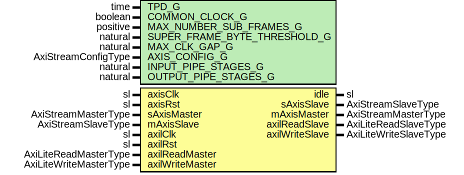

# Entity: AxiStreamBatcherAxil

- **File**: AxiStreamBatcherAxil.vhd
## Diagram

## Description

-----------------------------------------------------------------------------
 Title      : AxiStream BatcherV1 Protocol: https://confluence.slac.stanford.edu/x/th1SDg
-----------------------------------------------------------------------------
 Company    : SLAC National Accelerator Laboratory
-----------------------------------------------------------------------------
 Description: AXI-Lite wrapper for AXI-Stream Batcher
-----------------------------------------------------------------------------
 This file is part of SURF. It is subject to
 the license terms in the LICENSE.txt file found in the top-level directory
 of this distribution and at:
    https://confluence.slac.stanford.edu/display/ppareg/LICENSE.html.
 No part of SURF, including this file, may be
 copied, modified, propagated, or distributed except according to the terms
 contained in the LICENSE.txt file.
-----------------------------------------------------------------------------
## Generics

| Generic name                 | Type                | Value | Description |
| ---------------------------- | ------------------- | ----- | ----------- |
| TPD_G                        | time                | 1 ns  |             |
| COMMON_CLOCK_G               | boolean             | false |             |
| MAX_NUMBER_SUB_FRAMES_G      | positive            | 32    |             |
| SUPER_FRAME_BYTE_THRESHOLD_G | natural             | 8192  |             |
| MAX_CLK_GAP_G                | natural             | 256   |             |
| AXIS_CONFIG_G                | AxiStreamConfigType |       |             |
| INPUT_PIPE_STAGES_G          | natural             | 0     |             |
| OUTPUT_PIPE_STAGES_G         | natural             | 1     |             |
## Ports

| Port name       | Direction | Type                   | Description |
| --------------- | --------- | ---------------------- | ----------- |
| axisClk         | in        | sl                     |             |
| axisRst         | in        | sl                     |             |
| idle            | out       | sl                     |             |
| sAxisMaster     | in        | AxiStreamMasterType    |             |
| sAxisSlave      | out       | AxiStreamSlaveType     |             |
| mAxisMaster     | out       | AxiStreamMasterType    |             |
| mAxisSlave      | in        | AxiStreamSlaveType     |             |
| axilClk         | in        | sl                     |             |
| axilRst         | in        | sl                     |             |
| axilReadMaster  | in        | AxiLiteReadMasterType  |             |
| axilReadSlave   | out       | AxiLiteReadSlaveType   |             |
| axilWriteMaster | in        | AxiLiteWriteMasterType |             |
| axilWriteSlave  | out       | AxiLiteWriteSlaveType  |             |
## Signals

| Name                | Type                   | Description |
| ------------------- | ---------------------- | ----------- |
| r                   | RegType                |             |
| rin                 | RegType                |             |
| syncAxilReadMaster  | AxiLiteReadMasterType  |             |
| syncAxilReadSlave   | AxiLiteReadSlaveType   |             |
| syncAxilWriteMaster | AxiLiteWriteMasterType |             |
| syncAxilWriteSlave  | AxiLiteWriteSlaveType  |             |
## Constants

| Name       | Type    | Value                                                                                                                                                                                                                                                                                                                                                                                                                                                                                                                                                                                               | Description |
| ---------- | ------- | --------------------------------------------------------------------------------------------------------------------------------------------------------------------------------------------------------------------------------------------------------------------------------------------------------------------------------------------------------------------------------------------------------------------------------------------------------------------------------------------------------------------------------------------------------------------------------------------------- | ----------- |
| REG_INIT_C | RegType |  (       superFrameByteThreshold => toSlv(SUPER_FRAME_BYTE_THRESHOLD_G,  32),        maxSubFrames            => toSlv(MAX_NUMBER_SUB_FRAMES_G,  16),        maxClkGap               => toSlv(MAX_CLK_GAP_G,  32),        axilReadSlave           => AXI_LITE_READ_SLAVE_INIT_C,        axilWriteSlave          => AXI_LITE_WRITE_SLAVE_INIT_C) |             |
## Types

| Name    | Type | Description |
| ------- | ---- | ----------- |
| RegType |      |             |
## Processes
- comb: ( axisRst, r, syncAxilReadMaster, syncAxilWriteMaster )
**Description**
 [in] 
- seq: ( axisClk )
## Instantiations

- U_AxiStreamBatcher_1: surf.AxiStreamBatcher
- U_AxiLiteAsync_1: surf.AxiLiteAsync
**Description**
 [in]

