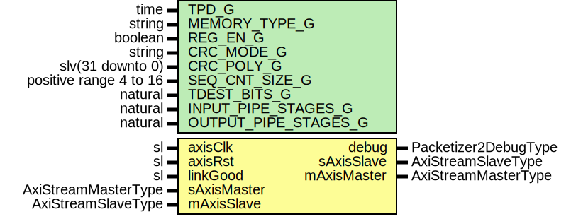

# Entity: AxiStreamDepacketizer2

## Diagram

## Description

Title      : AxiStreamPackerizerV2 Protocol: https://confluence.slac.stanford.edu/x/3nh4DQ
Company    : SLAC National Accelerator Laboratory
Description: Formats an AXI-Stream for a transport link.
Sideband fields are placed into the data stream in a header.
Smaller packets are combined together to make a long frame
This file is part of 'SLAC Firmware Standard Library'.
It is subject to the license terms in the LICENSE.txt file found in the
top-level directory of this distribution and at:
   https://confluence.slac.stanford.edu/display/ppareg/LICENSE.html.
No part of 'SLAC Firmware Standard Library', including this file,
may be copied, modified, propagated, or distributed except according to
the terms contained in the LICENSE.txt file.
## Generics

| Generic name         | Type                   | Value         | Description         |
| -------------------- | ---------------------- | ------------- | ------------------- |
| TPD_G                | time                   | 1 ns          |                     |
| MEMORY_TYPE_G        | string                 | "distributed" |                     |
| REG_EN_G             | boolean                | false         |                     |
| CRC_MODE_G           | string                 | "DATA"        | or "NONE" or "FULL" |
| CRC_POLY_G           | slv(31 downto 0)       | x"04C11DB7"   |                     |
| SEQ_CNT_SIZE_G       | positive range 4 to 16 | 16            |                     |
| TDEST_BITS_G         | natural                | 8             |                     |
| INPUT_PIPE_STAGES_G  | natural                | 0             |                     |
| OUTPUT_PIPE_STAGES_G | natural                | 1             |                     |
## Ports

| Port name   | Direction | Type                 | Description                                 |
| ----------- | --------- | -------------------- | ------------------------------------------- |
| axisClk     | in        | sl                   | Clock and Reset                             |
| axisRst     | in        | sl                   |                                             |
| linkGood    | in        | sl                   | Link Status monitoring and debug interfaces |
| debug       | out       | Packetizer2DebugType |                                             |
| sAxisMaster | in        | AxiStreamMasterType  | AXIS Interfaces                             |
| sAxisSlave  | out       | AxiStreamSlaveType   |                                             |
| mAxisMaster | out       | AxiStreamMasterType  |                                             |
| mAxisSlave  | in        | AxiStreamSlaveType   |                                             |
## Signals

| Name               | Type                             | Description |
| ------------------ | -------------------------------- | ----------- |
| r                  | RegType                          |             |
| rin                | RegType                          |             |
| inputAxisMaster    | AxiStreamMasterType              |             |
| inputAxisSlave     | AxiStreamSlaveType               |             |
| outputAxisMaster   | AxiStreamMasterType              |             |
| outputAxisSlave    | AxiStreamSlaveType               |             |
| ramDin             | slv(RAM_DATA_WIDTH_C-1 downto 0) |             |
| ramDout            | slv(RAM_DATA_WIDTH_C-1 downto 0) |             |
| ramPacketSeqOut    | slv(SEQ_CNT_SIZE_G-1 downto 0)   |             |
| ramPacketActiveOut | sl                               |             |
| ramSentEofeOut     | sl                               |             |
| ramCrcRem          | slv(31 downto 0)                 |             |
| ramAddrr           | slv(ADDR_WIDTH_C-1 downto 0)     |             |
| crcIn              | slv(63 downto 0)                 |             |
| crcOut             | slv(31 downto 0)                 |             |
| crcRem             | slv(31 downto 0)                 |             |
## Constants

| Name             | Type                | Value                                                                                                                                                                                                                                                                                                                                                                                                                                                                                                                                                                                                                                                                                                                                                                                                                                                                                                                                                                                                                                                                                                                                                                                                                    | Description |
| ---------------- | ------------------- | ------------------------------------------------------------------------------------------------------------------------------------------------------------------------------------------------------------------------------------------------------------------------------------------------------------------------------------------------------------------------------------------------------------------------------------------------------------------------------------------------------------------------------------------------------------------------------------------------------------------------------------------------------------------------------------------------------------------------------------------------------------------------------------------------------------------------------------------------------------------------------------------------------------------------------------------------------------------------------------------------------------------------------------------------------------------------------------------------------------------------------------------------------------------------------------------------------------------------ | ----------- |
| CRC_EN_C         | boolean             |  (CRC_MODE_G /= "NONE")                                                                                                                                                                                                                                                                                                                                                                                                                                                                                                                                                                                                                                                                                                                                                                                                                                                                                                                                                                                                                                                                                                                                                                                                  |             |
| CRC_HEAD_TAIL_C  | boolean             |  (CRC_MODE_G = "FULL")                                                                                                                                                                                                                                                                                                                                                                                                                                                                                                                                                                                                                                                                                                                                                                                                                                                                                                                                                                                                                                                                                                                                                                                                   |             |
| ADDR_WIDTH_C     | positive            |  ite((TDEST_BITS_G = 0),  1,  TDEST_BITS_G)                                                                                                                                                                                                                                                                                                                                                                                                                                                                                                                                                                                                                                                                                                                                                                                                                                                                                                                                                                                                                                                                                                        |             |
| RAM_DATA_WIDTH_C | positive            |  32+2+SEQ_CNT_SIZE_G                                                                                                                                                                                                                                                                                                                                                                                                                                                                                                                                                                                                                                                                                                                                                                                                                                                                                                                                                                                                                                                                                                                                                                                                     |             |
| AXIS_CONFIG_C    | AxiStreamConfigType |  (       TSTRB_EN_C    => false,        TDATA_BYTES_C => 8,        TDEST_BITS_C  => 8,        TID_BITS_C    => 8,        TKEEP_MODE_C  => TKEEP_COMP_C,        TUSER_BITS_C  => 8,        TUSER_MODE_C  => TUSER_FIRST_LAST_C)                                                                                                                                                                                                                                                                                                                                                                                                                                                                                                                                                                                                                                                                                                                                                                         |             |
| REG_INIT_C       | RegType             |  (       state            => TERMINATE_S,        activeTDest      => (others => '1'),        packetSeq        => (others => '0'),        packetActive     => '0',        sentEofe         => '0',        ramWe            => '0',        sideband         => '0',        crcDataValid     => '0',        crcDataWidth     => (others => '1'),        crcInit          => (others => '1'),        crcReset         => '1',        linkGoodDly      => '0',        rdLat            => 2,        debug            => PACKETIZER2_DEBUG_INIT_C,        inputAxisSlave   => AXI_STREAM_SLAVE_INIT_C,        outputAxisMaster => (others => axiStreamMasterInit(AXIS_CONFIG_C))) |             |
## Types

| Name      | Type                                                                                                                                                                                                                                         | Description |
| --------- | -------------------------------------------------------------------------------------------------------------------------------------------------------------------------------------------------------------------------------------------- | ----------- |
| StateType | ( IDLE_S,  WAIT_S,  HEADER_S,  MOVE_S,  TERMINATE_S,  CRC_S)  |             |
| RegType   |                                                                                                                                                                                                                                              |             |
## Processes
- comb: ( inputAxisMaster, linkGood, outputAxisSlave, r, ramCrcRem, crcOut,
                   ramPacketActiveOut, ramPacketSeqOut, ramSentEofeOut )
- seq: ( axisClk )
## Instantiations

- U_Input: surf.AxiStreamPipeline
**Description**
Input pipeline

- U_DualPortRam_1: surf.DualPortRam
- U_Output: surf.AxiStreamPipeline
**Description**
Output pipeline

