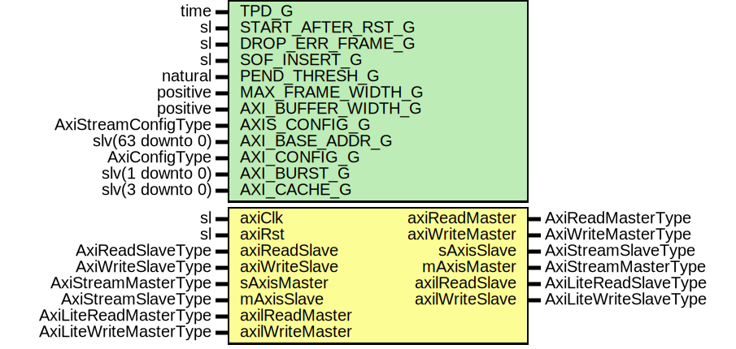

# Entity: AxiStreamDmaFifo

- **File**: AxiStreamDmaFifo.vhd
## Diagram

## Description

Company    : SLAC National Accelerator Laboratory
Description:
Generic AXI Stream FIFO (one frame at a time transfers, no TDEST interleaving)
using an AXI4 memory for the buffering of the AXI stream frames
This file is part of 'SLAC Firmware Standard Library'.
It is subject to the license terms in the LICENSE.txt file found in the
top-level directory of this distribution and at:
   https://confluence.slac.stanford.edu/display/ppareg/LICENSE.html.
No part of 'SLAC Firmware Standard Library', including this file,
may be copied, modified, propagated, or distributed except according to
the terms contained in the LICENSE.txt file.
## Generics

| Generic name       | Type                | Value                  | Description                                                                      |
| ------------------ | ------------------- | ---------------------- | -------------------------------------------------------------------------------- |
| TPD_G              | time                | 1 ns                   |                                                                                  |
| START_AFTER_RST_G  | sl                  | '1'                    | '1' still start the DMA REQs after RST; '0' will wait for AXI-Lite to start this |
| DROP_ERR_FRAME_G   | sl                  | '1'                    | '1' will drop the AXIS if error detect                                           |
| SOF_INSERT_G       | sl                  | '1'                    | Inserts SsiPkg's SOF bit                                                         |
| PEND_THRESH_G      | natural             | 0                      | In units of bytes                                                                |
| MAX_FRAME_WIDTH_G  | positive            | 14                     | Maximum AXI Stream frame size (units of address bits)                            |
| AXI_BUFFER_WIDTH_G | positive            | 28                     | Total AXI Memory for FIFO buffering (units of address bits)                      |
| AXIS_CONFIG_G      | AxiStreamConfigType |                        | AXI Stream Configurations                                                        |
| AXI_BASE_ADDR_G    | slv(63 downto 0)    | x"0000_0000_0000_0000" | Memory Base Address Offset                                                       |
| AXI_CONFIG_G       | AxiConfigType       |                        |                                                                                  |
| AXI_BURST_G        | slv(1 downto 0)     | "01"                   |                                                                                  |
| AXI_CACHE_G        | slv(3 downto 0)     | "1111"                 |                                                                                  |
## Ports

| Port name       | Direction | Type                   | Description                  |
| --------------- | --------- | ---------------------- | ---------------------------- |
| axiClk          | in        | sl                     | Clock and Reset              |
| axiRst          | in        | sl                     |                              |
| axiReadMaster   | out       | AxiReadMasterType      | AXI4 Interface               |
| axiReadSlave    | in        | AxiReadSlaveType       |                              |
| axiWriteMaster  | out       | AxiWriteMasterType     |                              |
| axiWriteSlave   | in        | AxiWriteSlaveType      |                              |
| sAxisMaster     | in        | AxiStreamMasterType    | AXI Stream Interface         |
| sAxisSlave      | out       | AxiStreamSlaveType     |                              |
| mAxisMaster     | out       | AxiStreamMasterType    |                              |
| mAxisSlave      | in        | AxiStreamSlaveType     |                              |
| axilReadMaster  | in        | AxiLiteReadMasterType  | Optional: AXI-Lite Interface |
| axilReadSlave   | out       | AxiLiteReadSlaveType   |                              |
| axilWriteMaster | in        | AxiLiteWriteMasterType |                              |
| axilWriteSlave  | out       | AxiLiteWriteSlaveType  |                              |
## Signals

| Name         | Type                                               | Description |
| ------------ | -------------------------------------------------- | ----------- |
| r            | RegType                                            |             |
| rin          | RegType                                            |             |
| wrAck        | AxiWriteDmaAckType                                 |             |
| rdAck        | AxiReadDmaAckType                                  |             |
| wrQueueAfull | sl                                                 |             |
| rdQueueRst   | sl                                                 |             |
| rdQueueReset | sl                                                 |             |
| rdQueueValid | sl                                                 |             |
| rdQueueReady | sl                                                 |             |
| rdQueueData  | slv(LOCAL_AXI_READ_DMA_READ_REQ_SIZE_C-1 downto 0) |             |
## Constants

| Name                               | Type     | Value                                                                                                                                                                                                                                                                                                                                                                                                                                                                                                                                                                                                                                                                                                                                                                                                                                                                                                                                                                                                                                                                                                                                                                                                                                                                                                                                                                                                                                                                                                                                     | Description                                                       |
| ---------------------------------- | -------- | ----------------------------------------------------------------------------------------------------------------------------------------------------------------------------------------------------------------------------------------------------------------------------------------------------------------------------------------------------------------------------------------------------------------------------------------------------------------------------------------------------------------------------------------------------------------------------------------------------------------------------------------------------------------------------------------------------------------------------------------------------------------------------------------------------------------------------------------------------------------------------------------------------------------------------------------------------------------------------------------------------------------------------------------------------------------------------------------------------------------------------------------------------------------------------------------------------------------------------------------------------------------------------------------------------------------------------------------------------------------------------------------------------------------------------------------------------------------------------------------------------------------------------------------- | ----------------------------------------------------------------- |
| BYP_SHIFT_C                        | boolean  |  true                                                                                                                                                                                                                                                                                                                                                                                                                                                                                                                                                                                                                                                                                                                                                                                                                                                                                                                                                                                                                                                                                                                                                                                                                                                                                                                                                                                                                                                                                                                                     | APP DMA driver enforces alignment, which means shift not required |
| BIT_DIFF_C                         | positive |  AXI_BUFFER_WIDTH_G-MAX_FRAME_WIDTH_G                                                                                                                                                                                                                                                                                                                                                                                                                                                                                                                                                                                                                                                                                                                                                                                                                                                                                                                                                                                                                                                                                                                                                                                                                                                                                                                                                                                                                                                                                                     |                                                                   |
| ADDR_WIDTH_C                       | positive |  ite((BIT_DIFF_C <= 10),  BIT_DIFF_C,  10)                                                                                                                                                                                                                                                                                                                                                                                                                                                                                                                                                                                                                                                                                                                                                                                                                                                                                                                                                                                                                                                                                                                                                                                                                                                                                                                                                                                                                          |                                                                   |
| CASCADE_SIZE_C                     | positive |  ite((BIT_DIFF_C <= 10),  1,  2**(BIT_DIFF_C-10))                                                                                                                                                                                                                                                                                                                                                                                                                                                                                                                                                                                                                                                                                                                                                                                                                                                                                                                                                                                                                                                                                                                                                                                                                                                                                                                                                                                                                   |                                                                   |
| LOCAL_AXI_READ_DMA_READ_REQ_SIZE_C | integer  |  MAX_FRAME_WIDTH_G+(2*AXIS_CONFIG_G.TUSER_BITS_C)+AXIS_CONFIG_G.TDEST_BITS_C+AXIS_CONFIG_G.TID_BITS_C                                                                                                                                                                                                                                                                                                                                                                                                                                                                                                                                                                                                                                                                                                                                                                                                                                                                                                                                                                                                                                                                                                                                                                                                                                                                                                                                                                                                                                     |                                                                   |
| REG_INIT_C                         | RegType  |  (       rstCnt         => '0',        insertSof      => SOF_INSERT_G,        online         => START_AFTER_RST_G,        dropOnErr      => DROP_ERR_FRAME_G,        baseAddr       => AXI_BASE_ADDR_G,        maxSize        => toSlv(2**MAX_FRAME_WIDTH_G,  32),        swCache        => AXI_CACHE_G,        errorCnt       => (others => '0'),        rdQueueReady   => '0',        wrQueueValid   => '0',        wrQueueData    => (others => '0'),        wrIndex        => (others => '0'),        rdIndex        => (others => '0'),        frameCnt       => (others => '0'),        frameCntMax    => (others => '0'),        wrReq          => AXI_WRITE_DMA_REQ_INIT_C,        rdReq          => AXI_READ_DMA_REQ_INIT_C,        axilReadSlave  => AXI_LITE_READ_SLAVE_INIT_C,        axilWriteSlave => AXI_LITE_WRITE_SLAVE_INIT_C) |                                                                   |
## Types

| Name    | Type | Description |
| ------- | ---- | ----------- |
| RegType |      |             |
## Functions
- localToSlv (r : AxiReadDmaReqType)  return slv 
**Description**
Using a local version (instead of AxiDmaPkg generalized functions) that's better logic optimized for this module
- localToAxiReadDmaReq (din : slv;  valid : sl)  return AxiReadDmaReqType 
## Processes
- comb: ( axiRst, axilReadMaster, axilWriteMaster, r, rdAck,
                   rdQueueData, rdQueueValid, wrAck, wrQueueAfull )
- seq: ( axiClk )
## Instantiations

- U_IbDma: surf.AxiStreamDmaWrite
**Description**
Inbound Controller

- U_ObDma: surf.AxiStreamDmaRead
**Description**
Outbound Controller

- U_ReadQueue: surf.FifoCascade
**Description**
Read Queue

- U_rdQueueReset: surf.RstPipeline
