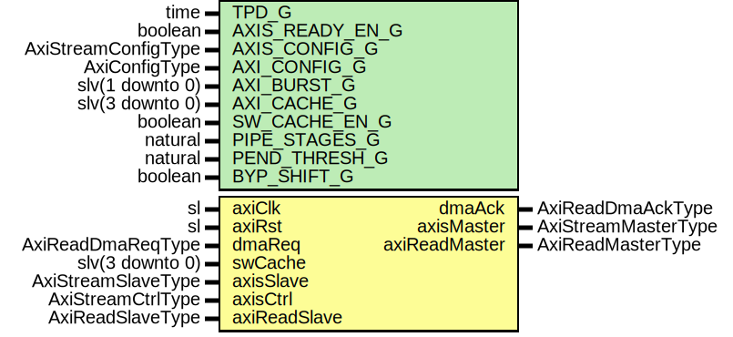

# Entity: AxiStreamDmaRead

## Diagram

## Description

Company    : SLAC National Accelerator Laboratory
Description:
Block to transfer a single AXI Stream frame from memory using an AXI
interface.
This file is part of 'SLAC Firmware Standard Library'.
It is subject to the license terms in the LICENSE.txt file found in the
top-level directory of this distribution and at:
   https://confluence.slac.stanford.edu/display/ppareg/LICENSE.html.
No part of 'SLAC Firmware Standard Library', including this file,
may be copied, modified, propagated, or distributed except according to
the terms contained in the LICENSE.txt file.
## Generics

| Generic name    | Type                | Value  | Description       |
| --------------- | ------------------- | ------ | ----------------- |
| TPD_G           | time                | 1 ns   |                   |
| AXIS_READY_EN_G | boolean             | false  |                   |
| AXIS_CONFIG_G   | AxiStreamConfigType |        |                   |
| AXI_CONFIG_G    | AxiConfigType       |        |                   |
| AXI_BURST_G     | slv(1 downto 0)     | "01"   |                   |
| AXI_CACHE_G     | slv(3 downto 0)     | "1111" |                   |
| SW_CACHE_EN_G   | boolean             | false  |                   |
| PIPE_STAGES_G   | natural             | 1      |                   |
| PEND_THRESH_G   | natural             | 0      | In units of bytes |
| BYP_SHIFT_G     | boolean             | false  |                   |
## Ports

| Port name     | Direction | Type                | Description           |
| ------------- | --------- | ------------------- | --------------------- |
| axiClk        | in        | sl                  | Clock/Reset           |
| axiRst        | in        | sl                  |                       |
| dmaReq        | in        | AxiReadDmaReqType   | DMA Control Interface |
| dmaAck        | out       | AxiReadDmaAckType   |                       |
| swCache       | in        | slv(3 downto 0)     |                       |
| axisMaster    | out       | AxiStreamMasterType | Streaming Interface   |
| axisSlave     | in        | AxiStreamSlaveType  |                       |
| axisCtrl      | in        | AxiStreamCtrlType   |                       |
| axiReadMaster | out       | AxiReadMasterType   | AXI Interface         |
| axiReadSlave  | in        | AxiReadSlaveType    |                       |
## Signals

| Name       | Type                | Description |
| ---------- | ------------------- | ----------- |
| r          | RegType             |             |
| rin        | RegType             |             |
| pause      | sl                  |             |
| sSlave     | AxiStreamSlaveType  |             |
| pipeMaster | AxiStreamMasterType |             |
| pipeSlave  | AxiStreamSlaveType  |             |
| mMaster    | AxiStreamMasterType |             |
| mSlave     | AxiStreamSlaveType  |             |
## Constants

| Name         | Type            | Value                                                                                                                                                                                                                                                                                                                                                                                                                                                                                                                                                                                                                                                                                                                                                                                                                                                                                                                                                                                                                                                                                                                                                                                 | Description |
| ------------ | --------------- | ------------------------------------------------------------------------------------------------------------------------------------------------------------------------------------------------------------------------------------------------------------------------------------------------------------------------------------------------------------------------------------------------------------------------------------------------------------------------------------------------------------------------------------------------------------------------------------------------------------------------------------------------------------------------------------------------------------------------------------------------------------------------------------------------------------------------------------------------------------------------------------------------------------------------------------------------------------------------------------------------------------------------------------------------------------------------------------------------------------------------------------------------------------------------------------- | ----------- |
| DATA_BYTES_C | integer         |  AXIS_CONFIG_G.TDATA_BYTES_C                                                                                                                                                                                                                                                                                                                                                                                                                                                                                                                                                                                                                                                                                                                                                                                                                                                                                                                                                                                                                                                                                                                                                          |             |
| ADDR_LSB_C   | integer         |  bitSize(DATA_BYTES_C-1)                                                                                                                                                                                                                                                                                                                                                                                                                                                                                                                                                                                                                                                                                                                                                                                                                                                                                                                                                                                                                                                                                                                                                              |             |
| ARLEN_C      | slv(7 downto 0) |  getAxiLen(AXI_CONFIG_G,  4096)                                                                                                                                                                                                                                                                                                                                                                                                                                                                                                                                                                                                                                                                                                                                                                                                                                                                                                                                                                                                                                                                                                                    |             |
| REG_INIT_C   | RegType         |  (       pendBytes => (others => '0'),        size      => (others => '0'),        reqSize   => (others => '0'),        reqCnt    => (others => '0'),        ackCnt    => (others => '0'),        dmaReq    => AXI_READ_DMA_REQ_INIT_C,        dmaAck    => AXI_READ_DMA_ACK_INIT_C,        shift     => (others => '0'),        shiftEn   => '0',        first     => '0',        leftovers => '0',        rMaster   => axiReadMasterInit(AXI_CONFIG_G,  AXI_BURST_G,  AXI_CACHE_G),        sMaster   => axiStreamMasterInit(AXIS_CONFIG_G),        reqState  => IDLE_S,        state     => IDLE_S) |             |
## Types

| Name         | Type                                                                                                                                                                                          | Description |
| ------------ | --------------------------------------------------------------------------------------------------------------------------------------------------------------------------------------------- | ----------- |
| ReqStateType | ( IDLE_S,  FIRST_S,  NEXT_S)                                                                                            |             |
| StateType    | ( IDLE_S,  MOVE_S,  LAST_S,  DONE_S,  BLOWOFF_S)  |             |
| RegType      |                                                                                                                                                                                               |             |
## Processes
- comb: ( axiReadSlave, axiRst, dmaReq, mMaster, mSlave, pause, r,
                   sSlave, swCache )
- seq: ( axiClk )
- Remap_mAxisMaster: ( mMaster, r )
## Instantiations

- U_Pipeline: surf.AxiStreamPipeline
- U_AxiStreamShift: surf.AxiStreamShift
