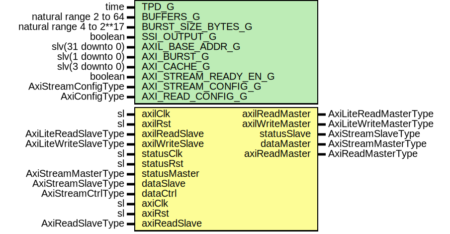

# Entity: AxiStreamDmaRingRead

- **File**: AxiStreamDmaRingRead.vhd
## Diagram

## Description

-----------------------------------------------------------------------------
 Company    : SLAC National Accelerator Laboratory
-----------------------------------------------------------------------------
 Description: AXI Stream to DMA Ring Buffer Read Module
-----------------------------------------------------------------------------
 This file is part of 'SLAC Firmware Standard Library'.
 It is subject to the license terms in the LICENSE.txt file found in the
 top-level directory of this distribution and at:
    https://confluence.slac.stanford.edu/display/ppareg/LICENSE.html.
 No part of 'SLAC Firmware Standard Library', including this file,
 may be copied, modified, propagated, or distributed except according to
 the terms contained in the LICENSE.txt file.
-----------------------------------------------------------------------------
## Generics

| Generic name          | Type                     | Value           | Description |
| --------------------- | ------------------------ | --------------- | ----------- |
| TPD_G                 | time                     | 1 ns            |             |
| BUFFERS_G             | natural range 2 to 64    | 64              |             |
| BURST_SIZE_BYTES_G    | natural range 4 to 2**17 | 4096            |             |
| SSI_OUTPUT_G          | boolean                  | false           |             |
| AXIL_BASE_ADDR_G      | slv(31 downto 0)         | (others => '0') |             |
| AXI_BURST_G           | slv(1 downto 0)          | "01"            |  INCR       |
| AXI_CACHE_G           | slv(3 downto 0)          | "0011"          |  Cacheable  |
| AXI_STREAM_READY_EN_G | boolean                  | true            |             |
| AXI_STREAM_CONFIG_G   | AxiStreamConfigType      |                 |             |
| AXI_READ_CONFIG_G     | AxiConfigType            |                 |             |
## Ports

| Port name       | Direction | Type                   | Description                                                      |
| --------------- | --------- | ---------------------- | ---------------------------------------------------------------- |
| axilClk         | in        | sl                     | AXI-Lite Interface for local registers                           |
| axilRst         | in        | sl                     |                                                                  |
| axilReadMaster  | out       | AxiLiteReadMasterType  |                                                                  |
| axilReadSlave   | in        | AxiLiteReadSlaveType   |                                                                  |
| axilWriteMaster | out       | AxiLiteWriteMasterType |                                                                  |
| axilWriteSlave  | in        | AxiLiteWriteSlaveType  |                                                                  |
| statusClk       | in        | sl                     | Status stream                                                    |
| statusRst       | in        | sl                     |                                                                  |
| statusMaster    | in        | AxiStreamMasterType    |                                                                  |
| statusSlave     | out       | AxiStreamSlaveType     |                                                                  |
| dataMaster      | out       | AxiStreamMasterType    | DMA Stream      dataClk    : in  sl;       dataRst    : in  sl;  |
| dataSlave       | in        | AxiStreamSlaveType     |                                                                  |
| dataCtrl        | in        | AxiStreamCtrlType      |                                                                  |
| axiClk          | in        | sl                     | AXI4 Interface for RAM                                           |
| axiRst          | in        | sl                     |                                                                  |
| axiReadMaster   | out       | AxiReadMasterType      |                                                                  |
| axiReadSlave    | in        | AxiReadSlaveType       |                                                                  |
## Signals

| Name            | Type                | Description      |
| --------------- | ------------------- | ---------------- |
| r               | RegType             |                  |
| rin             | RegType             |                  |
| intStatusMaster | AxiStreamMasterType |                  |
| axilAck         | AxiLiteAckType      |                  |
| dmaAck          | AxiReadDmaAckType   |                  |
| dmaReqAxi       | AxiReadDmaReqType   |  axiClk signals  |
| dmaAckAxi       | AxiReadDmaAckType   |                  |
## Constants

| Name           | Type    | Value                                                                                                                                                                                                                                                                                                                                                                                                                                                                                                                                     | Description |
| -------------- | ------- | ----------------------------------------------------------------------------------------------------------------------------------------------------------------------------------------------------------------------------------------------------------------------------------------------------------------------------------------------------------------------------------------------------------------------------------------------------------------------------------------------------------------------------------------- | ----------- |
| DMA_ADDR_LOW_C | integer |  log2(BURST_SIZE_BYTES_G)                                                                                                                                                                                                                                                                                                                                                                                                                                                                                                                 |             |
| REG_INIT_C     | RegType |  (       startAddr      => (others => '0'),        endAddr        => (others => '0'),        mode           => (others => '0'),        state          => START_LOW_S,        axilReq        => AXI_LITE_REQ_INIT_C,        dmaReq         => AXI_READ_DMA_REQ_INIT_C,        intStatusSlave => AXI_STREAM_SLAVE_INIT_C) |             |
## Types

| Name      | Type                                                                                                                                                                                                                                                                                                                                                           | Description |
| --------- | -------------------------------------------------------------------------------------------------------------------------------------------------------------------------------------------------------------------------------------------------------------------------------------------------------------------------------------------------------------- | ----------- |
| StateType | ( START_LOW_S,  START_HIGH_S,  END_LOW_S,  END_HIGH_S,  MODE_S,  DMA_REQ_S,  CLEAR_HIGH_S,  CLEAR_LOW_S)  |             |
| RegType   |                                                                                                                                                                                                                                                                                                                                                                |             |
## Processes
- comb: ( axilAck, axilRst, dmaAck, intStatusMaster, r )
 **Description**
 [in] 
- seq: ( axilClk )
## Instantiations

- U_AxiLiteMaster_1: surf.AxiLiteMaster
- U_AxiStreamDmaRead_1: surf.AxiStreamDmaRead
 **Description**
 [in]
 DMA Write block

- U_Synchronizer_Req: surf.Synchronizer
 **Description**
 [in]
 Main logic runs on AXI-Lite clk, which may be different from the DMA AXI clk
 Synchronize the request/ack bus if necessary

- U_SynchronizerFifo_ReqData: surf.SynchronizerVector
 **Description**
 [out]

- U_Synchronizer_Ack: surf.Synchronizer
- U_SynchronizerFifo_Ack: surf.SynchronizerVector
 **Description**
 [out]

- U_AxiStreamFifo_Status: surf.AxiStreamFifoV2
 **Description**
 [out]

